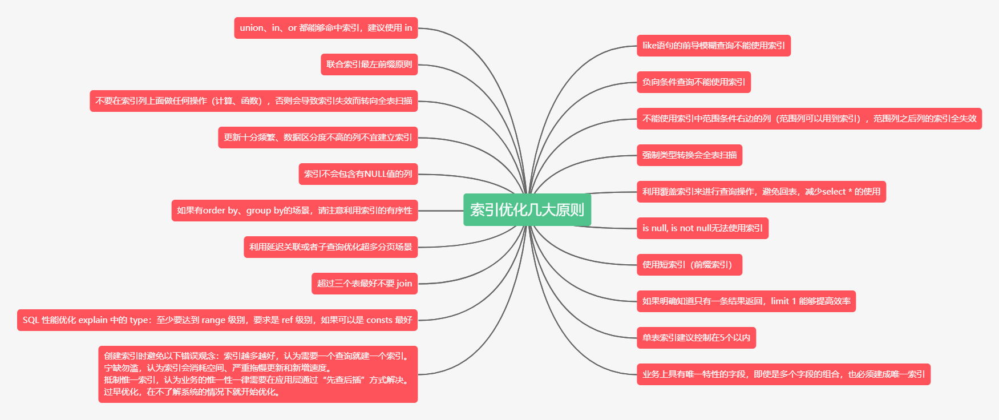

# 后端 Web开发

## 一、Java

### Java基础

#### 面向对象

#### 抽象类与接口

- 抽象类的特性

  1. 使用abstract修饰，<font color = "red">`抽象方法只能是public，protected，不能是private（继承后无法被实现）`</font>
  2. <font color = "red">抽象类无法直接创建对象，</font>必须子类继承实现抽象方法之后才能创建对象
  3. 抽象类可以继承抽象类，子类必须复制继承父类抽象方法
  4. 就算是只含有一个抽象方法的类也必须定义为抽象类

- 接口类的特性

  1. 接口使用interface关键字修饰，<font color = "red">接口可以包含变量，成员变量会被隐式标记成public static final</font>
  2. 接口中的方法只能标记成public abstract，
  3. 一个类可以继承多个接口，但是必须实现所有接口方法

- 抽象类和接口类的区别

  1. 抽象类可以实现成员方法的实现细节，而接口中只能存在public stract
  2. 抽象类的成员变量可以是各种类型，但是接口类只能是public static final
  3. 接口方法不能含有静态代码块和静态方法

- <font color = "blue" size = "5">结论</font>

  例子，抽象类可以定义一个人的固有属性，口眼耳鼻等，接口类只要是定义那些不是人人都有的东西—>打球，游泳等

  1. 抽象类主要是定义某个领域的固定属性，也就是公共的部分，而接口定义的是这个领域的扩展
  2. 当需要为一些类提供公共模块的时候，优先考虑抽象类，这样被子类继承即可使用，代码简洁
  3. 当注重代码的扩展性和可维护性的时候应该优先考虑接口类型，接口是程序之间的协议，比抽象类的使用更加的安全 

#### 内部类

- 内部类的基本使用方法；内部类在使用情况上和基本的方法的使用情况差不多，

  静态内部不可以使用非静态内部类，非静态内部类可以使用任何类但是不能定义静态变量

  构造内部类：

  ```java
  OutterObject outterObject = new OutterObject(Constructor Parameters);
  InnerObject innerObject = outterObject.new InnerObject(Constructor Parameters);
  ```

  

- 内部类的优点：

  1. 当要实现的一个接口和类里面的一个方法名完全一致就可以使用内部类来进行解决
  2. 可以通过内部类和接口来解决Java无法进行多继承的问题
  3. 提高封装性
  4. 一个内部类可以访问创建它的外部类的变量，甚至是私有变量，这就为我们设计程序提供了更多的思路
  5. <font color ="red">未完待续.........</font>

#### Java的异常

### Java常见关键字

#### static

#### transient

将不需要序列化的属性前添加关键字**transient**,序列化对象的时候，这个属性就不会被序列化。（静态变量无法被序列化）

**底层原理**

java的序列化操作是将对象的状态储存到硬盘上去，等需要的时候就可以再把它读出来使用；所以transient的作用就是把修饰的字段固定在内存中进行操作而不会写到磁盘中里持久化。

**被transient关键字修饰的变量仍然可以被序列化**

Java序列化提供了两种方式

一是实现Serializable接口

二是实现Exteranlizable接口，需要重写writeExternal和readExternal方法，它的效率比Serializable高一些，并且可以决定哪些属性需要序列化

#### volatile

- volatile修饰的变量不允许线程内部缓存和重排序，即直接修改内存。

- volatile只能让被他修饰内容具有可见性，但不能保证它具有原子性。

- 在访问volatile变量时不会执行加锁操作，因此也就不会使执行线程阻塞.

#### public、protected、private

### Java容器

在 Java 中除了以 Map 结尾的类之外， 其他类都实现了 Collection 接口。


#### ArrayList

**扩容机制**

- 计算cap*1.5与size+1取最大值
- 然后创建新的ArrayList
- 再用CopyOf方法将原数据拷贝到新的ArrayList中

#### HashMap

**重要字段**

- TREEIFY_THRESHOLD = 8; 链表转化为红黑树的阈值
- DEFAULT_INITIAL_CAPACITY = 1 << 4; 初始容量: 16
- DEFAULT_LOAD_FACTOR = 0.75f; 阈值，当元素个数占总容量比例超过该值，则进行resize()
- threshold; 该值为capacity * loadfactor的计算结果

**hash()函数**

```java
static final int hash(Object key) {
    int h;
    return (key == null) ? 0 : (h = key.hashCode()) ^ (h >>> 16);
}
```
- HashMap中计算key在数组中的下标是通过 **hash(key) & (n - 1)** 得到的。
- 因为map容量始终是2次幂，n - 1的二进制数全为1，这样计算的下标就完全取决于hash(key)的结果，只要hash(key)能充分随机就好。

**红黑树**

一种特殊的二叉查找树。红黑树的每个节点上都有存储位表示节点的颜色，可以是红(Red)或黑(Black)

红黑树的特性:
（1）每个节点或者是黑色，或者是红色。
（2）根节点是黑色。
（3）每个叶子节点（NIL）是黑色。 ^[注意：这里叶子节点，是指为空(NIL或NULL)的叶子节点！]
（4）如果一个节点是红色的，则它的子节点必须是黑色的。
（5）从一个节点到该节点的子孙节点的所有路径上包含相同数目的黑节点。^[确保没有一条路径会比其他路径长出俩倍。因而，红黑树是相对是接近平衡的二叉树。]

它的时间复杂度是O(logN)，一棵含有n个节点的红黑树的高度至多为2log(n+1).

将红色的节点移到根节点；然后，将根节点设为黑色

**HashMap多线程死循环**

在并发情况下，Jdk1.7的put方法使用的是头插法，当一个线程在进行扩容操作的时候，新的元素是从链表的头部插入，而此时如果有另一个线程也需要插入该元素，则会在这两个链表节点出现死循环的情况。
Jdk1.8已经改为尾插法，但是仍然不建议在高并发的场景使用HashMap，而应该使用ConcurrentHashMap。

#### ConcurrentHashMap

##### 1.7: Segment数组+HashEntry数组+链表


Java7 中 ConcurrentHashMap 使用的分段锁，也就是每一个 Segment 上同时只有一个线程可以操作，每一个 Segment 都是一个类似 HashMap 数组的结构，它可以扩容，它的冲突会转化为链表。但是 Segment 的个数一但初始化就不能改变。

##### 1.8: Node数组+链表/红黑树

ConcurrentHashMap 的初始化是通过自旋和 CAS 操作完成的

变量 **sizeCtl** 是用来控制Node数组的初始化和扩容操作的。

- -1 说明正在初始化
- -N 说明有N-1个线程正在进行扩容
- 表示 table 初始化大小，如果 table 没有初始化
- 表示 table 容量，如果 table　已经初始化。

Java8 中的 ConcurrentHashMap 使用的 **Synchronized** 锁加 CAS 的机制。结构也由 Java7 中的 Segment 数组 + HashEntry 数组 + 链表 进化成了 Node 数组 + 链表 / 红黑树，Node 是类似于一个 HashEntry 的结构。它的冲突再达到一定大小时会转化成红黑树，在冲突小于一定数量时又退回链表。

-------

### Java虚拟机

#### JVM内存模型


1.8同1.7比，最大的差别就是：元数据区取代了永久代。


元空间的本质和永久代类似，都是对JVM规范中方法区的实现。

元空间与永久代最大的区别：元数据空间并不在虚拟机中，而是使用本地内存。

-----

##### 1. 程序计数器

每个线程一块，指向当前线程正在执行的字节码代码的行号。如果当前线程执行的是native方法，则其值为null。

主要有两个作用：

- 字节码解释器通过改变程序计数器来依次读取指令，从而实现代码的流程控制，如：顺序执行、选择、循环、异常处理。
- 在多线程的情况下，程序计数器用于记录当前线程执行的位置，从而当线程被切换回来的时候能够知道该线程上次运行到哪儿了。

程序计数器是唯一一个不会出现OutOfMemoryError的内存区域，它的生命周期随着线程的创建而创建，随着线程的结束而死亡。

-----

##### 2. Java虚拟机栈


Java虚拟机栈(JVM Stack)是线程私有的，生命周期与线程同进同退。

每个java方法在执行时都会创建一个**栈帧**(Stack Frame)用于存储**局部变量表、操作数栈、动态链接、方法出口等信息**。

**每一个方法从调用直至执行结束，就对应着一个栈帧从虚拟机栈中入栈到出栈的过程**。

**局部变量表**：存放了编译期可知的各种基本类型(boolean、byte、char、short、int、float、long、double)、对象引用(reference 类型)和 returnAddress 类型(指向了一条字节码指令的地址)

StackOverflowError：线程请求的栈深度大于虚拟机所允许的深度。

OutOfMemoryError：如果虚拟机栈可以动态扩展，而扩展时无法申请到足够的内存。

------

##### 3. 本地方法栈

功能与Java虚拟机栈十分相同。

区别是，Java 虚拟机栈为虚拟机执行 Java 方法(也就是字节码)服务，而本地方法栈则为虚拟机使用到的 **Native方法**服务。

也会有 StackOverflowError 和 OutOfMemoryError 异常。

-----

##### 4. 元数据区
元数据区取代了1.7版本及以前的永久代。元数据区和永久代本质上都是方法区的实现。方法区存放虚拟机加载的**类信息，静态变量，常量等数据**。

-----

##### 5. 直接内存
在 JDK 1.4 中新加入 NIO (New Input/Output) 类，引入了一种基于通道(Channel)和缓存(Buffer)的 I/O 方式，它可以使用 Native 函数库直接分配堆外内存，然后通过一个存储在 Java 堆中的 DirectByteBuffer 对象作为这块内存的引用进行操作。可以避免在 Java 堆和 Native 堆中来回的数据耗时操作。

OutOfMemoryError：会受到本机内存限制，如果内存区域总和大于物理内存限制从而导致动态扩展时出现该异常。


-----

##### 6. 堆


堆是JVM**内存占用最大**，管理最复杂的一个区域。其唯一的用途就是存放**对象实例**：所有的对象实例及数组都在对上进行分配。

JDK1.8后，**字符串常量池**从永久代中剥离出来，存放在堆中。

堆的内存分配原则：

1. 新new的小对象都放在Eden区（伊甸园嘛，创造的地方）如果Eden区没有足够的空间时，虚拟机执行一次Minor GC。

2. 大对象直接进入老年代（大对象是指需要大量连续内存空间的对象）。这样做的目的是避免在Eden区和两个Survivor区之间发生大量的内存拷贝（新生代采用复制算法收集内存）。

3. 长期存活的对象进入老年代。虚拟机为每个对象定义了一个年龄计数器，如果对象经过了1次Minor GC那么对象会进入Survivor区，之后每经过一次Minor GC那么对象的年龄加1，知道达到阀值对象进入老年区。

4. 动态判断对象的年龄。如果Survivor区中相同年龄的所有对象大小的总和大于Survivor空间的一半，年龄大于或等于该年龄的对象可以直接进入老年代。

5. 空间分配担保。每次进行Minor GC时，JVM会计算Survivor区移至老年区的对象的平均大小，如果这个值大于老年区的剩余值大小则进行一次Full GC，如果小于检查HandlePromotionFailure设置，如果true则只进行Monitor GC,如果false则进行Full GC。

#### JVM垃圾清理

##### GC算法

jvm虚拟机主要是为了解决程序中哪些需要回收、怎么回收、回收的时机是什么时候;

1. 哪些需要回收，jvm中哪些对象是垃圾对象？

   - <font color="#EE7AE9">引用计数算法（已经弃用）</font>

     特点：一种比较简单直观的算法，效率高

     原理：对象有一个引用，那么计数+1,删除一个引用计数-1，只收集计数为0的对象

     缺点：

     ​		<1>、互相引用的两个对象的计数器不为0，但是这个两个对象都已经属于无用的对象，这样会出现死锁的情况，占用内存。

     ​		<2>、由于引用计数算法需要计算每个对象被引用的次数，所以需要编译器的帮忙为每个对象装配计数器，增加了内存了占用率。

   - <font color="#EE7AE9">根搜索算法</font>

     特点：解决引用计数出现的问题

     原理：在若干对象中，从任意**根对象**到这个对象是不可达的状态的时候，那么这个对象就是属于可以回收的状态，

     根对象：

     ​			1>、虚拟机栈中的引用对象。

     ​			2>、方法区中静态属性引用的对象。

     ​			3>、方法区中常量引用的对象。

     ​			4>、本地方法栈JNI引用的对象。

2. 怎么回收，如何处理jvm中的垃圾对象？

   - <font color="#EE7AE9">复制算法</font>
      复制算法是将内存分成两片不同的区域，（活动区域、空闲区域），当活动区域的空间被耗尽的时候，JVM会暂停线程，启动GC复制线程，GC线程更新存活对象的内存引用地址指向空闲的区域，这时候空闲区域就变成了活动区域，原来在旧活动区域的垃圾对象就会被清除。
      缺点：
      - 实际内存的使用率只有50%，造成内存空间的浪费。
      - 当某个对象的生存时间非常长的时候，复制算法来回的切换引用地址会造成性能的下降

   - <font color="#EE7AE9">标记-清除算法</font>
      当有效空间快要被耗尽的时候，JVM就会遍历所有的对象进行标记垃圾对象的操作，遍历完之后就会清除所有的垃圾对象，剩下存活对象，算法结束。
      缺点：
      - 由于每次直接删除垃圾对象，会造成剩下的物理地址不是连续的，而导致无法分配连续的空间给新的大对象。

   - <font color="#EE7AE9">标记-整理算法</font>

      标记整理算法有两个过程，标记+整理

      和标记清除一样的GC过程，都是遍历所有的GC Root，标记可达的存活对象，但是会多出“整理”的过程，这个整理的过程实际上就是对存活下来的对象的物理地址进行整理，呈现有序的状态，这样就不用了担心有较大的对象进入之后无法分配对象的时候；

      缺点：虽然已经解决了标记清除带来内存的物理地址排列紊乱的情况，但是这个问题却被转化成每次标记整理的时候都需要进行相应的数据整理所带来时间增加的情况。

   - <font color="#EE7AE9">分代收集算法</font>

      分代算法的实际上就是将内存的区域进行划分，对不同的地方使用不同的GC策略。

      - 对象类型：

        - 夭折对象（局部变量/循环内的临时变量）

        - 老不死对象（缓存对象/数据库连接对象/单例对象...)

        - 永恒对象（String池中的对象/类加载信息)

      - 对象内存的区域：

        - Java堆：夭折对象和老不死对象都生存在Java堆里面

        - 方法区：永恒对象所在区域

     - Java堆区域划分详解：

       ​	Java堆主要分成两片区域：1/3的区域用于构建新生代、2/3的区域用于构建老年代，其中新生代又分成from:to:Eden = 1:1:8，from和to主要适用于复制算法，而Eden使用的算法是标记整理或者是标记清除

     - GC过程：每次对象都会在新生代中的Eden中产生，在进行younger GC的时候就会进入到from或者是to的区域内，年龄+1,在之后的younge GC的过程中都会对对象的年龄进行+1，当年龄达到一定的年龄的时候就会进入到老年代中，而老年代的对象由于存活时间一般都比较长，所以采用的GC算法是标记整理或者是标记清除的算法。

     - 对象的转换情况：

       ​	1、新生代每次GC都会伴随着年龄的增长，到达一定的年龄后直接进入到老年代中。

       ​	2、当内存无法容纳新的对象的时候，也会进入到老年代，所以老年代是新生代的备用仓库。

       ​	3、永恒对象只存在于方法区中，不存在与Java堆中任意位置

3. 什么时候进行回收

   young/minor gc：当新生代不足以分配内存给新生的对象的时候，就会触发一次young gc,在进行young gc前，程序会判断老年代内连续空间是否大于新生代所有对象的总和，如果不是那么就启动full gc。

   full gc:

   - 老年代空间不足以分配内存的时候，当创建一个新的对象时候，如果新生代的80%的空间不足以分配的时候会直接进入到老年代，如果此时老年代的空间不足以分配内存的时候就会触发full gc。
   - 当永久代的空间已满的时候，再往永久代填入对象的时候就会触发full gc。
   - 显示调用System.gc，显示调用会在调用full gc前会先调用一次young gc

##### 垃圾收集器

[垃圾收集器概述](https://www.lagou.com/lgeduarticle/51284.html)

jdk提供了多重垃圾收集器，下文会提供主流的垃圾收集器搭配组合，各种组合按照特点分为以下三类：

串行收集器：Serial + Serial Old;
并行收集器: Parallel Scavenge + Parallel Old，专注于应用吞吐量；
并发收集器：CMS，G1，专注于响应时间。


###### Serial收集器

Serial收集器（Serial + Serial Old）的主要特点是**单线程回收资源**。当需要执行垃圾回收时，程序会暂停一切工作(又称为Stop The World，STW)，使用复制算法完成垃圾清理工作。

优点：
简单高效，是Client模式下默认的垃圾收集器；
对于资源受限的环境，比如单核(例如Docker中设置单核)，单线程效率较高；
内存小于一两百兆的桌面程序中，交互有限，则有限的STW是可以接受的。

缺点：
垃圾回收速度较慢且回收能力有限，频繁的STW会导致较差的使用体验。

###### ParNew收集器

ParNew收集器是Serial收集器的多线程版本，除了使用多线程进行垃圾收集工作，其他的控制参数，收集算法，对象分配规则等均与Serial收集器一致。
ParNew收集器在单核/双核环境下，效率未必有Serial收集器工作效率高(多线程切换开销等因素限制)，当然随着核数的增加，其性能也会得到较大的提升。

###### Parallel收集器

Parallel收集器（Parallel Scavenge + Parallel Old）相比于Serial收集器的主要特点是，其是通过**多线程**完成垃圾的清理工作。其中Parallel Scavenge使用复制算法完成垃圾收集（Parallel Old使用标记整理算法），如果从这一点看其与ParNew相似，但实际上两者的出发点存在区别，区别如下所示：

ParNew出发点在于加速资源回收的速度，以减少应用的STW时间；
Parallel Scavenge出发点在于资源回收的吞吐量(吞吐量:用户线程时间/(用户线程时间 + GC线程时间)).
高吞吐量适合于交互较少的后台应用程序（诸如科学计算应用），能够更加充分的压榨CPU。开发者可以根据应用的实际情况，通过调整以下两个参数追求最优性能：

最大停顿时间：垃圾收集器在执行垃圾回收时终端应用执行的最大时间间隔,-XX:MaxGCPauseMills;
吞吐量：执行垃圾收集的时间与执行应用的时间占比，-XX：GCTimeRatio=，垃圾收集时间占比：1/(1+N)。

###### CMS收集器

CMS(Concurrent Mark Sweep)收集器是jdk 1.5推出的第一款真正意义上的并发收集器（针对老年代），实现了让垃圾收集器与用户线程（近似）同时工作。

**特点**

基于"标记-清除"算法；以获取最短回收停顿时间为目标；并发收集，停顿时间短。

**CMS的垃圾收集过程：**

- 初始标记

初始标记仅标记一下GC Roots能直接关联到的对象，速度很快。在Java语言中，可作为GC Roots的对象包括4种情况

- 重新标记

修正并发标记期间因用户程序继续运作而导致标记产生变动的那一部分对象的标记记录，这个阶段的停顿时间一般会比初始标记阶段稍长一些，但远比并发标记时间短。

- 并发标记

初始标记和重新标记任然需要“stop the world”，并发标记过程就是进行GC Roots Tracing的过程。

- 并发清理-清除算法

整个过程中耗时最长的并发标记和并发清除过程收集器线程都可以与用户线程一起工作，所以，从总体上来说，CMS收集器的内存回收过程是与用户线程一起并发执行的。

优点： 并发收集，低停顿

理由： 由于在整个过程和中最耗时的并发标记和 并发清除过程收集器程序都可以和用户线程一起工作，所以总体来说，Cms收集器的内存回收过程是与用户线程一起并发执行的。

###### G1收集器

G1将内存划分为多个大小相同的Region(1-32M，上限2048个)，每个Region均拥有自己的分代属性，这些分代不需要连续。通过划分Region，G1可以根据计算老年代对象的效益率，优先回收具有最高效益率的对象（分代的内存不连续，GC搜索垃圾时需要全盘扫描找出对象引用情况，G1通过在每个Region中维护一个Remembered Set记录对象引用情况解决此问题）

**Young GC**
G1的Young GC采用复制算法，具体步骤为:(1)新对象进入Eden区；(2)存活对象拷贝至Survivor区；(3)存活时间经过多轮Young GC之后，晋升至Old区。

**Mixed GC**
G1只有在不能正常工作的情况下，采用Full GC进行垃圾回收，此时会STW，并且执行效率较差。正常情况下都是采用Mixed GC回收Young generation区和部分Old generatrion区。在执行Mixed GC之前需要进行并发标记过程(Global Concurrent Marking)，具体步骤如下：
- Initial marking phase: 标记GCRoots(会STW)；
- Root region scanning phase： 标记存活Region；
- Concurrent marking phase：标记存活的对象；
- Remark phase：重新标记(会STW)；
- Cleanup phase： 回收内存。

------

#### 类的加载

当程序主动使用某个类时，如果该类还未被加载到内存中，则JVM会通过加载、连接、初始化3个步骤来对该类进行初始化。如果没有意外，JVM将会连续完成3个步骤，所以有时也把这个3个步骤统称为类加载或类初始化。


##### 一、类的加载过程

###### 1.加载    

加载指的是将类的class文件读入到内存，并为之创建一个java.lang.Class对象，也就是说，当程序中使用任何类时，系统都会为之建立一个java.lang.Class对象。

类的加载由类加载器完成，类加载器通常由JVM提供，这些类加载器也是前面所有程序运行的基础，JVM提供的这些类加载器通常被称为系统类加载器。除此之外，开发者可以通过继承ClassLoader基类来创建自己的类加载器。

通过使用不同的类加载器，可以从不同来源加载类的二进制数据，通常有如下几种来源。

- 从本地文件系统加载class文件，这是前面绝大部分示例程序的类加载方式。
- 从JAR包加载class文件，这种方式也是很常见的，前面介绍JDBC编程时用到的数据库驱动类就放在JAR文件中，JVM可以从JAR文件中直接加载该class文件。
- 通过网络加载class文件。
- 把一个Java源文件动态编译，并执行加载。

类加载器通常无须等到“首次使用”该类时才加载该类，Java虚拟机规范允许系统预先加载某些类。

###### 2.链接

当类被加载之后，系统为之生成一个对应的Class对象，接着将会进入连接阶段，连接阶段负责把类的二进制数据合并到JRE中。类连接又可分为如下3个阶段。

1. 验证：验证阶段用于检验被加载的类是否有正确的内部结构，并和其他类协调一致。Java相对C++语言是安全的语言，例如它有C++不具有的数组越界的检查。这本身就是对自身安全的一种保护。验证阶段是Java非常重要的一个阶段，它会直接的保证应用是否会被恶意入侵的一道重要的防线，越是严谨的验证机制越安全。验证的目的在于确保Class文件的字节流中包含信息符合当前虚拟机要求，不会危害虚拟机自身安全。其主要包括四种验证，文件格式验证，元数据验证，字节码验证，符号引用验证。

    四种验证做进一步说明：

     - **文件格式验证**：主要验证字节流是否符合Class文件格式规范，并且能被当前的虚拟机加载处理。例如：主，次版本号是否在当前虚拟机处理的范围之内。常量池中是否有不被支持的常量类型。指向常量的中的索引值是否存在不存在的常量或不符合类型的常量。

     - **元数据验证**：对字节码描述的信息进行语义的分析，分析是否符合java的语言语法的规范。

     - **字节码验证**：最重要的验证环节，分析数据流和控制，确定语义是合法的，符合逻辑的。主要的针对元数据验证后对方法体的验证。保证类方法在运行时不会有危害出现。

     - **符号引用验证**：主要是针对符号引用转换为直接引用的时候，是会延伸到第三解析阶段，主要去确定访问类型等涉及到引用的情况，主要是要保证引用一定会被访问到，不会出现类等无法访问的问题。

1. 准备：类准备阶段负责为类的静态变量分配内存，并设置默认初始值。

2. 解析：将类的二进制数据中的符号引用替换成直接引用。说明一下：符号引用：符号引用是以一组符号来描述所引用的目标，符号可以是任何的字面形式的字面量，只要不会出现冲突能够定位到就行。布局和内存无关。直接引用：是指向目标的指针，偏移量或者能够直接定位的句柄。该引用是和内存中的布局有关的，并且一定加载进来的。

###### 3.初始化
    初始化是为类的静态变量赋予正确的初始值，准备阶段和初始化阶段看似有点矛盾，其实是不矛盾的，如果类中有语句：private static int a = 10，它的执行过程是这样的，首先字节码文件被加载到内存后，先进行链接的验证这一步骤，验证通过后准备阶段，给a分配内存，因为变量a是static的，所以此时a等于int类型的默认初始值0，即a=0,然后到解析（后面在说），到初始化这一步骤时，才把a的真正的值10赋给a,此时a=10。

-----

##### 二、类加载时机

1. 创建类的实例，也就是new一个对象
2. 访问某个类或接口的静态变量，或者调用类的静态方法
3. 反射（Class.forName("com.lyj.load")）
4. 初始化一个类的子类（会首先初始化子类的父类）
5. JVM启动时标明的启动类，即文件名和类名相同的那个类         

**除此之外，下面几种情形需要特别指出：**

- 对于一个final类型的静态变量，如果该变量的值在编译时就可以确定下来，那么这个变量相当于“宏变量”。
- Java编译器会在编译时直接把这个变量出现的地方替换成它的值，因此即使程序使用该静态变量，也不会导致该类的初始化。
- 反之，如果final类型的静态Field的值不能在编译时确定下来，则必须等到运行时才可以确定该变量的值，如果通过该类来访问它的静态变量，则会导致该类被初始化。

-----

##### 三、类加载器
    类加载器负责加载所有的类，其为所有被载入内存中的类生成一个java.lang.Class实例对象。一旦一个类被加载如JVM中，同一个类就不会被再次载入了。正如一个对象有一个唯一的标识一样，一个载入JVM的类也有一个唯一的标识。在Java中，一个类用其全限定类名（包括包名和类名）作为标识；但在JVM中，一个类用其全限定类名和其类加载器作为其唯一标识。例如，如果在pg的包中有一个名为Person的类，被类加载器ClassLoader的实例kl负责加载，则该Person类对应的Class对象在JVM中表示为(Person.pg.kl)。这意味着两个类加载器加载的同名类：（Person.pg.kl）和（Person.pg.kl2）是不同的、它们所加载的类也是完全不同、互不兼容的。

JVM预定义有三种类加载器，当一个 JVM启动的时候，Java开始使用如下三种类加载器：

1. 根类加载器（BootstrapClassLoader）:它用来加载 Java 的核心类，是用原生代码来实现的，并不继承自 java.lang.ClassLoader（负责加载$JAVA_HOME中jre/lib/rt.jar里所有的class，由C++实现，不是ClassLoader子类）。由于引导类加载器涉及到虚拟机本地实现细节，开发者无法直接获取到启动类加载器的引用，所以不允许直接通过引用进行操作。

2. 扩展类加载器（ExtClassLoader）：它负责加载JRE的扩展目录，lib/ext或者由java.ext.dirs系统属性指定的目录中的JAR包的类。由Java语言实现，父类加载器为null。

3. 系统类加载器（AppClassLoader）：被称为系统（也称为应用）类加载器，它负责在JVM启动时加载来自Java命令的-classpath选项、java.class.path系统属性，或者CLASSPATH环境变量所指定的JAR包和类路径。程序可以通过ClassLoader的静态方法getSystemClassLoader()来获取系统类加载器。如果没有特别指定，则用户自定义的类加载器都以此类加载器作为父加载器。由Java语言实现，父类加载器为ExtClassLoader。

    **类加载器加载Class大致要经过如下8个步骤：**

   1. 检测此Class是否载入过，即在缓冲区中是否有此Class，如果有直接进入第8步，否则进入第2步。
   2. 如果没有父类加载器，则要么Parent是根类加载器，要么本身就是根类加载器，则跳到第4步，如果父类加载器存在，则进入第3步。
   3. 请求使用父类加载器去载入目标类，如果载入成功则跳至第8步，否则接着执行第5步。
   4. 请求使用根类加载器去载入目标类，如果载入成功则跳至第8步，否则跳至第7步。
   5. 当前类加载器尝试寻找Class文件，如果找到则执行第6步，如果找不到则执行第7步。
   6. 从文件中载入Class，成功后跳至第8步。
   7. 抛出ClassNotFountException异常。
   8.  返回对应的java.lang.Class对象。

-----

##### 四、类加载机制

1. JVM的类加载机制主要有如下3种。

- **全盘负责**：所谓全盘负责，就是当一个类加载器负责加载某个Class时，该Class所依赖和引用其他Class也将由该类加载器负责载入，除非显示使用另外一个类加载器来载入。

- **缓存机制**。缓存机制将会保证所有加载过的Class都会被缓存，当程序中需要使用某个Class时，类加载器先从缓存区中搜寻该Class，只有当缓存区中不存在该Class对象时，系统才会读取该类对应的二进制数据，并将其转换成Class对象，存入缓冲区中。这就是为很么修改了Class后，必须重新启动JVM，程序所做的修改才会生效的原因。

- **双亲委派**：所谓的双亲委派，则是先让父类加载器试图加载该Class，只有在父类加载器无法加载该类时才尝试从自己的类路径中加载该类。

2. 双亲委派机制：

类加载器的父子结构：根加载器—>扩展类加载器—>应用程序加载器—>自定义加载器

- *内容：*

    在使用某类加载器加载class文件进入内存的时候，首先会使用根加载器进行加载，如果不能加载的话再逐层往下递归，直至到达指定的类加载器后才加载该类。

- *意义*

    1. 避免类的重复加载
    2. 防止核心API库被随意篡改：我们自己写的类会覆盖系统本身内部的类，造成系统内部程序的混乱，例如`java.lang.object`类

-------

### 锁和多线程

#### 创建线程的三种方式的对比

**1）采用实现Runnable. Callable接口的方式创建多线程**。

优势是：

- 线程类只是实现了Runnable接口或Callable接口，还可以继承其他类。

- 在这种方式下，多个线程可以共享同一个target对象，所以非常适合多个相同线程来处理同一份资源的情况，从而可以将CPU. 代码和数据分开，形成清晰的模型，较好地体现了面向对象的思想。

劣势是：

- 编程稍微复杂，如果要访问当前线程，则必须使用Thread.currentThread()方法。

**2）使用继承Thread类的方式创建多线程**

优势是：

- 编写简单，如果需要访问当前线程，则无需使用Thread.currentThread()方法，直接使用this即可获得当前线程。

劣势是：

- 线程类已经继承了Thread类，所以不能再继承其他父类。

**3）Runnable和Callable的区别**

- Callable规定（重写）的方法是call()，Runnable规定（重写）的方法是run()。
- Callable的任务执行后可返回值，而Runnable的任务是不能返回值的。
- Call方法可以抛出异常，run方法不可以。
- 运行Callable任务可以拿到一个Future对象，表示异步计算的结果。它提供了检查计算是否完成的方法，以等待计算的完成，并检索计算的结果。通过Future对象可以了解任务执行情况，可取消任务的执行，还可获取执行结果。

#### Syncronized和Lock

**区别**

1. synchronize的自动释放锁，但是Lock必须手动进行释放，所以这就引发一个问题，如果程序在中间抛出异常，那么相对于synchronize来说，Lock就不会进行unlock，所以每次的解锁都必须放进finally里面进行。

2. Lock有共享锁的功能，所以可以设置读写锁来提高效率，但是synchronize不能。

3. Lock锁的事代码块，而synchronize锁不只是代码块还可以是方法锁还有类锁。

4. Lock可以知道线程有没有获取到锁，但是synchronize不能。

##### Syncronized

##### ReentrantLock

ReetrantLock是一个可重入的独占锁，主要有两个特性，一个是支持公平锁和非公平锁，一个是可重入。 ReetrantLock实现依赖于AQS(AbstractQueuedSynchronizer)。

ReetrantLock主要依靠AQS维护一个阻塞队列，多个线程对加锁时，失败则会进入阻塞队列。等待唤醒，重新尝试加锁。

#### TreadLocal

TreadLocal是一个用来存储线程私有属性值的数据结构。

##### ThreadLocal实现原理


ThreadLocal的实现是这样的：每个Thread 维护一个 ThreadLocalMap 映射表，这个映射表的 key 是 ThreadLocal实例本身，value 是真正需要存储的 Object。

也就是说 ThreadLocal 本身并不存储值，它只是作为一个 key 来让线程从 ThreadLocalMap 获取 value。值得注意的是图中的虚线，表示 ThreadLocalMap 是使用 ThreadLocal 的弱引用作为 Key 的，弱引用的对象在 GC 时会被回收

##### ThreadLocal内存泄漏

ThreadLocal内存泄漏的根源是：由于ThreadLocalMap的生命周期跟Thread一样长，如果没有手动删除对应key就会导致内存泄漏，而不是因为弱引用。

##### 如何避免ThreadLocal内存泄漏

- **每次使用完ThreadLocal，都调用它的remove()方法，清除数据。**

在使用线程池的情况下，没有及时清理ThreadLocal，不仅是内存泄漏的问题，更严重的是可能导致业务逻辑出现问题。所以，使用ThreadLocal就跟加锁完要解锁一样，用完就清理。


#### Java中的锁

##### 无锁、自旋锁、CAS

CAS有什么缺陷？

1. ABA 问题

并发环境下，假设初始条件是A，去修改数据时，发现是A就会执行修改。但是看到的虽然是A，中间可能发生了A变B，B又变回A的情况。此时A已经非彼A，数据即使成功修改，也可能有问题。

ABA问题的解决办法就是使用版本号，在变量前面追加版本号，每次变量更新时把版本号加1，那么A-B-A就会变成1A-2B-3A。

从jdk1.5开始，jdk中的Atomic包里提供了一个类AtomicStampedReference来解决ABA问题。这个类的compareAndSet方法的作用首先检查当前引用是否等于预期引用，并且检查当前标志是否等于预期标志，如果都相等，则以原子方式将该引用和标志的值设为给定的更新值。

2. 循环时间长开销

自旋CAS，如果一直循环执行，一直不成功，会给CPU带来非常大的执行开销。

很多时候，CAS思想体现，是有个自旋次数的，就是为了避开这个耗时问题~

3. 只能保证一个变量的原子操作。

CAS 保证的是对一个变量执行操作的原子性，如果对多个变量操作时，CAS 目前无法直接保证操作的原子性的。

可以通过这两个方式解决这个问题：

使用互斥锁来保证原子性；

将多个变量封装成对象，通过AtomicReference来保证原子性。

##### 偏向锁

在锁对象的对象头中记录一下当前获取到该锁的线程ID，该线程下次如果又来获取该锁就可以直接获取到了

##### 轻量级锁

由偏向级锁升级而来，当一个线程获取到锁后，此时这把锁是偏向锁，此时如果有第二个线程来竞争锁，偏向锁就会升级为轻量级锁，之所以叫轻量级锁，是为了与重量级锁区分凯；轻量级锁底层是通过自旋来实现的，并不会阻塞线程

##### 自旋锁

线程在获取锁的过程中不会去阻塞线程，也就无所谓的唤醒线程，阻塞和唤醒这两个步骤都是需要操作系统去进行的，比较消耗时间，自旋锁是线程通过CSA获取预期的一个标记；如果没有获取到，则继续循环获取，获取到了则表示获取到了锁，这个过程一直在运行，相对而言没有使用太多的操作系统资源，比较轻量级

如果自旋次数过多仍然没有获取到锁，则会升级为重量级锁，重量级锁导致线程阻塞

##### 重量级锁

重量锁在JVM中又叫对象监视器（Monitor），它很像C中的Mutex，除了具备Mutex(0|1)互斥的功能，它还负责实现了Semaphore(信号量)的功能，也就是说它至少包含一个竞争锁的队列，和一个信号阻塞队列（wait队列），前者负责做互斥，后一个用于做线程同步。

##### Syncronized锁升级

synchronized 锁升级原理：在锁对象的对象头里面有一个 threadid 字段，在第一次访问的时候 threadid 为空，jvm 让其持有偏向锁，并将 threadid 设置为其线程 id，再次进入的时候会先判断 threadid 是否与其线程 id 一致，如果一致则可以直接使用此对象，如果不一致，则升级偏向锁为轻量级锁，通过自旋循环一定次数来获取锁，执行一定次数之后，如果还没有正常获取到要使用的对象，此时就会把锁从轻量级升级为重量级锁，此过程就构成了 synchronized 锁的升级。

锁的升级的目的：锁升级是为了减低了锁带来的性能消耗。在 Java 6 之后优化 synchronized 的实现方式，使用了偏向锁升级为轻量级锁再升级到重量级锁的方式，从而减低了锁带来的性能消耗。

#### 线程池

##### **ThreadPoolExecutor线程池类**

线程池尽量采用ThreadPoolExecutor的方式进行创建；

```java
public ThreadPoolExector(int corePoolSize,
                         int maximumPoolSize,
                         long keepAliveTime,
                         TimeUnit unit,
                         BlockingQueue<Runnable> workQueue,
                         ThreadFactory thradFactory,
                         RejectedExecutionHandle handler);
```

- corePoolSize：提交一个任务到线程池的时候，线程池会新建一个线程执行任务，及时其他已有的线程处于空闲的状态的时候，线程池也会新建线程来执行任务，可调用线程池的prestartAllCoreThreads方法启动所有线程。
- maximumPoolSize：线程允许创建的最大线程数，如果任务队列满了之后，线程池已创建的线程数小于最大线程数，则线程池就会创建新的线程用来执行任务，（无界任务队列忽略此参数）
- keepAliveTime：当线程池的线程数量超过corePoolSize的时候，多余的空闲线程存活时间
- unit：keepAliveTime的单位
- workQueue：任务队列，有以下四种任务队列
  1. ArrayBlockingQueue：基于数组结构的游街阻塞队列，此队列按照FIFO（先进先出）原则对元素记性排序
  2. LinkedBlockingQueue：一个基于链表结构的阻塞队列，此队列按FIFO（先进先出）原则对元素进行排序，吞吐量通常要高于ArrayBlockingQueue。
  3. SynchronousQueue：一个不储存元素的阻塞队列，每个插入操作必须等到另一个线程调用一出操作，否则插入操作一直处于阻塞状态
  4. PriorityBlockingQueue：一个具有优先级的无线阻塞队列
- threadFactory：线程工厂，用于创建线程，一般使用默认的即可，也可以通过定义线程工厂的给每个创建出来的线程设置更有意义的名字
- handler：拒绝策略，当队列和线程池都满的情况下，又有新的任务进来的时候需要采取一种新的策略进行处理
  1. AbortPolicy：直接抛出异常，组织系统正常工作
  2. CallerRunPolicy：只要线程未关闭，该策略直接在调用者线程中，运行当前被丢弃的任务
  3. DiscardOldPolicy：该策略将丢弃最老的一个请求，也就是即将被执行的一个任务，并尝试再次提交当前任务
  4. DiscardPilicy：该策略默默地丢弃无法处理的任务
  5. 可自定义RejectedExecutionHandler策略
- **执行过程**


-------

### Java设计模式

[设计模式面试题CSDN](https://blog.csdn.net/weixin_43122090/article/details/105462226)

[设计模式面试题解背诵版](https://developer.51cto.com/art/202104/659216.htm)

#### 请列举出在JDK中几个常用的设计模式？
- 单例模式：保证被创建一次，节省系统开销。
- 工厂模式（简单工厂、抽象工厂）：解耦代码。
- 观察者模式：定义了对象之间的一对多的依赖，这样一来，当一个对象改变时，它的所有的依赖者都会收到通知并自动更新。
- 外观模式：提供一个统一的接口，用来访问子系统中的一群接口，外观定义了一个高层的接口，让子系统更容易使用。
- 模版方法模式：定义了一个算法的骨架，而将一些步骤延迟到子类中，模版方法使得子类可以在不改变算法结构的情况下，重新定义算法的步骤。
- 状态模式：允许对象在内部状态改变时改变它的行为，对象看起来好像修改了它的类。
- 装饰器设计模式：（Decorator design pattern）被用于多个 Java IO 类中。

#### 什么是设计模式？你是否在你的代码里面使用过任何设计模式？
设计模式是世界上各种各样程序员用来解决特定设计问题的尝试和测试的方法。设计模式是代码可用性的延伸


#### Java 中什么叫单例设计模式？请用Java 写出线程安全的单例模式
单例模式重点在于在整个系统上共享一些创建时较耗资源的对象。整个应用中只维护一个特定类实例，它被所有组件共同使用。Java.lang.Runtime是单例模式的经典例子。从 Java 5 开始你可以使用枚举（enum）来实现线程安全的单例。

#### 在 Java 中，什么叫观察者设计模式（observer design pattern）？
观察者模式是基于对象的状态变化和观察者的通讯，以便他们作出相应的操作。简单的例子就是一个天气系统，当天气变化时必须在展示给公众的视图中进行反映。这个视图对象是一个主体，而不同的视图是观察者。

#### 使用工厂模式最主要的好处是什么？在哪里使用？
工厂模式的最大好处是增加了创建对象时的封装层次。如果你使用工厂来创建对象，之后你可以使用更高级和更高性能的实现来替换原始的产品实现或类，这不需要在调用层做任何修改。

#### 举一个用Java 实现的装饰模式(decorator design pattern)？它是作用于对象层次还是类层次？
装饰模式增加强了单个对象的能力。Java IO 到处都使用了装饰模式，典型例子就是 Buffered 系列类如BufferedReader和BufferedWriter，它们增强了Reader和Writer对象，以实现提升性能的 Buffer 层次的读取和写入。

#### Java为什么不允许从静态方法中访问非静态变量？
Java 中不能从静态上下文访问非静态数据只是因为非静态变量是跟具体的对象实例关联的，而静态的却没有和任何实例关联。

#### 如果需要设计一个ATM机，设计思路是什么？
比如设计金融系统来说，必须知道它们应该在任何情况下都能够正常工作。不管是断电还是其他情况，ATM 应该保持正确的状态（事务） , 想想 加锁（locking）、事务（transaction）、错误条件（error condition）、边界条件（boundary condition） 等等。尽管你不能想到具体的设计，但如果你可以指出非功能性需求，提出一些问题，想到关于边界条件，这些都会是很好的。

#### Java的重载和重写？
如果你看到一个类的不同实现有着不同的方式来做同一件事，那么就应该用重写（overriding），而重载（overloading）是用不同的输入做同一件事。在 Java 中，重载的方法签名不同，而重写并不是。

#### 请举例说明什么情况下会更倾向于使用抽象类而不是接口？
接口和抽象类都遵循”面向接口而不是实现编码”设计原则，它可以增加代码的灵活性，可以适应不断变化的需求。下面有几个点可以帮助你回答这个问题：
- 在 Java 中，你只能继承一个类，但可以实现多个接口。所以一旦你继承了一个类，你就失去了继承其他类的机会了。
- 接口通常被用来表示附属描述或行为如：Runnable、Clonable、Serializable等等，因此当你使用抽象类来表示行为时，你的类就不能同时是Runnable和Clonable(注：这里的意思是指如果把Runnable等实现为抽象类的情况)，因为在 Java 中你不能继承两个类，但当你使用接口时，你的类就可以同时拥有多个不同的行为。
- 在一些对时间要求比较高的应用中，倾向于使用抽象类，它会比接口稍快一点。
- 如果希望把一系列行为都规范在类继承层次内，并且可以更好地在同一个地方进行编码，那么抽象类是一个更好的选择。有时，接口和抽象类可以一起使用，接口中定义函数，而在抽象类中定义默认的实现。

#### 简单工厂和抽象工厂的区别
- 简单工厂：用来生产同一等级结构中的任意产品，对于增加新的产品，无能为力。
- 工厂方法：用来生产同一等级结构中的固定产品，支持增加任意产品。
抽象工厂：用来生产不同产品族的全部产品，对于增加新的产品，无能为力；支持增加产品族。

#### 单例模式

**优点**
- 单例类只有一个实例对象，节省了系统资源（省去了对象的频繁创建 与销毁）；
- 该单例对象必须由单例类自行创建；
- 单例类对外提供一个访问该单例的全局访问点。

**缺点**
- 单例模式一般没有接口，扩展困难。如果要扩展，则除了修改原来的代码，没有第二种途径，违背开闭原则。
- 在并发测试中，单例模式不利于代码调试。在调试过程中，如果单例中的代码没有执行完，也不能模拟生成一个新的对象。
- 单例模式的功能代码通常写在一个类中，如果功能设计不合理，则很容易违背单一职责原则。

**使用场景**

- 需要频繁的进行创建和销毁的对象；
- 创建对象时耗时过多或耗费资源过多，但又经常用到的对象；
- 工具类对象；
- 频繁访问数据库或文件的对象。


**实现**

1.懒汉式

是否 Lazy 初始化：是
是否多线程安全：否
实现难度：易

描述：这种方式是最基本的实现方式，这种实现最大的问题就是不支持多线程。因为没有加锁 synchronized，所以严格意义上它并不算单例模式。 这种方式 lazy loading 很明显，不要求线程安全，在多线程不能正常工作。

用的时候才去检查有没有实例，如果有则返回，没有则新建
```java
public class Singleton {     
    private static Singleton instance;    
    private Singleton (){}       
    public static Singleton getInstance() {   
        if (instance == null) {        
            instance = new Singleton();  
        }      
        return instance;   
    }  
}
```
2.懒汉式（加锁）

是否 Lazy 初始化：是
是否多线程安全：是
实现难度：易

描述：这种方式具备很好的 lazy loading，能够在多线程中很好的工作，但是，效率很低，99% 情况下不需要同步。 优点：第一次调用才初始化，避免内存浪费。 缺点：必须加锁 synchronized 才能保证单例，但加锁会影响效率。 getInstance() 的性能对应用程序不是很关键（该方法使用不太频繁）。
```java
public class Singleton {  
    private static Singleton instance;  
    private Singleton (){}  
    public static synchronized Singleton getInstance() {  
    if (instance == null) {  
        instance = new Singleton();  
    }  
    return instance;  
    }  
}
```
3.饿汉式

是否 Lazy 初始化：否
是否多线程安全：是
实现难度：易

描述：这种方式比较常用，但容易产生垃圾对象。 优点：没有加锁，执行效率会提高。饿汉式借助类加载机制，绝对保证单例唯一 缺点：类加载时就初始化，浪费内存。 它基于 classloader 机制避免了多线程的同步问题，不过，instance 在类装载时就实例化，虽然导致类装载的原因有很多种，在单例模式中大多数都是调用 getInstance 方法， 但是也不能确定有其他的方式（或者其他的静态方法）导致类装载，这时候初始化 instance 显然没有达到 lazy loading 的效果。

实例在初始化的时候就已经建好了，不管你有没有用到，都先建好了再说；没有线程安全问题，但浪费空间
```java
public class Singleton {  
    private static Singleton instance = new Singleton();  
    private Singleton (){}  
    public static Singleton getInstance() {  
    return instance;  
    }  
}
```
-------

### Spring

#### SpringBean

bean规范如下：

1. 所有属性为private
2. 提供默认构造方法
3. 提供getter和setter
4. 实现serializable接口

**SpringBean的作用域**

[bean的作用域scope](https://blog.csdn.net/w_linux/article/details/80069039)

#### Spring IoC

[Spring Bean/IOC](https://www.awaimai.com/2596.html)

来自<[BeanDefinition的资源定位过程.md](https://github.com/doocs/source-code-hunter/blob/master/docs/Spring/IoC/1、BeanDefinition的资源定位过程.md)>

**IOC(接口）**
1. IOC思想基于IOC容器完成，IOC容器底层就是对象工厂
2. Spring提供IOC容器实现两种方式：(两个接口）
	- BeanFactory:
	  - IOC容器基本实现，是Spring内部的使用接口，不提供开发人员进行使用
	  - 加载配置文件时候不会创建对象，在获取对象（使用）才去创建对象
	- ApplicationContext:
	  - BeanFactory接口的子接口，提供更多更强大的功能，一般由开发人员进行使用
	  - 加载配置文件时候就会把在配置文件对象进行创建

**BeanDefinition资源定位（ refresh() 方法）**

1. 首先初始化 BeanFactory ，调用 obtainFreshBeanFactory() ，其中需要子类实现自定义的 refreshBeanFactory() 和 getBeanFactory() 方法，返回子类定义好的 BeanFactory 。此外，获取到 BeanFactory 后，需要对 BeanFactory 执行各种初始化操作，比如注册 BeanPost 事件处理器、是否启用 lazy_init 等。
2. refreshBeanFactory() 方法中，要对 BeanFactory 进行定制化，比如是否开启注解装配等。然后，调用 loadBeanDefinitions() 载入 BeanDefinition 。
3. 在 loadBeanDefinitions() 中，子类 AbstractXmlApplicationContext 生成了 BeanDefinitionReader 并用该 Reader 执行真正的 loadBeanDefinitions() 。
4. loadBeanDefinitions() 中会调用 getResouce() 获取用户传入的配置文件路径，得到 FileSystemResource 对象，后续将对该对象进行相关 I/O 操作，进行 BeanDefinition 的读取和载入。

**将Bean解析成BeanDefinition**

1. BeanDefinitionReader 会对配置文件中元素进行解析，类似于解析 Jsoup HTML 文档。
2. 将 <Bean> 元素交给 parseBeanDefinitionElement() 方法处理，并将该 Bean 解析封装为 BeanDefinitionHolder 对象。

**将BeanDefinitionHolder注册进IoC容器**

其实就是存入一个 ConcurrentHashMap<String, BeanDefinition> 中。

#### Dependency Injection（依赖注入）

**Spring 中触发 IoC容器“依赖注入” 的方式有两种：**

1. 应用程序通过 getBean()方法 向容器索要 bean 实例时触发依赖注入。
2. 提前给 bean 配置了 lazy-init 属性为 false，Spring 在 IoC 容器初始化会自动调用此 bean 的 getBean() 方法，提前完成依赖注入。

**BeanFactory 的 getBean()和 doGetBean()**

依赖注入从 getBean() 开始，该方法由 BeanFactory 接口提供。 getBean() 方法提供多个重载，最终还是调用 doGetBean() 。

- 在 doGetBean() 中：
  1. 根据 beanName 去容器 Map 中查找，如果找到并且该 bean 是单例模式，直接返回。
  2. 如果没有找到该 bean 或者该 bean 不是单例模式，而且当前 BeanFactory 的父容器不为 null ，则需要委派父容器去创建 bean 。
  3. 父容器为 null 的话，就开始获取该 bean 的依赖，然后递归地对该 bean 的依赖 bean 进行 getBean() 。
  4. 根据当前 bean 的生存周期执行不同的前置方法，最终还是调用 createBean() 方法创建 bean 。
- createBean() 和 doCreateBean()
  - doCreateBean() 中主要有 createBeanInstance() 和 populateBean() 两个方法，分别用于生成 bean 所包含的 Java 对象，以及处理 bean 对象之间的依赖关系。
  - 在 doCreateBean() 中，有 initiate() 方法真正实例化 bean 对象，采用了两种策略来实例化 bean 对象： Java 反射机制和 CGLIB 。
    - 当 bean 对象在 xml 配置文件中没有覆盖 look-up method 或者 replace method 的时候，使用 Java 反射机制获取 bean 的构造函数进行实例化。
    - 反之，则使用 CGLIB 来实例化对象。
- lazy-init
  - 通过牺牲 IoC 容器初始化的性能，来有效提升应用第一次获取该 bean 的效率。
  - 在 refresh() 函数中实现。

**FactoryBean 接口和 BeanFactory 接口的区别**

- FactoryBean
  
    FactoryBean 是一个特殊的 Bean 。可以通过实现 FactoryBean 接口实现向 IoC 容器注册两个 Bean，一个是 Bean 本身，一个是 FactoryBean.getObject() 返回值代表的 Bean 。
    
    - 当在IOC容器中的Bean实现了FactoryBean后，通过getBean(String BeanName)获取到的Bean对象并不是FactoryBean的实现类对象，而是这个实现类中的getObject()方法返回的对象。要想获取FactoryBean的实现类，就要getBean(&BeanName)，在BeanName之前加上"&"。
    
- BeanFactory
  
    BeanFactory 是 Spring  IOC 容器的核心接口，它定义了容器的主要功能，如创建 bean，获取 bean 等，是用来管理 bean 的。

#### Spring AOP

面向切面编程，指在程序运行中，将代码动态地切入到类的指定方法、位置上，不影响主业务代码。 Spring AOP 是基于动态代理的，即运行时注入。

**AOP 原理**

在 AopProxyFactory 中会为目标代理对象 target 调用 createAopProxy() 创建 AopProxy 代理对象，主要依据相应 Bean 是否实现了 InvocationHandler 接口，如果实现则使用 JDK 代理的方式代理对象，否则使用 CGLIB。

**Advice 增强**

有 beforeAdvice 和 afterAdvice ，分别在 Pointcut 的前、后执行。

**PointCut 切面**

通过正则表达式或者匹配方法名匹配相应需要 Advice 增强的方法。

#### Spring 事务

<来自[spring-transaction](https://github.com/Snailclimb/JavaGuide/blob/master/docs/system-design/framework/spring)>

理解ACID， MySQL 使用 Undolog 保证原子性。

##### 相关接口:

**PlatformTransactionManager**
（平台）事务管理器，Spring 事务策略的核心。

```java
public interface PlatformTransactionManager {
    //获得事务
    TransactionStatus getTransaction(@Nullable TransactionDefinition var1) throws TransactionException;
    //提交事务
    void commit(TransactionStatus var1) throws TransactionException;
    //回滚事务
    void rollback(TransactionStatus var1) throws TransactionException;
}
```

**TransactionDefinition**

事务定义信息(事务隔离级别、传播行为、超时、只读、回滚规则)。
定义了事务的传播行为、隔离级别、超时时间和是否为只读事务。

**TransactionStatus**

记录事务的运行状态。定义了一组方法,用来获取或判断事务的相应状态信息。

##### 传播行为:

**TransactionDefinition.PROPAGATION_REQUIRED**

默认的事务传播行为。如果当前存在事务，则加入该事务；如果当前没有事务，则创建一个新的事务。

```java
Class A {
    @Transactional(propagation=propagation.PROPAGATION_REQUIRED)
    public void aMethod {
        //do something
        B b = new B();
        b.bMethod();
    }
}
Class B {
    @Transactional(propagation=propagation.PROPAGATION_REQUIRED)
    public void bMethod {
       //do something
    }
}
```

只要其中一个方法回滚，整个事务均回滚。

**TransactionDefinition.PROPAGATION_REQUIRES_NEW**

- 不管外部方法是否开启事务，Propagation.REQUIRES_NEW 修饰的内部方法会新开启自己的事务，且开启的事务相互独立，互不干扰。
- 如果 aMethod() 发生异常回滚， bMethod() 不会跟着回滚，因为  bMethod() 开启了独立的事务。但是，如果  bMethod() 抛出了未被捕获的异常并且这个异常满足事务回滚规则的话， aMethod() 同样也会回滚，因为这个异常被  aMethod() 的事务管理机制检测到了。

**TransactionDefinition.PROPAGATION_NESTED**
如果 aMethod() 回滚的话，bMethod()和bMethod2()都要回滚，而bMethod()回滚的话，并不会造成 aMethod() 和bMethod()回滚。

##### 事务只读属性

- 如果给方法加上了Transactional注解的话，这个方法执行的所有sql会被放在一个事务中。
- 如果不加Transactional，每条sql会开启一个单独的事务，中间被其它事务改了数据，都会实时读取到最新值。
  1. 如果你一次执行单条查询语句，则没有必要启用事务支持，数据库默认支持 SQL 执行期间的读一致性；
  2. 如果你一次执行多条查询语句，例如统计查询，报表查询，在这种场景下，多条查询 SQL 必须保证整体的读一致性，否则，在前条 SQL 查询之后，后条 SQL 查询之前，数据被其他用户改变，则该次整体的统计查询将会出现读数据不一致的状态，此时，应该启用事务支持

**Spring AOP 自调用问题**

若同一类中的其他没有 @Transactional 注解的方法内部调用有 @Transactional 注解的方法，有@Transactional 注解的方法的事务会失效。
这是由于Spring AOP代理的原因造成的，因为只有当 @Transactional 注解的方法在类以外被调用的时候，Spring 事务管理才生效。

```java
@Service
public class MyService {
    private void method1() {
        method2();
     //......
    }
    @Transactional
    public void method2() {
        //......
    }
}
```

MyService 类中的method1()调用method2()就会导致method2()的事务失效。

#### Spring MVC

DispatcherServlet

- DispatcherServlet 通过多层继承 HttpServlet ，使用 Servlet API 来对 HTTP 请求进行响应。
- 它会对 MVC 的其他模块进行初始化，比如 HandlerMapper 和 ViewResolver 等。具有自己的 IoC 容器。
- 将 HTTP 请求转发给 HandlerAdapter 返回 handler 对象，也即 Controller ，执行相应的业务代码后，返回 ModelAndView 对象。将 ModelAndView 对象转发给 ViewResolver 渲染 HTML 页面。

-------
## 二、GoLang

### Slice（切片）的扩容机制
1. 如果当前所需容量 （cap） 大于原先容量的两倍 （doublecap），则最终申请容量（newcap）为当前所需容量（cap）；

2. 如果<条件1>不满足，表示当前所需容量（cap）不大于原容量的两倍（doublecap），则进行如下判断；

3. 如果原切片长度（old.len）小于1024，则最终申请容量（newcap）等于原容量的两倍（doublecap）；

4. 否则，最终申请容量（newcap，初始值等于 old.cap）每次增加 newcap/4，直到大于所需容量（cap）为止，然后，判断最终申请容量（newcap）是否溢出，如果溢出，最终申请容量（newcap）等于所需容量（cap）；

### 协程，线程，进程的区别。
进程
进程是具有一定独立功能的程序关于某个数据集合上的一次运行活动,进程是系统进行资源分配和调度的一个独立单位。每个进程都有自己的独立内存空间，不同进程通过进程间通信来通信。由于进程比较重量，占据独立的内存，所以上下文进程间的切换开销（栈、寄存器、虚拟内存、文件句柄等）比较大，但相对比较稳定安全。

线程
线程是进程的一个实体,是CPU调度和分派的基本单位,它是比进程更小的能独立运行的基本单位.线程自己基本上不拥有系统资源,只拥有一点在运行中必不可少的资源(如程序计数器,一组寄存器和栈),但是它可与同属一个进程的其他的线程共享进程所拥有的全部资源。线程间通信主要通过共享内存，上下文切换很快，资源开销较少，但相比进程不够稳定容易丢失数据。

协程
协程是一种用户态的轻量级线程，协程的调度完全由用户控制。协程拥有自己的寄存器上下文和栈。协程调度切换时，将寄存器上下文和栈保存到其他地方，在切回来的时候，恢复先前保存的寄存器上下文和栈，直接操作栈则基本没有内核切换的开销，可以不加锁的访问全局变量，所以上下文的切换非常快。

### Golang 中常用的并发模型？
Golang 中常用的并发模型有三种:

#### 通过channel通知实现并发控制
无缓冲的通道指的是通道的大小为0，也就是说，这种类型的通道在接收前没有能力保存任何值，它要求发送 goroutine 和接收 goroutine 同时准备好，才可以完成发送和接收操作。

从上面无缓冲的通道定义来看，发送 goroutine 和接收 gouroutine 必须是同步的，同时准备后，如果没有同时准备好的话，先执行的操作就会阻塞等待，直到另一个相对应的操作准备好为止。这种无缓冲的通道我们也称之为同步通道。
```go
func main() {
    ch := make(chan struct{})
    go func() {
        fmt.Println("start working")
        time.Sleep(time.Second * 1)
        ch <- struct{}{}
    }()

    <-ch

    fmt.Println("finished")
}
```
当主 goroutine 运行到 <-ch 接受 channel 的值的时候，如果该 channel 中没有数据，就会一直阻塞等待，直到有值。 这样就可以简单实现并发控制

#### 通过sync包中的WaitGroup实现并发控制
Goroutine是异步执行的，有的时候为了防止在结束mian函数的时候结束掉Goroutine，所以需要同步等待，这个时候就需要用 WaitGroup了，在 sync 包中，提供了 WaitGroup ，它会等待它收集的所有 goroutine 任务全部完成。在WaitGroup里主要有三个方法:

Add, 可以添加或减少 goroutine的数量.
Done, 相当于Add(-1).
Wait, 执行后会堵塞主线程，直到WaitGroup 里的值减至0.
在主 goroutine 中 Add(delta int) 索要等待goroutine 的数量。 在每一个 goroutine 完成后 Done() 表示这一个goroutine 已经完成，当所有的 goroutine 都完成后，在主 goroutine 中 WaitGroup 返回返回。
```go
func main(){
    var wg sync.WaitGroup
    var urls = []string{
        "http://www.golang.org/",
        "http://www.google.com/",
    }
    for _, url := range urls {
        wg.Add(1)
        go func(url string) {
            defer wg.Done()
            http.Get(url)
        }(url)
    }
    wg.Wait()
}
```
在Golang官网中对于WaitGroup介绍是A WaitGroup must not be copied after first use,在 WaitGroup 第一次使用后，不能被拷贝

应用示例:
```go
func main(){
 wg := sync.WaitGroup{}
    for i := 0; i < 5; i++ {
        wg.Add(1)
        go func(wg sync.WaitGroup, i int) {
            fmt.Printf("i:%d", i)
            wg.Done()
        }(wg, i)
    }
    wg.Wait()
    fmt.Println("exit")
}
```
运行:
```
i:1i:3i:2i:0i:4fatal error: all goroutines are asleep - deadlock!

goroutine 1 [semacquire]:
sync.runtime_Semacquire(0xc000094018)
        /home/keke/soft/go/src/runtime/sema.go:56 +0x39
sync.(*WaitGroup).Wait(0xc000094010)
        /home/keke/soft/go/src/sync/waitgroup.go:130 +0x64
main.main()
        /home/keke/go/Test/wait.go:17 +0xab
exit status 2
```
它提示所有的 goroutine 都已经睡眠了，出现了死锁。这是因为 wg 给拷贝传递到了 goroutine 中，导致只有 Add 操作，其实 Done操作是在 wg 的副本执行的。

因此 Wait 就死锁了。

这个第一个修改方式:将匿名函数中 wg 的传入类型改为 *sync.WaitGrou,这样就能引用到正确的WaitGroup了。 这个第二个修改方式:将匿名函数中的 wg 的传入参数去掉，因为Go支持闭包类型，在匿名函数中可以直接使用外面的 wg 变量

#### 在Go 1.7 以后引进的强大的Context上下文，实现并发控制
通常,在一些简单场景下使用 channel 和 WaitGroup 已经足够了，但是当面临一些复杂多变的网络并发场景下 channel 和 WaitGroup 显得有些力不从心了。 比如一个网络请求 Request，每个 Request 都需要开启一个 goroutine 做一些事情，这些 goroutine 又可能会开启其他的 goroutine，比如数据库和RPC服务。 所以我们需要一种可以跟踪 goroutine 的方案，才可以达到控制他们的目的，这就是Go语言为我们提供的 Context，称之为上下文非常贴切，它就是goroutine 的上下文。 它是包括一个程序的运行环境、现场和快照等。每个程序要运行时，都需要知道当前程序的运行状态，通常Go 将这些封装在一个 Context 里，再将它传给要执行的 goroutine 。

context 包主要是用来处理多个 goroutine 之间共享数据，及多个 goroutine 的管理。

context 包的核心是 struct Context，接口声明如下：
```go
// A Context carries a deadline, cancelation signal, and request-scoped values
// across API boundaries. Its methods are safe for simultaneous use by multiple
// goroutines.
type Context interface {
    // Done returns a channel that is closed when this `Context` is canceled
    // or times out.
    Done() <-chan struct{}

    // Err indicates why this Context was canceled, after the Done channel
    // is closed.
    Err() error

    // Deadline returns the time when this Context will be canceled, if any.
    Deadline() (deadline time.Time, ok bool)

    // Value returns the value associated with key or nil if none.
    Value(key interface{}) interface{}
}
```
Done() 返回一个只能接受数据的channel类型，当该context关闭或者超时时间到了的时候，该channel就会有一个取消信号

Err() 在Done() 之后，返回context 取消的原因。

Deadline() 设置该context cancel的时间点

Value() 方法允许 Context 对象携带request作用域的数据，该数据必须是线程安全的。

Context 对象是线程安全的，你可以把一个 Context 对象传递给任意个数的 gorotuine，对它执行 取消 操作时，所有 goroutine 都会接收到取消信号。

一个 Context 不能拥有 Cancel 方法，同时我们也只能 Done channel 接收数据。 其中的原因是一致的：接收取消信号的函数和发送信号的函数通常不是一个。 典型的场景是：父操作为子操作操作启动 goroutine，子操作也就不能取消父操作。

### go语言的并发机制以及它所使用的CSP并发模型．
CSP模型是上个世纪七十年代提出的,不同于传统的多线程通过共享内存来通信，CSP讲究的是“以通信的方式来共享内存”。用于描述两个独立的并发实体通过共享的通讯 channel(管道)进行通信的并发模型。 CSP中channel是第一类对象，它不关注发送消息的实体，而关注与发送消息时使用的channel。

Golang中channel 是被单独创建并且可以在进程之间传递，它的通信模式类似于 boss-worker 模式的，一个实体通过将消息发送到channel 中，然后又监听这个 channel 的实体处理，两个实体之间是匿名的，这个就实现实体中间的解耦，其中 channel 是同步的一个消息被发送到 channel 中，最终是一定要被另外的实体消费掉的，在实现原理上其实类似一个阻塞的消息队列。

Goroutine 是Golang实际并发执行的实体，它底层是使用协程(coroutine)实现并发，coroutine是一种运行在用户态的用户线程，类似于 greenthread，go底层选择使用coroutine的出发点是因为，它具有以下特点：

用户空间 避免了内核态和用户态的切换导致的成本。
可以由语言和框架层进行调度。
更小的栈空间允许创建大量的实例。
Golang中的Goroutine的特性:

Golang内部有三个对象： P对象(processor) 代表上下文（或者可以认为是cpu），M(work thread)代表工作线程，G对象（goroutine）.

正常情况下一个cpu对象启一个工作线程对象，线程去检查并执行goroutine对象。碰到goroutine对象阻塞的时候，会启动一个新的工作线程，以充分利用cpu资源。 所有有时候线程对象会比处理器对象多很多.

我们用如下图分别表示P、M、G:

G（Goroutine） ：我们所说的协程，为用户级的轻量级线程，每个Goroutine对象中的sched保存着其上下文信息.

M（Machine） ：对内核级线程的封装，数量对应真实的CPU数（真正干活的对象）.

P（Processor） ：即为G和M的调度对象，用来调度G和M之间的关联关系，其数量可通过GOMAXPROCS()来设置，默认为核心数.

在单核情况下，所有Goroutine运行在同一个线程（M0）中，每一个线程维护一个上下文（P），任何时刻，一个上下文中只有一个Goroutine，其他Goroutine在runqueue中等待。

一个Goroutine运行完自己的时间片后，让出上下文，自己回到runqueue中（如下图所示）。

当正在运行的G0阻塞的时候（可以需要IO），会再创建一个线程（M1），P转到新的线程中去运行。


当M0返回时，它会尝试从其他线程中“偷”一个上下文过来，如果没有偷到，会把Goroutine放到Global runqueue中去，然后把自己放入线程缓存中。 上下文会定时检查Global runqueue。

Golang是为并发而生的语言，Go语言是为数不多的在语言层面实现并发的语言；也正是Go语言的并发特性，吸引了全球无数的开发者。

Golang的CSP并发模型，是通过Goroutine和Channel来实现的。

Goroutine 是Go语言中并发的执行单位。有点抽象，其实就是和传统概念上的”线程“类似，可以理解为”线程“。 Channel是Go语言中各个并发结构体(Goroutine)之前的通信机制。通常Channel，是各个Goroutine之间通信的”管道“，有点类似于Linux中的管道。

通信机制channel也很方便，传数据用channel <- data，取数据用<-channel。

在通信过程中，传数据channel <- data和取数据<-channel必然会成对出现，因为这边传，那边取，两个goroutine之间才会实现通信。

而且不管传还是取，必阻塞，直到另外的goroutine传或者取为止。

### Go Context类

### 什么是channel，为什么它可以做到线程安全？
Channel是Go中的一个核心类型，可以把它看成一个管道，通过它并发核心单元就可以发送或者接收数据进行通讯(communication),Channel也可以理解是一个先进先出的队列，通过管道进行通信。

Golang的Channel,发送一个数据到Channel 和 从Channel接收一个数据 都是 原子性的。而且Go的设计思想就是:不要通过共享内存来通信，而是通过通信来共享内存，前者就是传统的加锁，后者就是Channel。也就是说，设计Channel的主要目的就是在多任务间传递数据的，这当然是安全的。

### Golang GC
首先我们先来了解下垃圾回收.什么是垃圾回收？

内存管理是程序员开发应用的一大难题。传统的系统级编程语言（主要指C/C++）中，程序开发者必须对内存小心的进行管理操作，控制内存的申请及释放。因为稍有不慎，就可能产生内存泄露问题，这种问题不易发现并且难以定位，一直成为困扰程序开发者的噩梦。如何解决这个头疼的问题呢？

过去一般采用两种办法：

- 内存泄露检测工具。这种工具的原理一般是静态代码扫描，通过扫描程序检测可能出现内存泄露的代码段。然而检测工具难免有疏漏和不足，只能起到辅助作用。

- 智能指针。这是 c++ 中引入的自动内存管理方法，通过拥有自动内存管理功能的指针对象来引用对象，是程序员不用太关注内存的释放，而达到内存自动释放的目的。这种方法是采用最广泛的做法，但是对程序开发者有一定的学习成本（并非语言层面的原生支持），而且一旦有忘记使用的场景依然无法避免内存泄露。

为了解决这个问题，后来开发出来的几乎所有新语言（java，python，php等等）都引入了语言层面的自动内存管理 – 也就是语言的使用者只用关注内存的申请而不必关心内存的释放，内存释放由虚拟机（virtual machine）或运行时（runtime）来自动进行管理。而这种对不再使用的内存资源进行自动回收的行为就被称为垃圾回收。

常用的垃圾回收的方法:

#### 引用计数（reference counting）
这是最简单的一种垃圾回收算法，和之前提到的智能指针异曲同工。对每个对象维护一个引用计数，当引用该对象的对象被销毁或更新时被引用对象的引用计数自动减一，当被引用对象被创建或被赋值给其他对象时引用计数自动加一。当引用计数为0时则立即回收对象。

这种方法的优点是实现简单，并且内存的回收很及时。这种算法在内存比较紧张和实时性比较高的系统中使用的比较广泛，如ios cocoa框架，php，python等。

但是简单引用计数算法也有明显的缺点：

频繁更新引用计数降低了性能。
一种简单的解决方法就是编译器将相邻的引用计数更新操作合并到一次更新；还有一种方法是针对频繁发生的临时变量引用不进行计数，而是在引用达到0时通过扫描堆栈确认是否还有临时对象引用而决定是否释放。等等还有很多其他方法，具体可以参考这里。

#### 循环引用。
当对象间发生循环引用时引用链中的对象都无法得到释放。最明显的解决办法是避免产生循环引用，如cocoa引入了strong指针和weak指针两种指针类型。或者系统检测循环引用并主动打破循环链。当然这也增加了垃圾回收的复杂度。

#### 标记-清除（mark and sweep）
标记-清除（mark and sweep）分为两步，标记从根变量开始迭代得遍历所有被引用的对象，对能够通过应用遍历访问到的对象都进行标记为“被引用”；标记完成后进行清除操作，对没有标记过的内存进行回收（回收同时可能伴有碎片整理操作）。这种方法解决了引用计数的不足，但是也有比较明显的问题：每次启动垃圾回收都会暂停当前所有的正常代码执行，回收是系统响应能力大大降低！当然后续也出现了很多mark&sweep算法的变种（如三色标记法）优化了这个问题。

#### 三色标记
通过字面意思我们就可以知道它由3种颜色组成：

- 黑色 Black：表示对象是可达的，即使用中的对象，黑色是已经被扫描的对象。

- 灰色 Gary：表示被黑色对象直接引用的对象，但还没对它进行扫描。

- 白色 White：白色是对象的初始颜色，如果扫描完成后，对象依然还是白色的，说明此对象是垃圾对象。

三色标记规则：黑色不能指向白色对象。即黑色可以指向灰色，灰色可以指向白色。

三色标记法，主要流程如下：
1. 初始所有对象被标记为白色。
2. 从 root 开始找到所有可达对象,标记为灰色,放入待处理队列。
3. 遍历灰色对象队列,将其引用对象标记为灰色放入待处理队列,自身标记为黑色。
4. 处理完灰色对象队列,直到没有灰色对象。
5. 剩余白色对象为垃圾对象,执行清扫工作。

三色法标记主要是第一部分是扫描所有对象进行三色标记，标记为黑色、灰色和白色，标记完成后只有黑色和白色对象，黑色代表使用中对象，白色对象代表垃圾，灰色是白色过渡到黑色的中间临时状态，第二部分是清扫垃圾，即清理白色对象。

#### 分代搜集（generation）
java的jvm 就使用的分代回收的思路。在面向对象编程语言中，绝大多数对象的生命周期都非常短。分代收集的基本思想是，将堆划分为两个或多个称为代（generation）的空间。新创建的对象存放在称为新生代（young generation）中（一般来说，新生代的大小会比 老年代小很多），随着垃圾回收的重复执行，生命周期较长的对象会被提升（promotion）到老年代中（这里用到了一个分类的思路，这个是也是科学思考的一个基本思路）。

因此，新生代垃圾回收和老年代垃圾回收两种不同的垃圾回收方式应运而生，分别用于对各自空间中的对象执行垃圾回收。新生代垃圾回收的速度非常快，比老年代快几个数量级，即使新生代垃圾回收的频率更高，执行效率也仍然比老年代垃圾回收强，这是因为大多数对象的生命周期都很短，根本无需提升到老年代。

#### Golang GC 时会发生什么?

Golang 1.5后，采取的是“非分代的、非移动的、并发的、三色的”标记清除垃圾回收算法。

golang 中的 gc 基本上是标记清除的过程：

gc的过程一共分为四个阶段：

栈扫描（开始时STW）
第一次标记（并发）
第二次标记（STW）
清除（并发）
整个进程空间里申请每个对象占据的内存可以视为一个图，初始状态下每个内存对象都是白色标记。

先STW，做一些准备工作，比如 enable write barrier。然后取消STW，将扫描任务作为多个并发的goroutine立即入队给调度器，进而被CPU处理
第一轮先扫描root对象，包括全局指针和 goroutine 栈上的指针，标记为灰色放入队列
第二轮将第一步队列中的对象引用的对象置为灰色加入队列，一个对象引用的所有对象都置灰并加入队列后，这个对象才能置为黑色并从队列之中取出。循环往复，最后队列为空时，整个图剩下的白色内存空间即不可到达的对象，即没有被引用的对象；
第三轮再次STW，将第二轮过程中新增对象申请的内存进行标记（灰色），这里使用了write barrier（写屏障）去记录
Golang gc 优化的核心就是尽量使得 STW(Stop The World) 的时间越来越短。

-------
## 三、计算机操作系统

### 缓存（cache）与缓冲(buffer)的主要区别
Buffer的核心作用是用来缓冲，缓和冲击。比如你每秒要写100次硬盘，对系统冲击很大，浪费了大量时间在忙着处理开始写和结束写这两件事嘛。用个buffer暂存起来，变成每10秒写一次硬盘，对系统的冲击就很小，写入效率高了，日子过得爽了。极大缓和了冲击。
Cache的核心作用是加快取用的速度。比如你一个很复杂的计算做完了，下次还要用结果，就把结果放手边一个好拿的地方存着，下次不用再算了。加快了数据取用的速度。
简单来说就是buffer偏重于写，而cache偏重于读。

### 进程与线程

#### 区别

**（一）调度**

线程是独立调度的基本单位，在同一进程中’线程的切换不会引起进程切换，从一个进程内的线程切换到另一个进程中的线程时，会引起进程切换。

**（二）拥有资源**

进程是资源分配的基本单位，但是线程不拥有资源，线程可以访问隶属进程的资源

**（三）系统开销**

由于创建或撤销进程时，系统都要为之分配或回收资源，如内存空间、I/O设备等，所付出的开销远大于创建或撤销线程时的开销。类似地，在进行进程切换时，涉及当前执行进程CPU环境的保存及新调度进程CPU环境的设置，而线程切换时只需保存和设置少量寄存器内容，开销很小。

**（四）通信方面**

进程间通信（IPC)需要进程同步和互斥手段的辅助，以保证数据的一致性。而线程间可以通过直接读/写同一进程中的数据段（如全局变量）来进行通信。

#### 进程间通信

1. 无名管道

    管道是通过调用pipe函数创建的，fd[0]用于读，fd[1]用于写

    ```C
    #include <unistd.h>
    int pipe(int fd[2]);
    ```

    它具有以下限制：
    - 半双工通信（单向交替传输）
    - 只能在父子进程中使用

2. FIFO（命名管道）

    ```C
    #include <sys/stat.h>
    int mkfifo(const char *path, mode_t mode);
    int mkfifoat(int fd, const char *path, mode_t mode);
    ```
    FIFO常用于client-server应用程序中，FIFO用作汇聚点，在Client进程和服务器进程之间传递数据

3. 消息队列

    相比FIFO，消息队列可以独立于读写进程存在，从而避免了FIFO中同步管道的打开和关闭时可能产生的困难；

4. 信号量

    他是一个计数器，用于多个进程提供对共享数据对象的访问
    - 避免了FIFO的同步阻塞问题，不需要进程自己提供同步方法；
    - 读进程可以根据消息类型有选择地接受消息，而不像FIFO那样只能默认的接收；

5. 共享存储

- 允许多个进程共享一个给定的存储区。因为数据不需要在进程之间复制，所以这是最快的一种IPC。

- 需要使用信号量用来同步对共享存储的访问。

- 多个进程可以讲同一个文件映射到它们的地址空间从而实现共享内存。另外XSI共享内存不是使用文件，二十使用内存的匿名段。

6. Socket套接字

  与其他通信机制不同的是，它可用于不同的机器间的进程通信。

#### 进程切换

从一个进程的运行转到另一个进程上运行，这个过程中经过下面这些变化：
1.  保存处理机上下文，包括程序计数器和其他寄存器。
2. 更新PCB信息。
3. 把进程的PCB移入相应的队列，如就绪、在某事件阻塞等队列。
4. 选择另一个进程执行，并更新其PCB。
5. 更新内存管理的数据结构。
6. 恢复处理机上下文。

#### PCB

#### 进程 线程 协程 管程 纤程

来自 <[知乎](https://zhuanlan.zhihu.com/p/26757689)> 

相关概念
**任务、作业（Job，Task，Schedule）**
在进程的概念出现之前，进程有着这样的称谓。
**进程**
为了使多个程序能够并发（同一时刻只有一个在运行，但感觉起来像多个同时运行；并行（同一时刻真的多个在运行，不是感觉像多个））的执行，操作系统需要一个结构来抽象和表示这个程序的运行。
- 进程是操作系统对一个正在运行的程序的一种抽象结构。
- 进程是指在操作系统中能独立运行并作为资源分配的基本单位，由一组机器指令、数据和堆栈等组成的能独立运行的活动实体。
- 操作系统可以同时运行多个进程，多个进程直接可以并发执行和交换信息。
- 进程在运行是需要一定的资源，如CPU、存储空间和I/O设备等。
**线程**
进程是资源分配的基本单位，进程的调度涉及到的内容比较多（存储空间，CPU，I/O资源等，进程现场保护），调度开销较大，在并发的切换过程效率较低。为了更高效的进行调度，提出了比进程更轻量的独立运行和调度的基本单位。
- 线程比进程更轻量
- 线程能独立运行，独立调度，拥有资源（一般是CPU资源，程序计数器等）
- 线程调度能大幅度减小调度的成本（相对于进程来说），线程的切换不会引起进程的切换
- 线程的引入进一步提高了操作系统的并发性，线程能并发执行
- 同一个进程的多个线程共享进程的资源（省去了资源调度现场保护的很多工作）
**协程、共行程序、Coroutine**
- 协程是用户模式下的轻量级线程，操作系统内核对协程一无所知
- 协程的调度完全有应用程序来控制，操作系统不管这部分的调度
- 一个线程可以包含一个或多个协程
- 协程拥有自己的寄存器上下文和栈，协程调度切换时，将寄存器上下纹和栈保存起来，在切换回来时恢复先前保运的寄存上下文和栈
- 协程能保留上一次调用时的状态，看到这里各种生成器（生成器是被阉割的协程）的概念浮现出来了。。
- Windows下的实现叫纤程
**纤程**
代码易移植性一直是平台间交互考虑的重点，在将引用程序从Unix移植到Windows的过程中，会存在一些类似于线程栈管理的不一致、结构和异常处理等问题，增加移植难度和成本。
为了帮助各公司更快、更正确地将他们的代码移植到Windows，Microsoft 在操作系统中增加了纤程（Fiber）。线程与纤程对比，有如下的特性：
- 线程是在Windows内核中实现的，操作系统会根据系统的调度算法对线程进行调度。
- 纤程是在用户模式下实现的，内核对纤程一无所知。
- 纤程是更轻量级的线程，一个线程可以包含一个或多个纤程
- 内核会对线程进行抢占式调度，线程一次只能执行一个纤程的代码（具体执行哪一个纤程由用户调度算法决定）
- 纤程的调度与线程的调度没有直接关系，操作系统随时可能会夺取纤程所在线程的运行权
- 除非正在运行的纤程显式的切换到另一个纤程，否则其他纤程将无法运行
- Windows有一套API来讲线程转换为纤程或者在同一个线程里面创建多个纤程
**管程**
把管程放最后还加了一道分割线原因是管程跟上面的几个概念不是同一类东东，虽然长得很像，就像Car和Bar一样。
**临界资源的概念：**
- 一次只允许一个进程访问的资源
- 多个进程只能互斥访问的资源
临界资源的访问需要同步操作，比如信号量就是一种方便有效的进程同步机制。但信号量的方式要求每个访问临界资源的进程都具有wait和signal操作。这样使大量的同步操作分散在各个进程中，不仅给系统管理带来了麻烦，而且会因同步操作的使用不当导致死锁。管程就是为了解决这样的问题而产生的。
操作系统中管理的各种软件和硬件资源，均可用数据结构抽象地描述其资源特性，即用少量信息和对该资源所执行的操作来表征该资源，而忽略它们的内部结构和实现细节。利用共享数据结构抽象地表示系统中的共享资源。而把对该共享数据结构实施的操作定义为一组过程，如资源的请求和释放过程request和release。进程对共享资源的申请、释放和其他操作，都是通过这组过程对共享数据结构的操作来实现的，这组过程还可以根据资源的情况接受或阻塞进程的访问，确保每次仅有一个进程使用该共享资源，这样就可以统一管理对共享资源的所有访问，实现临界资源互斥访问。
管程就是代表共享资源的数据结构以及由对该共享数据结构实施操作的一组过程所组成的资源管理程序共同构成的一个操作系统的资源管理模块。管程被请求和释放临界资源的进程所调用。
管程定义了一个数据结构和能为并发进程所执行（在该数据结构上）的一组操作，这组操作能同步进程和改变管程中的数据。
**超线程**
这个也是一个跟上面的概念不是一类事的概念，超线程是Intel CPU设计上的一种技术。
一个CPU物理核在同一时间只能执行一个线程，而线程的切换会消耗掉上万的始终周期，效率还不够高。超线程就是在实现同一个CPU物理核在同一时间能几乎执行两个线程的技术。这就是我们在Intel CPU的机子上的任务管理器中经常看到double的CPU物理核心的缘由。

### 用户态和内核态

#### 特权级

对于任何操作系统来说，创建一个进程是核心功能。创建进程要做很多工作，会消耗很多物理资源。比如分配物理内存，父子进程拷贝信息，拷贝设置页目录页表等等，这些工作得由特定的进程去做，所以就有了特权级别的概念。最关键的工作必须交给特权级最高的进程去执行，这样可以做到集中管理，减少有限资源的访问和使用冲突。inter x86 架构的 cpu 一共有四个级别，0-3 级，0 级特权级最高，3 级特权级最低。

#### 用户态与内核态

- 当一个进程在执行用户自己的代码时处于用户运行态（用户态），此时特权级最低，为 3 级，是普通的用户进程运行的特权级，大部分用户直接面对的程序都是运行在用户态。Ring3 状态不能访问 Ring0 的地址空间，包括代码和数据；
- 当一个进程因为系统调用陷入内核代码中执行时处于内核运行态（内核态），此时特权级最高，为 0 级。执行的内核代码会使用当前进程的内核栈，每个进程都有自己的内核栈。

**例子**
用户运行一个程序，该程序创建的进程开始时运行自己的代码，处于用户态。如果要执行文件操作、网络数据发送等操作必须通过 write、send 等系统调用，这些系统调用会调用内核的代码，进程会切换到 Ring0，然后进入 3G-4G 中的内核地址空间去执行内核代码来完成相应的操作。内核态的进程执行完后又会切换到 Ring3，回到用户态。这样，用户态的程序就不能随意操作内核地址空间，具有一定的安全保护作用。

#### 用户态和内核态的切换
当在系统中执行一个程序时，大部分时间是运行在用户态下的，在其需要操作系统帮助完成一些用户态自己没有特权和能力完成的操作时就会切换到内核态。

**用户态切换到内核态的 3 种方式**
1. 系统调用
	这是用户态进程主动要求切换到内核态的一种方式。用户态进程通过系统调用申请使用操作系统提供的服务程序完成工作。例如 fork（）就是执行了一个创建新进程的系统调用。系统调用的机制和新是使用了操作系统为用户特别开放的一个中断来实现，如 Linux 的 int 80h 中断。
2. 异常
	当 cpu 在执行运行在用户态下的程序时，发生了一些没有预知的异常，这时会触发由当前运行进程切换到处理此异常的内核相关进程中，也就是切换到了内核态，如缺页异常。
3. 外围设备的中断
	当外围设备完成用户请求的操作后，会向 CPU 发出相应的中断信号，这时 CPU 会暂停执行下一条即将要执行的指令而转到与中断信号对应的处理程序去执行，如果前面执行的指令时用户态下的程序，那么转换的过程自然就会是 由用户态到内核态的切换。如硬盘读写操作完成，系统会切换到硬盘读写的中断处理程序中执行后边的操作等。

这三种方式是系统在运行时由用户态切换到内核态的最主要方式，其中系统调用可以认为是用户进程主动发起的，异常和外围设备中断则是被动的。从触发方式上看，切换方式都不一样，但从最终实际完成由用户态到内核态的切换操作来看，步骤有事一样的，都相当于执行了一个中断响应的过程。系统调用实际上最终是中断机制实现的，而异常和中断的处理机制基本一致。

**用户态切换到内核态的步骤**

1. 从当前进程的描述符中提取其内核栈的ss0及esp0信息。
2. 使用ss0和esp0指向的内核栈将当前进程的cs,eip,eflags,ss,esp信息保存起来，这个过程也完成了由用户栈到内核栈的切换过程，同时保存了被暂停执行的程序的下一条指令。
3. 将先前由中断向量检索得到的中断处理程序的cs,eip信息装入相应的寄存器，开始执行中断处理程序，这时就转到了内核态的程序执行了。

### 死锁的必要条件

- 互斥：每个资源要么已经分配给了一个进程，要么就是可用的。
- 占有和等待：已经得到了某个资源的进程可以再请求新的资源。
- 不可抢占：已经分配给一个进程的资源不能强制性的被抢占，它只能被占有它的进程显式地释放。
- 环路等待：有两个或者两个以上地进程组成一条环路，该环路中的每个进程都在等待下一个进程所占有的资源。

### I/O模型

#### 文件描述符

文件描述符（File descriptor）在形式上是一个非负整数。实际上，它是一个索引值，指向内核为每一个进程所维护的该进程打开文件的记录表。当程序打开一个现有文件或者创建一个新文件时，内核向进程返回一个文件描述符。


#### I/O 访问

对于一次IO访问（以read举例），数据会先被拷贝到操作系统内核的缓冲区中，然后才会从操作系统内核的缓冲区拷贝到应用程序的地址空间。所以说，当一个read操作发生时，它会经历两个阶段：
  1. 等待数据准备 (Waiting for the data to be ready)
  2. 将数据从内核拷贝到进程中 (Copying the data from the kernel to the process)

#### 五种I/O模型
- 阻塞 I/O（blocking IO）
- 非阻塞 I/O（nonblocking IO）
- I/O 多路复用（ IO multiplexing）
- 信号驱动 I/O（ signal driven IO）
- 异步 I/O（asynchronous IO）

##### 阻塞I/O（blocking IO）

当用户进程调用了recvfrom 这个系统调用，kernel 就开始了IO的第一个阶段：
		
- 准备数据（对于网络IO来说，很多时候数据在一开始还没有到达。比如，还没有收到一个完整的UDP包。这个时候kernel就要等待足够的数据到来）。这个过程需要等待，也就是说数据被拷贝到操作系统内核的缓冲区中是需要一个过程的。
- 用户进程阻塞（当然，是进程自己选择的阻塞）。当 kernel 一直等到数据准备好了，它就会将数据从 kernel 中拷贝到用户内存，然后 kernel 返回结果，用户进程才解除 block 的状态，重新运行起来。
		

所以，blocking IO的特点就是在IO执行的两个阶段都被block了。
		
优势	1. 每线程，每连接
问题	1. cpu上下文切换、调度消耗
		
##### 非阻塞 I/O（nonblocking IO）

当用户进程发出read操作时，如果kernel中的数据还没有准备好，那么它并不会block用户进程，而是立刻返回一个error。
从用户进程角度讲 ，它发起一个read操作后，并不需要等待，而是马上就得到了一个结果。用户进程判断结果是一个error时，它就知道数据还没有准备好，于是它可以再次发送read操作。一旦kernel中的数据准备好了，并且又再次收到了用户进程的system call，那么它马上就将数据拷贝到了用户内存，然后返回。

所以，nonblocking IO的特点是用户进程需要不断的主动询问kernel数据好了没有。

优势	1. 一个主线程即可完成BIO中多个线程完成的任务
问题	1. 需要轮询client链表，每次查看是否有数据到达都要调用 recv() 系统调用，涉及用户态到内核态的切换。当连接数量过大的时候，效率异常低下（C10K问题）
		
##### I/O 多路复用（IO multiplexing）

当用户进程调用了select，那么整个进程会被block，而同时，kernel会“监视”所有select负责的socket，当任何一个socket中的数据准备好了，select就会返回。这个时候用户进程再调用read操作，将数据从kernel拷贝到用户进程。

所以，I/O 多路复用的特点是通过一种机制一个进程能同时等待多个文件描述符，而这些文件描述符（套接字描述符）其中的任意一个进入读就绪状态，select()函数就可以返回。

如果处理的连接数不是很高的话，使用select/epoll的web server不一定比使用multi-threading + blocking IO的web server性能更好，可能延迟还更大。select/epoll的优势并不是对于单个连接能处理得更快，而是在于能处理更多的连接。

#### select、poll、epoll详解
[select、poll、epoll详解](https://www.jianshu.com/p/722819425dbd)
##### select

int select (int n, fd_set *readfds, fd_set *writefds, fd_set *exceptfds, struct timeval *timeout);
select 函数监视的文件描述符分3类，分别是writefds、readfds、和exceptfds。调用后select函数会阻塞，直到有描述副就绪（有数据 可读、可写、或者有except），或者超时（timeout指定等待时间，如果立即返回设为null即可），函数返回。当select函数返回后，可以通过遍历fdset，来找到就绪的描述符。

优势	

1. 通过一次系统调用，把所有的fds传递给内核，在内核中统一遍历，减少了多次系统调用的开销（使用bitmap数据结构）

弊端	

1. select是在 &readset 和 &writeset 上做出修改的，导致两个数组不可重用，每次必需重新赋值
2. 每次select都要重新遍历全量的fds，O(n)复杂度
3. 1024 个连接的限制，因为内核宏定义 fd_set 最多支持1024，除非重新编译内核
		
##### poll

int poll (struct pollfd *fds, unsigned int nfds, int timeout);
pollfd结构包含了要监视的event和发生的event，不再使用select“参数-值”传递的方式。同时，pollfd并没有最大数量限制（但是数量过大后性能也是会下降）。 和select函数一样，poll返回后，需要轮询pollfd来获取就绪的描述符。

优势

1. 使用 pollfd 结构体，通过修改 revents 字段表示响应事件
2. 没有 select 的最大 1024 个文件描述符的限制

弊端

1. 每次 poll 还是需要重新遍历全量的 fds

问题

select和poll都需要在返回后，通过遍历文件描述符来获取已经就绪的socket。事实上，同时连接的大量客户端在一时刻可能只有很少的处于就绪状态，因此随着监视的描述符数量的增长，其效率也会线性下降。
		
##### epoll

int epoll_create(int size)；//创建一个epoll的句柄，size用来告诉内核这个监听的数目一共有多大
int epoll_ctl(int epfd, int op, int fd, struct epoll_event *event)；
int epoll_wait(int epfd, struct epoll_event * events, int maxevents, int timeout);

epoll_create()

创建一个epoll的句柄，它会占用一个fd值，在linux下如果查看/proc/进程id/fd/，是能够看到这个fd的，所以在使用完epoll后，必须调用close()关闭，否则可能导致fd被耗尽。

epoll_ctl()

对指定描述符fd执行op操作。
- op：表示op操作，用三个宏来表示：添加EPOLL_CTL_ADD，删除EPOLL_CTL_DEL，修改EPOLL_CTL_MOD。分别添加、删除和修改对fd的监听事件。
- fd：是需要监听的fd（文件描述符）
- epoll_event：是告诉内核需要监听什么事

epoll_wait()

等待epfd上的io事件，最多返回maxevents个事件。

工作模式

LT（level trigger）模式
  当epoll_wait检测到描述符事件发生并将此事件通知应用程序，应用程序可以不立即处理该事件。下次调用epoll_wait时，会再次响应应用程序并通知此事件。

  同时支持 block 和 no-block socket 。内核告诉你一个文件描述符是否就绪了，然后你可以对这个就绪的fd进行IO操作。如果你不作任何操作，内核还是会继续通知你的。
ET（edge trigger）模式
  当epoll_wait检测到描述符事件发生并将此事件通知应用程序，应用程序必须立即处理该事件。如果不处理，下次调用epoll_wait时，不会再次响应应用程序并通知此事件。

  只支持 no-block socket 。

  当描述符从未就绪变为就绪时，内核通过 epoll 告诉你。然后它会假设你知道文件描述符已经就绪，并且不会再为那个文件描述符发送更多的就绪通知，直到你做了某些操作导致那个文件描述符不再为就绪状态了(比如，你在发送，接收或者接收请求，或者发送接收的数据少于一定量时导致了一个EWOULDBLOCK 错误）。

  ET模式在很大程度上减少了epoll事件被重复触发的次数，因此效率要比LT模式高。

### Linux基础

#### source、sh、bash、./有什么区别

[cnblogs](https://www.cnblogs.com/pcat/p/5467188.html)

sh遵循posix的特定规范：遇到错误时代码就不会再向下解释了，程序会停止在这里

-------
## 四、计算机网络


### <font color="#69d">应用层</font>
应用层的作用是通过进程间交互来完成特定的网络应用
#### <font color="#99CC33">HTTP</font>

超文本传输协议（HTTP，HyperText Transfer Protocol)是互联网上应用最为广泛的一种网络协议。所有的WWW文件都必须遵守这个标准。设计HTTP最初的目的是为了提供一种发布和接收HTML页面的方法。

##### 1、HTTP 1.0/1.1/2.0 的区别

    HTTP 1.0: 每个TCP连接只能发送一个请求，TCP连接

###### HTTP 1.0 -> 1.1

- 新增了24个错误1状态响应码

- Host头处理：IP+hostname，否则400 Bad request

- 带宽优化：支持断点续传；支持只发送header信息，如果服务器认为客户端有权限请求服务器，则返回100，否则返回401

- 长连接：默认开启Connection:keep-alive参数

- 缓存策略的控制

###### HTTP 1.1 -> 2.0

- 采用二进制格式而非文本格式

- 完全的多路复用

- 使用了报头(Header)压缩，降低了开销

- 让服务器可以将响应主动的推送到客户端缓存中(server push)

##### 2、https的请求过程

 

 此处涉及一个问题是客户端如何验证证书是否有效，当客户端获取到签名证书之后，浏览器从签名证书中获取颁发者的信息，从颁发者的证书中找到CA证书（CA证书是所有电脑在操作系统安装时就已经装好），使用CA中心提供的公钥检验CA证书的有效性，然后再用CA证书中的公钥去验证的客户端获取到的签名证书的有效性。 

##### <font color="#99CC33"> 文件传输协议（FTP）：</font>

- FTP 是File TransferProtocol（文件传输协议）的英文简称，而中文简称为“文传协议”。用于Internet上的控制文件的双向传输。同时，它也是一个应用程序（Application）。
- 所有FTP应用程序都遵守同一种协议以传输文件。在FTP的使用当中，用户经常遇到两个概念："下载"（Download）和"上传"（Upload），用户可通过客户机程序向（从）远程主机上传（下载）文件。
- FTP的默认端口：控制端口一般为21，而数据端口不一定是20，这和FTP的应用模式有关，如果是主动模式，应该为20，如果为被动模式，由服务器端和客户端协商而定。

##### <font color="#99CC33"> 简单文件传输协议（TFTP）：</font>
    TFTP（Trivial File Transfer Protocol,简单文件传输协议）是TCP/IP协议族中的一个用来在客户机与服务器之间进行简单文件传输的协议，提供不复杂、开销不大的文件传输服务。端口号为69。

##### <font color="#99CC33"> 远程终端协议（TELNET）：</font>
    Telnet协议是TCP/IP协议族中的一员，是Internet远程登陆服务的标准协议和主要方式。它为用户提供了在本地计算机上完成远程主机工作的能力。
    在终端使用者的电脑上使用telnet程序，用它连接到服务器。终端使用者可以在telnet程序中输入命令，这些命令会在服务器上运行，就像直接在服务器的控制台上输入一样。
    可以在本地就能控制服务器。要开始一个telnet会话，必须输入用户名和密码来登录服务器。Telnet是常用的远程控制Web服务器的方法。

### <font color="#69d">传输层</font>

#### <font color="#99CC33">TCP</font>

**TCP三次握手**

假设A为客户端，B为服务器端。
- 首先B处于LISTEN(监听）状态，等待客户的连接请求。
- A向B发送连接请求报文，SYN=1,ACK=0,选择一个初始的序号x。
- B收到连接请求报文，如果同意建立连接，则向A发送连接确认报文，SYN=1,ACK=1,确认号为×+1,同时也选择一个初始的序号y。
- A收到B的连接确认报文后，还要向B发出确认，确认号为y+1,序号为X+1。
- B收到A的确认后，连接建立。

三次握手的原因：

- 第三次握手是为了防止失效的连接请求到达服务器，使服务器错误打开连接。

**TCP四次挥手**

同样假设A为客户端，B为服务端。
- A发送连接释放报文，FIN=1。
- B收到之后发出确认，此时TCP属于半关闭状态，B能向A发送数据但是A不能向B发送数据。
- 当B不再需要连接时，发送连接释放报文，FIN=1。
- A收到后发出确认，进入TIME-WAIT状态，等待2MSL(最大报文存活时间）后释放连接。
- B收到A的确认后释放连接。

四次挥手的原因：

- 客户端发送了FIN连接释放报文之后，服务器收到了这个报文，就进入了CLOSE-WAIT状态。这个状态是为了让服务器端发送还未传送完毕的数据，传送完毕之后，服务器会发送FIN连接释放报文。

TIME_WAIT

客户端接收到服务器端的FIN报文后进入此状态，此时并不是直接进入CLOSED状态，还需要等待一个时间计时器设置的时间2MSL。这么做有两个理由：
- 确保最后一个确认报文能够到达。如果B没收到A发送来的确认报文，那么就会重新发送连接释放请求报文，A等待一段时间就是为了处理这种情况的发生。
- 等待一段时间是为了让本连接持续时间内所产生的所有报文都从网络中消失，使得下一个新的连接不会出现旧的连接请求报文。

**ARQ协议——自动重传协议**

停等协议
- 发送端每发送一组包，维护一个计时器，超时未收到ack就重传。
- 接收端每收到一组包，确认是否为期待包，是则ack，否则等待。如果收到的是重复的包，ack当前包。

Go-Back-N协议
- 发送方维持发送窗口，接收方也维持一个接收窗口。接收方通过TCP报文段中的窗口字段告诉发送方自己的窗口大小，发送方根据这个值和其他的信息设置自己的窗口大小。
- 发送方根据滑动窗口协议同时发送n个包，接收方将对连续接收的最后一个有序包发送ack，说明该包之前的包都已经收到。

**流量控制 - TCP滑动窗口**

窗口是缓存的一部分，用来暂时存放字节流。发送方和接收方各有一个窗口，接收方通过TCP报文段中的窗口字段告诉发送方自己的窗口大小，发送方根据这个值和其他信息设置自己的窗口大小。

**拥塞控制**（待修改）
- 慢开始
    最开始令cwnd = 1，收到ack后cwnd加倍，按照2、4、8…增长
- 拥塞避免
    当cwnd >= ssthresh时，cwnd每轮加1。如果遇到超时，ssthresh /= 2，然后慢开始
- 快重传/快恢复
    当连续收到三个重复的ack时，cwnd = ssthresh = cwnd / 2

**TCP粘包**


#### <font color="#99CC33">UDP</font>

TCP与UDP区别总结：
1. TCP面向连接（如打电话要先拨号建立连接）;UDP是无连接的，即发送数据之前不需要建立连接
2. TCP提供可靠的服务，无差错，不丢失，不重复，且按序到达;UDP尽最大努力交付，即不保证可靠交付，没有拥塞控制，因此网络出现拥塞不会使源主机的发送速率降低
3. 流模式（TCP）与数据报模式(UDP)
4. 每一条TCP连接只能是点到点的;UDP支持一对一，一对多，多对一和多对多的交互通信
5. TCP首部开销20字节;UDP的首部开销小，只有8个字节
6. TCP的逻辑通信信道是全双工的可靠信道，UDP则是不可靠信道

### 网络层

#### ARP协议

- ARP协议是地址解析协议（Address Resolution Protocol）是通过解析IP地址得到MAC地址。

- ARP缓存表，这个表记录着IP地址与MAC地址的映射关系

- ARP协议的主要工作就是建立、查询、更新、删除ARP表项。

### 链路层

### 物理层

## 五、数据库

数据库分为关系型数据和非关系型数据库

### 关系型数据库（MySQL）

#### 一、三大范式

##### 第一范式： 列不可分

1NF（第一范式）是对属性具有**原子性**的要求，不可再分，例如：
如果认为最后一列还可以再分成出生年，出生月，出生日，则它就不满足第一范式的要求。


##### 第二范式： 消除非主属性对码的部分函数依赖

2NF（第二范式）是对记录有**唯一性**的要求，即实体的唯一性，不存在部分依赖，每一列与主键都相关，例如：
该表明显说明了两个事物：学生信息和课程信息；正常的依赖应该是：学分依赖课程号，姓名依赖学号，但这里存在非主键字段对码的部分依赖，即与主键不相关，不满足第二范式的要求。


##### 第三范式： 消除非主属性对码的传递函数依赖

3NF（第三范式）对字段有**冗余性**的要求，任何字段不能由其他字段派生出来，它要求字段没有冗余，即不存在依赖传递，例如：

很明显，学院电话是一个冗余字段，因为存在依赖传递：（学号）→（学生）→（学院）→（学院电话）

#### 二、SQL原理：

- 第一步：将SQL语句发送到服务端执行
- 第二步：语句解析
  1. 查询高速缓存(library cache)
  2. 语句合法性检查(data dict cache)
  3. 语言含义检查(data dict cache)
  4. 获得对象解析锁(control structer)
  5. 数据访问权限的核对
  6. 确定最佳执行计划 
- 第三步：语句执行
- 第四步：提取数据

##### SQL语句中的函数、关键字、排序等执行的顺序：

1. FROM 子句返回初始结果集。
2. WHERE 子句排除不满足搜索条件的行。
3. GROUP BY 子句将选定的行收集到 GROUP BY 子句中各个唯一值的组中。
4. 选择列表中指定的聚合函数可以计算各组的汇总值。
5. 此外,HAVING 子句排除不满足搜索条件的行。
6. 计算所有的表达式;
7. 使用 order by 对结果集进行排序。
8. 查找你要搜索的字段。

##### SQL语句执行完整过程：

1. 客户端提交SQL语句，发送到服务端。
2. 服务端接收消息，在PGA中分配此次进程所需内存，并存储会话相关信息。
3. 服务器将SQL语句转化为ASCII码，并进行hash函数后再查询高速缓存。
4. 如果不在高速缓存中，则进行SQL语义解析，包括对语法的解析和对表、索引、视图等对象的解析，再根据语句生成一个执行计划，并核对用户的执行权限，最后生成编译代码。
5. 将本条SQL语句的信息存储到高速缓存中。
6. 为已编译的执行代码准备预处理数据。
7. 判断所需数据是否存在DB Buffer中，若不是则执行编译代码。
8. 记录日志。
9. 为事务建立回滚段。
10. 改写DB Buffer块的数据内容。

##### 预编译防止sql注入
**mybatis防止sql注入**
MyBatis框架作为一款半自动化的持久层框架，其SQL语句都要我们自己手动编写，这个时候当然需要防止SQL注入。其实，MyBatis的SQL是一个具有“输入+输出”的功能，类似于函数的结构，参考上面的两个例子。其中，parameterType表示了输入的参数类型，resultType表示了输出的参数类型。回应上文，如果我们想防止SQL注入，理所当然地要在输入参数上下功夫。

`#{}` 将sql进行预编译`where id = ?`，然后底层再使用PreparedStatement的set方法进行参数设置。
`${}` 将传入的数据直接将参数拼接在sql中，比如 `where id = 123`。
因此，#与$相比，#可以很大程度的防止sql注入，因为对sql做了预编译处理，因此在使用中一般使用`#{}`方式。

#### 三、事务

##### 1、事务的特性（ACID）

- 原子性（Atomicity）。事务中所涉及的程序对数据库的修改操作要么全部成功，要么全部失败。
- 一致性（Consistency）。事务执行前和执行后来源和去向保持平衡。
- 隔离性（Isolation）。并发时每个事务是隔离的，相互不影响。
- 持久性（Durubility）。一旦事务成功提交，应该保证数据的完整存在。

##### 2、事务并发

1. **脏读（Dirty Read）**
   
    一个事务读到了另一个未提交事务修改过的数据

2. **丢失修改（Lost to modify）**
   
    指在一个事务读取一个数据时，另外一个事务也访问了该数据，那么在第一个事 务中修改了这个数据后，第二个事务也修改了这个数据。这样第一个事务内的修改结果就被丢失

3. **不可重复读（Non-Repeatable Read）**

    在一个事务中多次读取同一个数据时，由于别的事务修改了这个数据，导致结果出现不一致。

4. **幻读（Phantom）**

    在一个事务中使用相同的查询条件两次读取，第二次读取到了其他事务新插入的行。

##### 3、事务的隔离级别

MySQL默认为Repeatable-read（可重复读），Oracle默认为Read-commited（读已提交）,Oracle只支持Read-committed和Serializable。


1. read uncommitted 读未提交

所有事务都可以看到没有提交事务的数据。

2. read committed 读已提交

事务成功提交后才可以被查询到。

3. repeatable 重复读

同一个事务多个实例读取数据时，可能将未提交的记录查询出来，而出现幻读。MySQL默认级别

4. Serializable可串行化

强制的进行排序，在每个读读数据行上添加共享锁。会导致大量超时现象和锁竞争。

##### 4、事务执行的过程


#### 四、数据库的锁

##### 分类

###### 粒度分类

- **表级锁**： MySQL中锁定**粒度最⼤**的⼀种锁，对当前操作的整张表加锁，实现简单，资源消耗也比较少，加锁快，不会出现死锁。其触发锁冲突的概率最⾼，并发度最低。（InnoDB会在查询语句命中任何索引时使用表级锁）
- **⾏级锁**： MySQL中锁定**粒度最⼩**的⼀种锁，只针对当前操作的⾏进⾏加锁。 ⾏级锁能⼤⼤减少数据库操作的冲突。其并发度⾼，但加锁的开销也最⼤，加锁慢，会出现死锁。InnoDB支持的行级锁，包括如下几种。
  - Record Lock: 对索引项加锁，锁定符合条件的行。其他事务不能修改和删除加锁项；
  - Gap Lock: 对索引项之间的“间隙”加锁，锁定记录的范围（对第一条记录前的间隙或最后一条将记录后的间隙加锁），不包含索引项本身。其他事务不能在锁范围内插入数据，这样就防止了别的事务新增幻影行。
  - Next-key Lock： 锁定索引项本身和索引范围。即Record Lock和Gap Lock的结合。可解决幻读问题。
- **页级锁**： MySQL中锁定粒度介于行级锁和表级锁中间的一种锁。表级锁速度快，但冲突多；行级冲突少，但速度慢。页级进行了折衷，一次锁定相邻的一组记录。BDB支持页级锁。开销和加锁时间界于表锁和行锁之间，会出现死锁。锁定粒度界于表锁和行锁之间，并发度一般。

###### 读写分类

- **共享锁（Share Locks，S锁，读锁）**，其他用户可以并发读取数据，但任何事务都不能获取数据上的排他X锁，直到已释放所有共享锁。

- **排它锁（(Exclusive lock，X锁，写锁）**，若事务T对数据对象A加上X锁，则只允许T读取和修改A，其它任何事务都不能再对A加任何类型的锁，直到T释放A上的锁。它防止任何其它事务获取资源上的锁，直到在事务的末尾将资源上的原始锁释放为止。在更新操作(INSERT、UPDATE 或 DELETE)过程中始终应用排它锁。

- InnoDB另外的两个**表级锁**：

  - **意向共享锁（IS）**： 表示事务准备给数据行记入共享锁，事务在一个数据行加共享锁前必须先取得该表的IS锁。

  - **意向排他锁（IX）**： 表示事务准备给数据行加入排他锁，事务在一个数据行加排他锁前必须先取得该表的IX锁。

  注意：

  - IS、IX锁表示的是一种意向，仅仅表示事务正在读或写某一行记录，在真正加行锁时才会判断是否冲突。意向锁是InnoDB自动加的，不需要用户干预。
  - IX，IS是表级锁，只会和表级的X，S锁发生冲突。

##### MVCC

多版本并发控制（Multi-Version Concurrency Control, MVCC）是 MySQL 的 InnoDB 存储引擎实现隔离级别的一种具体方式，用于实现**读已提交**和**可重复读**这两种隔离级别。

**版本号**

- 系统版本号：是一个递增的数字，每开始一个新的事务，系统版本号就会自动递增。
- 事务版本号：事务开始时的系统版本号。
		

**隐藏的列**
MVCC 在每行记录后面都保存着两个隐藏的列，用来存储两个版本号：
  - 创建版本号：创建一行数据时，将当前系统版本号作为创建版本号赋值。
  - 删除版本号：删除一行数据时，将当前系统版本号作为删除版本号赋值。

**REPEATABLE READ 隔离级别下 MVCC 如何工作**

SELECT

1. 只查找版本号早于当前事务版本的数据行，可以确保事务读取的行要么是在开始事务之前已经存在要么是事务自身插入或者修改过的，在事务开始之后才插入的行，事务不会看到。
2. 行的删除版本号要么未定义，要么大于当前事务版本号，这样可以确保事务读取到的行在事务开始之前未被删除。
			

UPDATE

将当前系统版本号作为更新前的数据行快照的删除版本号，并将当前系统版本号作为更新后的数据行快照的创建版本号。可以理解为先执行 DELETE 后执行 INSERT。
			
快照读和当前读

在RR级别中，通过MVCC机制，虽然让数据变得可重复读，但我们读到的数据可能是历史数据，不是数据库最新的数据。这种读取历史数据的方式，我们叫它快照读 ( snapshot read )，而读取数据库最新版本数据的方式，叫当前读 ( current read )。
		
快照读
上述 MVCC SELECT 操作。
			
当前读
对于会对数据修改的操作(update、insert、delete)都是采用当前读的模式。在执行这几个操作时会读取最新的记录，即使是别的事务提交的数据也可以查询到。因为需要读到最新数据，需要加锁。

幻读
    
使用 MVCC + next-key locks： next-key locks 由 record locks (索引加锁) 和 gap locks (间隙锁) 组成 ，每次锁住的不光是需要使用的数据，还会锁住这些数据附近的数据。

#### 五、MySQL索引

**索引**是存储引擎快速找到记录的一种数据结构。

##### 索引的优缺点

##### 索引的数据结构

###### B树（BTree）
BTree是一种平衡多叉树，每个节点包含的数据数目称为度，二分查找的复杂度=O(h*logn)，h为树的深度。

特点
  1. 搜索有可能在非叶子结点结束；
  2. 其搜索性能等价于在关键字全集内做一次二分查找
  3. 一个关键字只可能出现一次

###### B+树（B+Tree）

要考虑磁盘IO的影响。数据库索引是存储在磁盘上的，当数据量大时，就不能把整个索引全部加载到内存了，只能逐一加载每一个磁盘页（对应索引树的节点）。所以我们要减少IO次数，对于树来说，IO次数就是树的高度，而“矮胖”就是B+树的特征之一

特点
  1. 不保存数据，只用来索引，所有数据都保存在叶子节点
  2. 叶子结点本身依关键字的大小自小而大顺序链接
  3. 同一个数字会在不同节点中重复出现
  4. 所有的叶子节点之间是一种链式环结构。

###### Hash索引


##### 索引类型

1. 主键索引 Primary Key
2. 唯一索引 Unique
3. 普通索引/组合索引 Index
4. 全文索引 Fulltext (仅MyISAM)

##### 创建索引的技巧

1. 维度高的列创建索引。数据列中不重复值出现的个数即为维度。
2. 对 where,on,group by,order by 中出现的列使用索引。
3. 对较小的数据列使用索引，这样会使索引文件更小，同时内存中也可以装载更多的索引键。
4. 为较长的字符串使用前缀索引。
5. 不要过多创建索引，除了增加额外的磁盘空间外，对于DML操作的速度影响很大，因为其每增删改一次就得从新建立索引。
6. 使用组合索引，可以减少文件索引大小，在使用时速度要优于多个单列索引。

##### 索引优化原则

原则如下：



###### 最左前缀原则

##### 聚簇索引和非聚簇索引

###### 聚簇索引

聚簇索引就是按照每张表的主键构造一颗B+树，同时叶子节点中存放的就是整张表的**行记录数据**，也将聚集索引的叶子节点称为数据页。这个特性决定了索引组织表中数据也是索引的一部分，**每张表只能拥有一个聚簇索引**。

Innodb通过主键聚集数据，如果没有定义主键，innodb会选择非空的唯一索引代替。如果没有这样的索引，innodb会隐式的定义一个主键来作为聚簇索引。

聚簇索引的优缺点

**优点**：

1. 数据访问更快，因为聚簇索引将索引和数据保存在同一个B+树中，因此从聚簇索引中获取数据比非聚簇索引更快
2. 聚簇索引对于主键的排序查找和范围查找速度非常快

**缺点**：

1. 插入速度严重依赖于插入顺序，按照主键的顺序插入是最快的方式，否则将会出现页分裂，严重影响性能。因此，对于InnoDB表，我们一般都会定义一个自增的ID列为主键
2. 更新主键的代价很高，因为将会导致被更新的行移动。因此，对于InnoDB表，我们一般定义主键为不可更新。
3. 二级索引访问需要两次索引查找，第一次找到主键值，第二次根据主键值找到行数据。

###### 非聚簇索引

在聚簇索引之上创建的索引称之为辅助索引，辅助索引访问数据总是需要二次查找。辅助索引叶子节点存储的不再是行的物理位置，而是主键值。通过辅助索引首先找到的是主键值，再通过主键值找到数据行的数据页，再通过数据页中的Page Directory找到数据行。

Innodb辅助索引的叶子节点并不包含行记录的全部数据，叶子节点除了包含键值外，还包含了相应行数据的聚簇索引键。

##### 数据库SQL调优的几种方式(优化)

**一.创建索引**
1.要尽量避免全表扫描，首先应考虑在 where 及 order by 涉及的列上建立索引
2.(1)在经常需要进行检索的字段上创建索引，比如要按照表字段username进行检索，那么就应该在姓名字段上创建索引，如果经常要按照员工部门和员工岗位级别进行检索，那么就应该在员工部门和员工岗位级别这两个字段上创建索引。
(2)创建索引给检索带来的性能提升往往是巨大的，因此在发现检索速度过慢的时候应该首先想到的就是创建索引。
(3)一个表的索引数最好不要超过6个，若太多则应考虑一些不常使用到的列上建的索引是否有 必要。索引并不是越多越好，索引固然可以提高相应的 select 的效率，但同时也降低了 insert 及 update 的效率，因为 insert 或 update 时有可能会重建索引，所以怎样建索引需要慎重考虑，视具体情况而定。

**二.避免在索引上使用计算**
在where字句中，如果索引列是计算或者函数的一部分，DBMS的优化器将不会使用索引而使用全表查询,函数
属于计算的一种,同时在in和exists中通常情况下使用EXISTS，因为in不走索引
效率低：
```sql
select * from user where salary*22>11000(salary是索引列)
```
效率高：
```sql
select * from user where salary>11000/22(salary是索引列)
```
**三.使用预编译查询**
程序中通常是根据用户的输入来动态执行SQL，这时应该尽量使用参数化SQL,这样不仅可以避免SQL注入漏洞
攻击，最重要数据库会对这些参数化SQL进行预编译，这样第一次执行的时候DBMS会为这个SQL语句进行查询优化
并且执行预编译，这样以后再执行这个SQL的时候就直接使用预编译的结果，这样可以大大提高执行的速度。

**四.调整Where字句中的连接顺序**
DBMS一般采用自下而上的顺序解析where字句，根据这个原理表连接最好写在其他where条件之前，那些可以
过滤掉最大数量记录。

**五.尽量将多条SQL语句压缩到一句SQL中**
每次执行SQL的时候都要建立网络连接、进行权限校验、进行SQL语句的查询优化、发送执行结果，这个过程
是非常耗时的，因此应该尽量避免过多的执行SQL语句，能够压缩到一句SQL执行的语句就不要用多条来执行。

**六.用where字句替换HAVING字句**
避免使用HAVING字句，因为HAVING只会在检索出所有记录之后才对结果集进行过滤，而where则是在聚合前
刷选记录，如果能通过where字句限制记录的数目，那就能减少这方面的开销。HAVING中的条件一般用于聚合函数
的过滤，除此之外，应该将条件写在where字句中。

**七.使用表的别名**
当在SQL语句中连接多个表时，请使用表的别名并把别名前缀于每个列名上。这样就可以减少解析的时间并减
少哪些友列名歧义引起的语法错误。

**八.用union all替换union**
当SQL语句需要union两个查询结果集合时，即使检索结果中不会有重复的记录，如果使用union这两个结果集
同样会尝试进行合并，然后在输出最终结果前进行排序，因此如果可以判断检索结果中不会有重复的记录时候，应
该用union all，这样效率就会因此得到提高。

**九.考虑使用“临时表”暂存中间结果**
简化SQL语句的重要方法就是采用临时表暂存中间结果，但是，临时表的好处远远不止这些，将临时结果暂存在临时表，后面的查询就在tempdb中了，这可以避免程序中多次扫描主表，也大大减少了程序执行中“共享锁”阻塞“更新锁”，减少了阻塞，提高了并发性能。
但是也得避免频繁创建和删除临时表，以减少系统表资源的消耗。

**十.只在必要的情况下才使用事务begin translation**
SQL Server中一句SQL语句默认就是一个事务，在该语句执行完成后也是默认commit的。其实，这就是begin tran的一个最小化的形式，好比在每句语句开头隐含了一个begin tran，结束时隐含了一个commit。
有些情况下，我们需要显式声明begin tran，比如做“插、删、改”操作需要同时修改几个表，要求要么几个表都修改成功，要么都不成功。begin tran 可以起到这样的作用，它可以把若干SQL语句套在一起执行，最后再一起commit。 好处是保证了数据的一致性，但任何事情都不是完美无缺的。Begin tran付出的代价是在提交之前，所有SQL语句锁住的资源都不能释放，直到commit掉。
可见，如果Begin tran套住的SQL语句太多，那数据库的性能就糟糕了。在该大事务提交之前，必然会阻塞别的语句，造成block很多。
Begin tran使用的原则是，在保证数据一致性的前提下，begin tran 套住的SQL语句越少越好！有些情况下可以采用触发器同步数据，不一定要用begin tran。

**十一.尽量避免使用游标**
尽量避免向客户端返回大数据量，若数据量过大，应该考虑相应需求是否合理。因为游标的效率较差，如果游标操作的数据超过1万行，那么就应该考虑改写。

**十二.用varchar/nvarchar 代替 char/nchar**
尽可能的使用 varchar/nvarchar 代替 char/nchar ，因为首先变长字段存储空间小，可以节省存储空间，其次对于查询来说，在一个相对较小的字段内搜索效率显然要高些。
不要以为 NULL 不需要空间，比如：char(100) 型，在字段建立时，空间就固定了， 不管是否插入值（NULL也包含在内），都是占用 100个字符的空间的，如果是varchar这样的变长字段， null 不占用空间。

**十三.查询select语句优化**
1. 任何地方都不要使用 select * from t ，用具体的字段列表代替“*”，不要返回用不到的任何字段
2. 应尽量避免在 where 子句中对字段进行 null 值判断，否则将导致引擎放弃使用索引而进行全表扫描，
如：
```sql
select id from t where num is null
```
可以在num上设置默认值0，确保表中num列没有null值，
然后这样查询：
```sql
select id from t where num=0
select id from t where num=10 or num=20
```
可以这样查询：
```sql
select id from t where num=10
  union all
select id from t where num=20
```
3. 不能前置百分
```sql
select id from t where name like ‘%abc%’
```

4. 若要提高效率，可以考虑全文检索。
```sql
select id from t where num in(1,2,3)
```

5. 对于连续的数值，能用 between 就不要用 in 了：
```sql
select id from t where num between 1 and 3 
```
6. 如果查询的两个表大小相当，那么用in和exists差别不大。

例如：表A（小表），表B（大表）
```sql
 select * from A where cc in (select cc from B) #效率低，用到了A表上cc列的索引；     
 select * from A where exists(select cc from B where cc=A.cc)   #效率高，用到了B表上cc列的索引。
```
相反的
```sql
 select * from B where cc in (select cc from A)  #效率高，用到了B表上cc列的索引；
 select * from B where exists(select cc from A where cc=B.cc)  #效率低，用到了A表上cc列的索引。
```
**十四.更新Update语句优化**
如果只更改1、2个字段，不要Update全部字段，否则频繁调用会引起明显的性能消耗，同时带来大量日志

**十五. 删除Delete语句优化语句**
最高效的删除重复记录方法 ( 因为使用了ROWID)例子：
```sql
DELETE FROM EMP E WHERE E.ROWID > (SELECT MIN(X.ROWID) FROM EMP X WHERE X.EMP_NO = E.EMP_NO);
```
**十六.插入Insert语句优化**
在新建临时表时，如果一次性插入数据量很大，那么可以使用 select into 代替 create table，避免造成大量 log ，以提高速度；如果数据量不大，为了缓和系统表的资源，应先create table，然后insert。

**MySQL和Oracle的区别**

1. 空间上

Oracle是大型数据库，占用内存大、支持并发量大、访问量大，相对来说MySQL就比较轻便了

2. 锁


3. 提交方式

Oracle默认不自动提交，需要手动提交。Mysql默认自动提交。

4. 隔离级别

MySQL是repeatable read的隔离级别，而Oracle是read commited的隔离级别，同时二者都支持serializable串行化事务隔离级别，可以实现最高级别的。

5. sql语句的灵活性

mysql对sql语句有很多非常实用而方便的扩展，比如limit功能(分页)，insert可以一次插入多行数据，replace 语句；Oracle在这方面感觉更加稳重传统一些，Oracle的分页是通过伪列和子查询完成的，插入数据只能一行行的插入数据。

### 非关系型数据库（Redis）

[官方面试文档](https://www.redis.com.cn/redis-interview-questions.html)

#### Redis基本介绍

简单来说 **Redis 就是一个使用 C 语言开发的数据库**，不过与传统数据库不同的是 **Redis 的数据是存在内存中的** ，也就是它是内存数据库，所以读写速度非常快，因此 Redis 被广泛应用于缓存方向。

另外，**Redis 除了做缓存之外，Redis 也经常用来做分布式锁，甚至是消息队列。**

##### Redis单线程模型

#### Redis基本数据类型

##### String

##### List

##### hash

##### set

##### sorted set

##### bitmap

#### Redis底层数据结构

##### list链表

##### dict哈希表

##### ZSkipList跳表

##### intSet整数集合

##### zipList压缩集合

#### Redis内存淘汰机制

Redis 提供 6 种数据淘汰策略：

1. **volatile-lru（least recently used）**：从已设置过期时间的数据集（server.db[i].expires）中挑选最近最少使用的数据淘汰
2. **volatile-ttl**：从已设置过期时间的数据集（server.db[i].expires）中挑选将要过期的数据淘汰
3. **volatile-random**：从已设置过期时间的数据集（server.db[i].expires）中任意选择数据淘汰
4. **allkeys-lru（least recently used）**：当内存不足以容纳新写入数据时，在键空间中，移除最近最少使用的 key（这个是最常用的）
5. **allkeys-random**：从数据集（server.db[i].dict）中任意选择数据淘汰
6. **no-eviction**：禁止驱逐数据，也就是说当内存不足以容纳新写入数据时，新写入操作会报错。这个应该没人使用吧！

4.0 版本后增加以下两种：

1. **volatile-lfu（least frequently used）**：从已设置过期时间的数据集(server.db[i].expires)中挑选最不经常使用的数据淘汰
2. **allkeys-lfu（least frequently used）**：当内存不足以容纳新写入数据时，在键空间中，移除最不经常使用的 key

##### 判断数据过期

##### 过期删除策略

#### Redis分布式锁

##### 加锁

  setnx（key，1）  

##### 解锁

  del（key）  

##### 锁超时

  expire（key，  30）  

##### 问题

##### setnx和expire的非原子性

节点1加锁后，还未执行expire()就宕机，死锁

###### 解决方案

setnx后续支持传入超时参数，或者写lua脚本实现原子性

##### del 导致误删

节点1加锁并设置超时时间30s，由于运行很慢，超过30s后，锁自动过期。节点2获得锁，此后节点1完成后del锁，其实是删除掉了节点2的锁 

###### 解决方案

1. 令value为线程ID，删除锁时验证是自己的锁（判断是否是自己的锁，此操作非原子性，需要使用lua脚本）
2. 每个线程开启一个守护线程，当锁快要过期的时候，更新当前锁的expire时间

#### Redis事务

##### 事务的三个阶段

###### 事务开始

客户端发送 MULTI 命令标志事务开始，服务端返回 OK 。

###### 命令入队

当一个客户端处于非事务状态时， 这个客户端发送的命令会立即被服务器执行。

当一个客户端切换到事务状态之后， 服务器会根据这个客户端发来的不同命令执行不同的操作：

- 如果客户端发送的命令为 EXEC 、 DISCARD 、 WATCH 、 MULTI 四个命令的其中一个， 那么服务器立即执行这个命令。
- 如果客户端发送其他命令，     那么服务器并不立即执行这个命令， 而是**将这个命令放入一个事务队列**里面， 然后向客户端返回 QUEUED 回复。

###### 事务队列

每个客户端都维护一个事务状态：

```C
	typedef struct redisClient {
	  ...
	  // 事务状态
	  multiState mstate;      /* MULTI/EXEC state */
	  ...
	} redisClient;
```
事务状态包含一个事务队列， 以及一个已入队命令的计数器 ：

```C
	typedef struct multiState {
	  // 事务队列，FIFO 顺序
	  multiCmd *commands;
	  // 已入队命令计数
	  int count;
	} multiState;
```
事务队列是一个 multiCmd 类型的数组， 数组中的每个 multiCmd 结构都保存了一个已入队命令的相关信息， 包括指向命令实现函数的指针， 命令的参数， 以及参数的数量：

```C
	typedef struct multiCmd {
	  // 参数
	  robj **argv;
	  // 参数数量
	  int argc;
	  // 命令指针
	  struct redisCommand *cmd;
	} multiCmd;
```

##### 缓存与数据库的一致性

##### Redis持久化机制

[Redis持久化机制](https://www.cnblogs.com/chenliangcl/p/7240350.html)

###### 快照（snapshotting）持久化（RDB）

- RDB持久化是指在指定的时间间隔内将内存中的数据集快照写入磁盘，实际操作过程是fork一个子进程，先将数据集写入临时文件，写入成功后，再替换之前的文件，用二进制压缩存储。
- 可以对快照进行备份，可以将快照复制到其他服务器从而创建具有相同数据的服务器副本（Redis主从结构，主要用来提高 Redis 性能），还可以将快照留在原地以便重启服务器的时候使用。
- 可以通过配置文件来修改Redis服务器dump快照的频率。

###### AOF（append-only file）持久化

- AOF持久化以日志的形式记录服务器所处理的每一个写、删除操作，查询操作不会记录，以文本的方式记录，可以打开文件看到详细的操作记录。

- 与快照持久化相比，AOF 持久化 的实时性更好，因此已成为主流的持久化方案。默认情况下 Redis 没有开启 AOF（append only file）方式的持久化

- 在Redis的配置文件中存在三种同步方式，它们分别是：
  ```shell
  appendfsync always     #每次有数据修改发生时都会写入AOF文件。
  appendfsync everysec  #每秒钟同步一次，该策略为AOF的缺省策略。
  appendfsync no          #从不同步。高效但是数据不会被持久化。
  ```
###### redis持久化 – AOF重写

在重写即将开始之际，redis 会创建（fork）一个“重写子进程”，这个子进程会首先读取现有的 AOF 文件，并将其包含的指令进行分析压缩并写入到一个临时文件中。

与此同时，主工作进程会将新接收到的写指令一边累积到内存缓冲区中，一边继续写入到原有的 AOF 文件中，这样做是保证原有的 AOF 文件的可用性，避免在重写过程中出现意外。

当“重写子进程”完成重写工作后，它会给父进程发一个信号，父进程收到信号后就会将内存中缓存的写指令追加到新 AOF 文件中。

当追加结束后，redis 就会用新 AOF 文件来代替旧 AOF 文件，之后再有新的写指令，就都会追加到新的 AOF 文件中了。

#### Redis集群

[引用](https://segmentfault.com/a/1190000022028642)

Redis支持三种集群方案

- 主从复制模式
- Sentinel（哨兵）模式
- Cluster模式

##### 缓存雪崩


##### 缓存击穿

--------

## 六、系统设计

### 分布式

#### CAP理论

在分布式的存储架构中，严格一致性与可用性需要互相取舍，**一个分布式系统不可能同时满足C(一致性)、A(可用性)、P(分区容错性)**三个基本需求，并且最多只能满足其中的两项。对于一个分布式系统来说，分区容错是基本需求，否则不能称之为分布式系统，因此需要在C和A之间寻求平衡
 **`C(Consistency)`一致性**
 一致性是指更新操作成功并返回客户端完成后，所有节点在同一时间的数据完全一致。与ACID的C完全不同
 **`A(Availability)`可用性**
 可用性是指服务一直可用，而且是正常响应时间。
 **`P(Partition tolerance)`分区容错性**
 分区容错性是指分布式系统在遇到某节点或网络分区故障的时候，仍然能够对外提供满足一致性和可用性的服务。

#### BASE理论

BASE 是 Basically Available（基本可用） 、Soft-state（软状态） 和 Eventually Consistent（最终一致性） 三个短语的缩写。BASE 理论是对 CAP 中一致性 C 和可用性 A 权衡的结果，其来源于对大规模互联网系统分布式实践的总结，是基于 CAP 定理逐步演化而来的，它大大降低了我们对系统的要求。

**核心思想**

即使无法做到强一致性，但每个应用都可以根据自身业务特点，采用适当的方式来使系统达到最终一致性。
也就是牺牲数据的一致性来满足系统的高可用性，系统中一部分数据不可用或者不一致时，仍需要保持系统整体“主要可用”。

**Paxos 算法和 Raft 算法**
Paxos 算法诞生于 1990 年，这是一种解决分布式系统一致性的经典算法 。但是，由于 Paxos 算法非常难以理解和实现，不断有人尝试简化这一算法。到了2013 年才诞生了一个比 Paxos 算法更易理解和实现的分布式一致性算法—Raft 算法。

#### 分布式事务

##### 两阶段提交协议（2PC：Two-Phase Commit）

协议指定了一个 协调者 单点，用于协调整个数据库集群各节点的运行。
数据库集群中的各个节点称为 参与者 。

**第一阶段：投票**
  该阶段的主要目的在于打探数据库集群中的各个参与者是否能够正常的执行事务，具体步骤如下： 
    1. 协调者 向所有的 参与者 发送事务执行请求，并等待 参与者 反馈事务执行结果；
    2. 事务 参与者 收到请求之后，执行事务但不提交，并记录事务日志； 
    3. 参与者 将自己事务执行情况反馈给 协调者 ，同时阻塞等待 协调者 的后续指令。
    
**第二阶段：事务提交**
  在经过第一阶段 协调者 的询盘之后，各个 参与者 会回复自己事务的执行情况，这时候存在 3 种可能性： 
    1. 所有的 参与者 都回复能够正常执行事务。
    2. 一个或多个 参与者 回复事务执行失败。
    3. 协调者 等待超时。
  
  仅在第一种情况时，协调者 发送 commit 指令；其他情况会发送 rollback 通知
  
**缺点:**
  单点问题
    协调者 在整个两阶段提交过程中扮演着举足轻重的作用，一旦 协调者 所在服务器宕机，就会影响整个数据库集群的正常运行。
  同步阻塞
    两阶段提交执行过程中，所有的 参与者 都需要听从 协调者 的统一调度，期间处于阻塞状态而不能从事其他操作，这样效率极其低下。 
  数据不一致性
    如果在发出 commit 指令后，因为网络阻塞问题，有些 参与者 未收到 commit 指令，还是会存在数据不一致的问题。

​			
##### 三阶段提交协议
​	主要比两阶段多出了一个 预询盘 的过程。
​	
补偿事务（TCC）
​	Try
​		Try 阶段主要是对业务系统做检测及资源预留。
​	Confirm
​		Confirm 阶段主要是对业务系统做确认提交，Try阶段执行成功并开始执行 Confirm阶段时，默认 Confirm阶段是不会出错的。即：只要Try成功，Confirm一定成功。
​	Cancel
​		Cancel 阶段主要是在业务执行错误，需要回滚的状态下执行的业务取消，预留资源释放。

#### RPC

[RPC](https://www.cnblogs.com/metoy/p/4321311.html)

- RPC就是从一台机器（客户端）上通过参数传递的方式调用另一台机器（服务器）上的一个函数或方法（可以统称为服务）并得到返回的结果。
- RPC会隐藏底层的通讯细节（不需要直接处理Socket通讯或Http通讯）。
- 客户端发起请求，服务器返回响应（类似于Http的工作方式）RPC在使用形式上像调用本地函数（或方法）一样去调用远程的函数（或方法）。
- RPC 的主要目标是让**构建分布式应用更容易**，在提供强大的远程调用能力时不损失本地调用的语义简洁性。为实现该目标，RPC 框架需提供一种透明调用机制让使用者不必显式的区分本地调用和远程调用。
- RPC要达到的目标：远程调用时，要能够像本地调用一样方便，让调用者感知不到远程调用的逻辑。
- RPC需要解决的三个问题：Call ID映射 序列化和反序列化 网络传输


**RPC和SOA、SOAP、REST的区别吧**

1、REST

可以看着是HTTP协议的一种直接应用，默认基于JSON作为传输格式,使用简单,学习成本低效率高,但是安全性较低。

2、SOAP

SOAP是一种数据交换协议规范,是一种轻量的、简单的、基于XML的协议的规范。而SOAP可以看着是一个重量级的协议，基于XML、SOAP在安全方面是通过使用XML-Security和XML-Signature两个规范组成了WS-Security来实现安全控制的,当前已经得到了各个厂商的支持

它主要的优点是：易用、灵活、跨语言、跨平台。

3、SOA

面向服务架构，它可以根据需求通过网络对松散耦合的粗粒度应用组件进行分布式部署、组合和使用。服务层是SOA的基础，可以直接被应用调用，从而有效控制系统中与软件代理交互的人为依赖性。

SOA是一种粗粒度、松耦合服务架构，服务之间通过简单、精确定义接口进行通讯，不涉及底层编程接口和通讯模型。SOA可以看作是B/S模型、XML（标准通用标记语言的子集）/Web Service技术之后的自然延伸。


#### 微服务

微服务是一种架构风格，它将应用程序构建为以业务领域为模型的小型自治服务集合。每个敏捷团队都使用可用的框架和所选的技术堆栈构建单独的服务组件。每个服务组件形成一个强大的微服务架构，以提供更好的可扩展性。此外，敏捷团队可以单独处理每个服务组件的问题，而对整个应用程序没有影响或影响最小。

**特点**

- **解耦**  – 系统内的服务很大程度上是分离的。因此，整个应用程序可以轻松构建，更改和扩展
- **组件化**  – 微服务被视为可以轻松更换和升级的独立组件
- **业务能力**  – 微服务非常简单，专注于单一功能
- **自治**  – 开发人员和团队可以彼此独立工作，从而提高速度
- **持续交付**  – 通过软件创建，测试和批准的系统自动化，允许频繁发布软件
- **责任**  – 微服务不关注应用程序作为项目。相反，他们将应用程序视为他们负责的产品
- **分散治理**  – 重点是使用正确的工具来做正确的工作。这意味着没有标准化模式或任何技术模式。开发人员可以自由选择最有用的工具来解决他们的问题
- **敏捷**  – 微服务支持敏捷开发。任何新功能都可以快速开发并再次丢弃

**优点**

- **独立开发**  – 所有微服务都可以根据各自的功能轻松开发
- **独立部署**  – 基于其服务，可以在任何应用程序中单独部署它们
- **故障隔离**  – 即使应用程序的一项服务不起作用，系统仍可继续运行
- **混合技术堆栈**  – 可以使用不同的语言和技术来构建同一应用程序的不同服务
- **粒度缩放**  – 单个组件可根据需要进行缩放，无需将所有组件缩放在一起

**缺点**

- 增加故障排除挑战
- 由于远程呼叫而增加延迟
- 增加了配置和其他操作的工作量
- 难以保持交易安全
- 艰难地跨越各种边界跟踪数据
- 难以在服务之间进行编码


##### 微服务架构的组件（架构）

- **客户端**  – 来自不同设备的不同用户发送请求。
- **身份提供商**  – 验证用户或客户身份并颁发安全令牌。
- **API网关**  – 处理客户端请求。（路由转发、过滤器）
- **静态内容**  – 容纳系统的所有内容。
- **管理**  – 在节点上平衡服务并识别故障。
- **服务发现**  – 查找微服务之间通信路径的指南。
- **内容交付网络**  – 代理服务器及其数据中心的分布式网络。
- **远程服务**  – 启用驻留在IT设备网络上的远程访问信息。

### 高并发

#### 消息队列

[概述](https://blog.csdn.net/hanchao5272/article/details/99974373)

消息队列就是一个使用队列来通信的组件，是分布式系统实现高性能、高可用、可伸缩等高级特效的重要组件，适用多种场景，如：消息通讯、异步处理、应用解耦、流量削峰等等。常见的主流消息队列：ActiveMQ、RabbitMQ、RocketMQ、Kafka。

缺点：
- **系统可用性降低**：系统引入的外部依赖越多，越容易挂掉，本来你就是A系统调用BCD三个系统的接口就好了，人ABCD四个系统好好的没什么问题，你偏加个MQ进来，万一MQ挂了怎么办，整套系统崩溃了，就完蛋了
- **系统复杂性提高**：硬生生加个MQ进来，你怎么保证消息没有重复消费？怎么处理消息丢失的情况？怎么保证消息传递的顺序性？
- **一致性问题**：系统A处理完了直接返回成功了，人家都认为你这个请求成功了；但问题是，要是BCD三个系统哪里BD系统成功了，结果C系统写库失败了，咋整？数据就不一致了。


##### 消息队列的模式

**点对点模式：**

参与者：消息发送者被称为生产者(Producer)，消息容器被称之为队列(queue)、消息接收者被称之为消费者(Consumer)。
每个消息只有一个消费者，一旦被消费，则从队列中移除。
为了让队列移除消息，消费者在消费之后，应该给予队列应答(ACK)。

**发布-订阅模式：**

使用主题（Topic）作为消息通信载体，类似于**广播模式**；发布者发布一条消息，该消息通过主题传递给所有的订阅者，在一条消息广播之后才订阅的用户则是收不到该条消息的。

参与者：消息发送者被称为发布者(Publisher)，消息容器被称之为主题(Topic)、消息接收者被称之为订阅者(Consumer)。
每个消息可有多个订阅者，即使被消费，依然在队列中存在。

##### 异步处理
有时一个操作会涉及多步处理，如果全部同步处理，则耗时很长。

此时，可以将 **非关键性业务需要处理** 作为消息发送给MQ，然后直接返回操作结果，节省这些业务处理上的耗时。

然后，再通过其他服务异步的消费MQ中的消息，进行非关键性业务的处理。

优点：减低响应时间，提高性能和吞吐量。

##### 应用解耦
有时一个操作会涉及多个服务，如果其中一个服务挂掉，则整个操作不可用。

此时，可以将 **非关键性业务需要处理** 作为消息发送给MQ，然后直接返回操作结果，无需在意这些业务是否处理成功。

然后，再通过其他服务异步的消费MQ中的消息，进行非关键性业务的处理。

优点：降低应用耦合性，提升服务可用性和稳定性。

##### 流量削峰
在秒杀场景，由于峰值访问量过大，超出服务能力，则会压垮服务，导致服务崩溃。

此时，可以先将用户的秒杀请求作为消息存入MQ，然后服务再根据自身能力慢慢处理这些请求。

优点：提示峰值处理能力，提示服务稳定性。

##### 引入消息队列之后如何保证其高可用性?

##### 如何保证消息不被重复消费（如何保证消息消费时的幂等性）？

1.幂等性：就是用户对于同一操作发起的一次请求或者多次请求的结果是一致的，不会因为多次点击而产生了副作用。

2.MQ消息发送
- 发送端MQ-client(消息生产者：Producer)将消息发送给MQ-server；
- MQ-server将消息落地（持久化存到数据库中）；
- MQ-server回ACK给MQ-client（Producer）；
- MQ-server将消息发送给消息接受端MQ-client(消息消费者：Customer)；
- MQ-client（Customer）消费接受到消息后发送ACK给MQ-server；
- MQ-server将落地消息删除

##### 如何保证消息的可靠传输（如何处理消息丢失的问题）？


##### 如何保证消息的顺序性？

##### mq数据积压的问题


#### 读写分离&分库分表

##### 读写分离

一般情况下，我们都会选择一主多从，也就是一台**主**数据库负责**写**，其他的**从**数据库负责**读**。主库和从库之间会进行数据同步，以保证从库中数据的准确性。

读写分离主要是为了将对数据库的读写操作分散到**不同的数据库节点**上。这样的话，就能够小幅提升写性能，**大幅提升读性能**。

主库和从库的数据存在延迟，比如你写完主库之后，主库的数据同步到从库是需要时间的，这个时间差就导致了主库和从库的数据不一致性问题。这也就是我们经常说的 **主从同步延迟**

**主从复制的原理**
MySQL binlog(binary log 即二进制日志文件) 主要记录了 MySQL 数据库中数据的所有变化(数据库执行的所有 DDL 和 DML 语句)。因此，我们根据主库的 MySQL binlog 日志就能够将主库的数据同步到从库中。

##### 分库分表

**分库** 就是将数据库中的数据分散到不同的数据库上。
**分表** 就是对单表的数据进行拆分，可以是垂直拆分，也可以是水平拆分。

**使用场景：**
- 单表的数据达到千万级别以上，数据库读写速度比较缓慢（分表）。
- 数据库中的数据占用的空间越来越大，备份时间越来越长（分库）。
- 应用的并发量太大（分库）。


#### 负载均衡
负载均衡算法有哪些？
多台服务器以对称的方式组成一个服务器集合，每台服务器都具有等价的地位，能互相分担负载。
- 轮询法：将请求按照顺序轮流的分配到服务器上。大锅饭，不能发挥某些高性能服务器的优势。
- 随机法：随机获取一台，和轮询类似。
- 哈希法：通过ip地址哈希化来确定要选择的服务器编号。好处是,每次客户端访问的服务器都是同一个服务器，能很好地利用session或者cookie。
- 加权轮询：根据服务器性能不同加权。

### 高可用

高可用描述的是一个系统在大部分时间都是可用的，可以为我们提供服务的。高可用代表系统即使在发生硬件故障或者系统升级的时候，服务仍然是可用的。

- 使用集群，减少单点故障
- 限流：流量控制（flow control），其原理是监控应用流量的 QPS 或并发线程数等指标，当达到指定的阈值时对流量进行控制，以避免被瞬时的流量高峰冲垮，从而保障应用的高可用性。
- 超时和重试机制
- 熔断机制：系统自动收集所依赖服务的资源使用情况和性能指标，当所依赖的服务恶化或者调用失败次数达到某个阈值的时候就迅速失败，让当前系统立即切换依赖其他备用服务。
- 异步调用：程序中异步调用 / 消息队列
- 使用缓存
- 其他：
  - 核心应用和服务优先使用更好的硬件
  - 监控系统资源使用情况增加报警设置。
  - 注意备份，必要时候回滚。
  - 灰度发布
  - 定期检查/更换硬件

服务排队
在服务请求量远远大于服务可供应量时，需要对请求进行排队。
排队是有比较成熟的方案的，通常来说可以考虑在服务器和浏览器两侧进行配合。核心思路如下：
（1）能够在客户端（浏览器）挡住的访问坚决不要放到服务器上来。例如，可以使用JavaScript代码进行“封堵”，至少做一个比较好的倒计时提示来告诉访问着前面还有多少人，或者要倒计时等多久才能排队等到位
（2）能够分散到多个服务器上进行排队提示的内容坚决不要集中到一台服务器上来。这个原则和负载均衡的原则是没有区别的，我们不希望大家都一窝蜂到窗口来问“还差多少人到我”。能够用大广告牌说明的问题就写到大广告牌上，大家自己看。所以在服务器上也可以考虑用类似的方式进行分散性的广播，而不要集中到一台服务器做排队询问。

集群雪崩
在系统架构中提到的雪崩，就是由于一台服务器或者一台服务器中的某个模块发生故障进而引起连锁反应，最后导致大量的服务器或者软件模块无法正常工作，这种现象也较做“急剧变化”现象。例如，常用的负载均衡的集群里就会有类似的现象发生。想要防止雪崩需要做好以下几件事情：

（1）对服务器负载的估算。对服务器的负载应该有一个比较合理的估算。来自前端的HTTP请求或者其他形式的压力都可以通过软件来模拟进行压力测试，测试一台服务器在cpu达到60%左右时的负载数量。
（2）线上测试估算服务器数量。如果计算出峰值时需要2台服务器，每台服务器60% 的负载买时这时候服务器集群是没有真正“冗余”的，因为一旦其中的一台服务器由于故障停止响应立刻会引发雪崩，所以这时应该是在刚刚的基础上加一台服务器更为保险，即一共3台服务器，每台服务器40%的CPU负载。如果计算出需要4台服务器，每台服务器60%的负载，如果一台服务器发生故障，其余3台服务器的CPU负载会被压力推升到80%，但是应该远没有第一种情况危险。

-------
## 七、密码学

### 对称加密

#### DES

#### AES

### 非对称加密

#### RSA

欧拉函数：

  φ(n) = 有多少个与n构成互质关系的正整数小于等于n，

欧拉定理：

  a的φ(n)次方被n除的余数为1

中国剩余定理(CRT)：

  用于计算

[rsa算法](https://zhuanlan.zhihu.com/p/48249182)

### 不可逆加密

#### MD5

##### 防止暴力破解
1. 重复加密
2. 原文加盐（添加口令字符串后再进行加密）

