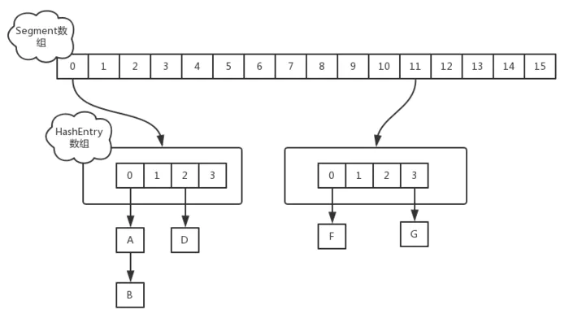
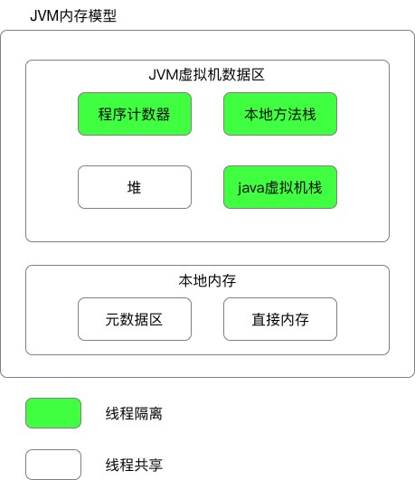
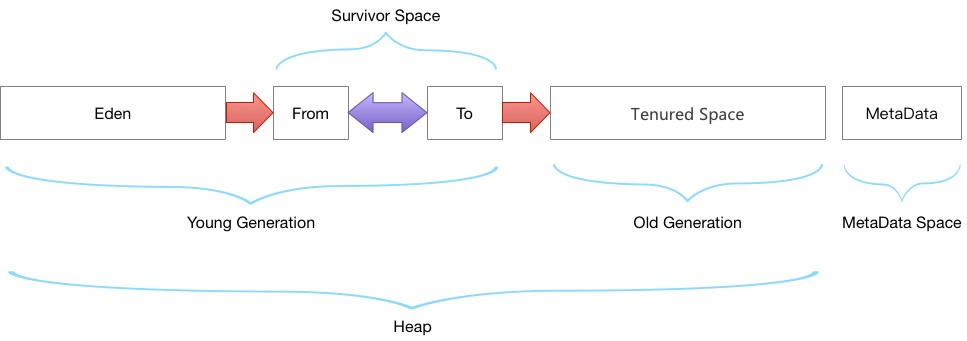

# Java 后端 Web开发

## 一、Java

### Java容器

#### HashMap

**重要字段**

- TREEIFY_THRESHOLD = 8; 链表转化为红黑树的阈值
- DEFAULT_INITIAL_CAPACITY = 1 << 4; 初始容量
- DEFAULT_LOAD_FACTOR = 0.75f; 阈值，当元素个数占总容量比例超过该值，则进行resize()
- threshold; 该值为capacity * loadfactor的计算结果

**hash()函数**

```java
static final int hash(Object key) {
    int h;
    return (key == null) ? 0 : (h = key.hashCode()) ^ (h >>> 16);
}
```
- HashMap中计算key在数组中的下标是通过hash(key) & (n - 1)得到的。
- 因为map容量始终是2次幂，n - 1的二进制数全为1，这样计算的下标就完全取决于hash(key)的结果，只要hash(key)能充分随机就好。


**HashMap多线程死循环**

在并发情况下，Jdk1.7的put方法使用的是头插法，当一个线程在进行扩容操作的时候，新的元素是从链表的头部插入，而此时如果有另一个线程也需要插入该元素，则会在这两个链表节点出现死循环的情况。
Jdk1.8已经改为尾插法，但是仍然不建议在高并发的场景使用HashMap，而应该使用ConcurrentHashMap。

#### ConcurrentHashMap



### Java虚拟机

#### JVM内存模型



1.8同1.7比，最大的差别就是：元数据区取代了永久代。

元空间的本质和永久代类似，都是对JVM规范中方法区的实现。

元空间与永久代最大的区别：元数据空间并不在虚拟机中，而是使用本地内存。

-----

##### 1. 程序计数器

每个线程一块，指向当前线程正在执行的字节码代码的行号。如果当前线程执行的是native方法，则其值为null。

主要有两个作用：

- 字节码解释器通过改变程序计数器来依次读取指令，从而实现代码的流程控制，如：顺序执行、选择、循环、异常处理。
- 在多线程的情况下，程序计数器用于记录当前线程执行的位置，从而当线程被切换回来的时候能够知道该线程上次运行到哪儿了。

程序计数器是唯一一个不会出现OutOfMemoryError的内存区域，它的生命周期随着线程的创建而创建，随着线程的结束而死亡。

-----

##### 2. Java虚拟机栈


Java虚拟机栈(JVM Stack)是线程私有的，生命周期与线程同进同退。

每个java方法在执行时都会创建一个栈帧(Stack Frame)用于存储**局部变量表、操作数栈、动态链接、方法出口等信息**。每一个方法从调用直至执行结束，就对应着一个栈帧从虚拟机栈中入栈到出栈的过程。

**局部变量表**：存放了编译期可知的各种基本类型(boolean、byte、char、short、int、float、long、double)、对象引用(reference 类型)和 returnAddress 类型(指向了一条字节码指令的地址)

StackOverflowError：线程请求的栈深度大于虚拟机所允许的深度。

OutOfMemoryError：如果虚拟机栈可以动态扩展，而扩展时无法申请到足够的内存。

------

##### 3. 本地方法栈

功能与Java虚拟机栈十分相同。

区别是，Java 虚拟机栈为虚拟机执行 Java 方法(也就是字节码)服务，而本地方法栈则为虚拟机使用到的 **Native方法**服务。

也会有 StackOverflowError 和 OutOfMemoryError 异常。

-----

##### 4. 元数据区
元数据区取代了1.7版本及以前的永久代。元数据区和永久代本质上都是方法区的实现。方法区存放虚拟机加载的**类信息，静态变量，常量等数据**。

-----

##### 5. 直接内存
在 JDK 1.4 中新加入 NIO (New Input/Output) 类，引入了一种基于通道(Channel)和缓存(Buffer)的 I/O 方式，它可以使用 Native 函数库直接分配堆外内存，然后通过一个存储在 Java 堆中的 DirectByteBuffer 对象作为这块内存的引用进行操作。可以避免在 Java 堆和 Native 堆中来回的数据耗时操作。

OutOfMemoryError：会受到本机内存限制，如果内存区域总和大于物理内存限制从而导致动态扩展时出现该异常。


-----

##### 6. 堆


堆是JVM**内存占用最大**，管理最复杂的一个区域。其唯一的用途就是存放**对象实例**：所有的对象实例及数组都在对上进行分配。

JDK1.8后，**字符串常量池**从永久代中剥离出来，存放在堆中。

堆的内存分配原则：

1. 新new的小对象都放在Eden区（伊甸园嘛，创造的地方）如果Eden区没有足够的空间时，虚拟机执行一次Minor GC。

2. 大对象直接进入老年代（大对象是指需要大量连续内存空间的对象）。这样做的目的是避免在Eden区和两个Survivor区之间发生大量的内存拷贝（新生代采用复制算法收集内存）。

3. 长期存活的对象进入老年代。虚拟机为每个对象定义了一个年龄计数器，如果对象经过了1次Minor GC那么对象会进入Survivor区，之后每经过一次Minor GC那么对象的年龄加1，知道达到阀值对象进入老年区。

4. 动态判断对象的年龄。如果Survivor区中相同年龄的所有对象大小的总和大于Survivor空间的一半，年龄大于或等于该年龄的对象可以直接进入老年代。

5. 空间分配担保。每次进行Minor GC时，JVM会计算Survivor区移至老年区的对象的平均大小，如果这个值大于老年区的剩余值大小则进行一次Full GC，如果小于检查HandlePromotionFailure设置，如果true则只进行Monitor GC,如果false则进行Full GC。

###### JVM GC算法

jvm虚拟机主要是为了解决程序中哪些需要回收、怎么回收、回收的时机是什么时候;

1. 哪些需要回收，这个问题主要是明确在jvm中哪些对象是垃圾对象，这里最主要设计到两种算法

   - <font color="#EE7AE9">引用计数算法（已经弃用）</font>

     特点：一种比较简单直观的算法，效率高

     原理：对象有一个引用，那么计数+1,删除一个引用计数-1，只收集计数为0的对象

     缺点：

     ​		<1>、互相引用的两个对象的计数器不为0，但是这个两个对象都已经属于无用的对象，这样会出现死锁的情况，占用内存。

     ​		<2>、由于引用计数算法需要计算每个对象被引用的次数，所以需要编译器的帮忙为每个对象装配计数器，增加了内存了占用率。

   - <font color="#EE7AE9">根搜索算法</font>

     特点：解决引用计数出现的问题

     原理：在若干对象中，从任意**根对象**到这个对象是不可达的状态的时候，那么这个对象就是属于可以回收的状态，

     根对象：

     ​			1>、虚拟机栈中的引用对象。

     ​			2>、方法区中静态属性引用的对象。

     ​			3>、方法区中常量引用的对象。

     ​			4>、本地方法栈JNI引用的对象。

2. 怎么回收，“哪些需要回收”中的两种算法已经解决了什么是“垃圾“的事情，这里所讲的算法是如何处理垃圾

   - <font color="#EE7AE9">复制算法</font>

     复制算法是将内存分成两片不同的区域，在任何时间点内，所动态分配的对象1只能存在于其中的一片区域内（活动区域)，而另一片的区域则是空闲（空闲区域），当活动区域的空间被动态分配的对象耗尽的时候，JVM会暂停线程，启动GC复制线程，GC线程更新存活对象的内存引用地址指向空闲的区域，这时候空闲区域就变成了活动区域，原来在旧活动区域的垃圾对象就会被清除，

     缺点：第一个是由于垃圾算法的特点，实际内存的使用率只有50%，造成内存空间的浪费。

     ​		   第二个是当某个对象的生存时间非常长的时候，复制算法来回的切换引用地址会造成性能的下降

   - <font color="#EE7AE9">标记-清除算法</font>

     标记清除算法操作比较简单，当有效空间快要被耗尽的时候，JVM就会遍历所有的对象进行标记垃圾对象的操作，遍历完之后就会清除所有的垃圾对象，剩下存活对象，算法结束。

     缺点：由于每次直接删除垃圾对象，会造成剩下的物理地址不是连续的，一旦有比较大的对象分配进入来之后；虽然有效空间的大小是可以分配进去这个比较新的对象的，但是由于地址不是连续的，所以这个对象就无法分配。

   - <font color="#EE7AE9">标记-整理算法</font>

     标记整理算法有两个过程，标记+整理

     和标记清除一样的GC过程，都是遍历所有的GC Root，标记可达的存活对象，但是会多出“整理”的过程，这个整理的过程实际上就是对存活下来的对象的物理地址进行整理，呈现有序的状态，这样就不用了担心有较大的对象进入之后无法分配对象的时候；

     缺点：虽然已经解决了标记清除带来内存的物理地址排列紊乱的情况，但是这个问题却被转化成每次标记整理的时候都需要进行相应的数据整理所带来时间增加的情况。

   - <font color="#EE7AE9">分代收集算法</font>

     分代算法的实际上并没有产生任何新的GC算法，只是将内存的区域进行划分，对不同的地方使用不同的GC策略。

     - 对象类型：

       ​	夭折对象（局部变量/循环内的临时变量）

       ​	老不死对象（缓存对象/数据库连接对象/单例对象...)

       ​	永恒对象（String池中的对象/类加载信息)

     - 对象内存的区域：

       ​	Java堆：夭折对象和老不死对象都生存在Java堆里面

       ​	方法区：永恒对象所在区域

     - Java堆区域划分详解：

       ​	Java堆主要分成两片区域：1/3的区域用于构建新生代、2/3的区域用于构建老年代，其中新生代又分成from:to:Eden = 1:1:8  from和to主要适用于复制算法，而Eden使用的算法是标记整理或者是标记清除

     - GC过程：每次对象都会在新生代中的Eden中产生，在进行younger GC的时候就会进入到from或者是to的区域内，年龄+1,在之后的younge GC的过程中都会对对象的年龄进行+1,当年龄达到一定的年龄的时候就会进入到老年代中，而老年代的对象由于存活时间一般都比较长，所以采用的GC算法是标记整理或者是标记清除的算法。

     - 对象的转换情况：

       ​	1、新生代每次GC都会伴随着年龄的增长，到达一定的年龄后直接进入到老年代中。

       ​	2、当内存无法容纳新的对象的时候，也会进入到老年代，所以老年代是新生代的备用仓库。

       ​	3、永恒对象只存在于方法区中，不存在与Java堆中任意位置

3. 什么时候进行回收

   young/minor gc：当新生代不足以分配内存给新生的对象的时候，就会触发一次young gc,在进行young gc前，程序会判断老年代内连续空间是否大于新生代所有对象的总和，如果不是那么就启动full gc，

   full gc:

   - 老年代空间不足以分配内存的时候，当创建一个新的对象时候，如果新生代的80%的空间不足以分配的时候会直接进入到老年代，如果此时老年代的空间不足以分配内存的时候就会触发full gc。
   - 当永久代的空间已满的时候，再往永久代填入对象的时候就会触发full gc。
   - 显示调用System.gc，显示调用会在调用full gc前会先调用一次young gc


------

#### 类的加载

当程序主动使用某个类时，如果该类还未被加载到内存中，则JVM会通过加载、连接、初始化3个步骤来对该类进行初始化。如果没有意外，JVM将会连续完成3个步骤，所以有时也把这个3个步骤统称为类加载或类初始化


##### 一、类的加载过程

###### 1.加载    

加载指的是将类的class文件读入到内存，并为之创建一个java.lang.Class对象，也就是说，当程序中使用任何类时，系统都会为之建立一个java.lang.Class对象。

类的加载由类加载器完成，类加载器通常由JVM提供，这些类加载器也是前面所有程序运行的基础，JVM提供的这些类加载器通常被称为系统类加载器。除此之外，开发者可以通过继承ClassLoader基类来创建自己的类加载器。

通过使用不同的类加载器，可以从不同来源加载类的二进制数据，通常有如下几种来源。

- 从本地文件系统加载class文件，这是前面绝大部分示例程序的类加载方式。
- 从JAR包加载class文件，这种方式也是很常见的，前面介绍JDBC编程时用到的数据库驱动类就放在JAR文件中，JVM可以从JAR文件中直接加载该class文件。
- 通过网络加载class文件。
- 把一个Java源文件动态编译，并执行加载。

类加载器通常无须等到“首次使用”该类时才加载该类，Java虚拟机规范允许系统预先加载某些类。

###### 2.链接

当类被加载之后，系统为之生成一个对应的Class对象，接着将会进入连接阶段，连接阶段负责把类的二进制数据合并到JRE中。类连接又可分为如下3个阶段。

1. 验证：验证阶段用于检验被加载的类是否有正确的内部结构，并和其他类协调一致。Java相对C++语言是安全的语言，例如它有C++不具有的数组越界的检查。这本身就是对自身安全的一种保护。验证阶段是Java非常重要的一个阶段，它会直接的保证应用是否会被恶意入侵的一道重要的防线，越是严谨的验证机制越安全。验证的目的在于确保Class文件的字节流中包含信息符合当前虚拟机要求，不会危害虚拟机自身安全。其主要包括四种验证，文件格式验证，元数据验证，字节码验证，符号引用验证。

    四种验证做进一步说明：

     - **文件格式验证**：主要验证字节流是否符合Class文件格式规范，并且能被当前的虚拟机加载处理。例如：主，次版本号是否在当前虚拟机处理的范围之内。常量池中是否有不被支持的常量类型。指向常量的中的索引值是否存在不存在的常量或不符合类型的常量。

     - **元数据验证**：对字节码描述的信息进行语义的分析，分析是否符合java的语言语法的规范。

     - **字节码验证**：最重要的验证环节，分析数据流和控制，确定语义是合法的，符合逻辑的。主要的针对元数据验证后对方法体的验证。保证类方法在运行时不会有危害出现。

     - **符号引用验证**：主要是针对符号引用转换为直接引用的时候，是会延伸到第三解析阶段，主要去确定访问类型等涉及到引用的情况，主要是要保证引用一定会被访问到，不会出现类等无法访问的问题。

1. 准备：类准备阶段负责为类的静态变量分配内存，并设置默认初始值。

2. 解析：将类的二进制数据中的符号引用替换成直接引用。说明一下：符号引用：符号引用是以一组符号来描述所引用的目标，符号可以是任何的字面形式的字面量，只要不会出现冲突能够定位到就行。布局和内存无关。直接引用：是指向目标的指针，偏移量或者能够直接定位的句柄。该引用是和内存中的布局有关的，并且一定加载进来的。

###### 3.初始化
    初始化是为类的静态变量赋予正确的初始值，准备阶段和初始化阶段看似有点矛盾，其实是不矛盾的，如果类中有语句：private static int a = 10，它的执行过程是这样的，首先字节码文件被加载到内存后，先进行链接的验证这一步骤，验证通过后准备阶段，给a分配内存，因为变量a是static的，所以此时a等于int类型的默认初始值0，即a=0,然后到解析（后面在说），到初始化这一步骤时，才把a的真正的值10赋给a,此时a=10。

-----

##### 二、类加载时机

1. 创建类的实例，也就是new一个对象
2. 访问某个类或接口的静态变量，或者调用类的静态方法
3. 反射（Class.forName("com.lyj.load")）
4. 初始化一个类的子类（会首先初始化子类的父类）
5. JVM启动时标明的启动类，即文件名和类名相同的那个类         

**除此之外，下面几种情形需要特别指出：**

- 对于一个final类型的静态变量，如果该变量的值在编译时就可以确定下来，那么这个变量相当于“宏变量”。
- Java编译器会在编译时直接把这个变量出现的地方替换成它的值，因此即使程序使用该静态变量，也不会导致该类的初始化。
- 反之，如果final类型的静态Field的值不能在编译时确定下来，则必须等到运行时才可以确定该变量的值，如果通过该类来访问它的静态变量，则会导致该类被初始化。

-----

##### 三、类加载器
    类加载器负责加载所有的类，其为所有被载入内存中的类生成一个java.lang.Class实例对象。一旦一个类被加载如JVM中，同一个类就不会被再次载入了。正如一个对象有一个唯一的标识一样，一个载入JVM的类也有一个唯一的标识。在Java中，一个类用其全限定类名（包括包名和类名）作为标识；但在JVM中，一个类用其全限定类名和其类加载器作为其唯一标识。例如，如果在pg的包中有一个名为Person的类，被类加载器ClassLoader的实例kl负责加载，则该Person类对应的Class对象在JVM中表示为(Person.pg.kl)。这意味着两个类加载器加载的同名类：（Person.pg.kl）和（Person.pg.kl2）是不同的、它们所加载的类也是完全不同、互不兼容的。

  JVM预定义有三种类加载器，当一个 JVM启动的时候，Java开始使用如下三种类加载器：

1. 根类加载器（bootstrap class loader）:它用来加载 Java 的核心类，是用原生代码来实现的，并不继承自 java.lang.ClassLoader（负责加载$JAVA_HOME中jre/lib/rt.jar里所有的class，由C++实现，不是ClassLoader子类）。由于引导类加载器涉及到虚拟机本地实现细节，开发者无法直接获取到启动类加载器的引用，所以不允许直接通过引用进行操作。

2. 扩展类加载器（extensions class loader）：它负责加载JRE的扩展目录，lib/ext或者由java.ext.dirs系统属性指定的目录中的JAR包的类。由Java语言实现，父类加载器为null。

3. 系统类加载器（system class loader）：被称为系统（也称为应用）类加载器，它负责在JVM启动时加载来自Java命令的-classpath选项、java.class.path系统属性，或者CLASSPATH环境变量所指定的JAR包和类路径。程序可以通过ClassLoader的静态方法getSystemClassLoader()来获取系统类加载器。如果没有特别指定，则用户自定义的类加载器都以此类加载器作为父加载器。由Java语言实现，父类加载器为ExtClassLoader。

    **类加载器加载Class大致要经过如下8个步骤：**

   1. 检测此Class是否载入过，即在缓冲区中是否有此Class，如果有直接进入第8步，否则进入第2步。
   2. 如果没有父类加载器，则要么Parent是根类加载器，要么本身就是根类加载器，则跳到第4步，如果父类加载器存在，则进入第3步。
   3. 请求使用父类加载器去载入目标类，如果载入成功则跳至第8步，否则接着执行第5步。
   4. 请求使用根类加载器去载入目标类，如果载入成功则跳至第8步，否则跳至第7步。
   5. 当前类加载器尝试寻找Class文件，如果找到则执行第6步，如果找不到则执行第7步。
   6. 从文件中载入Class，成功后跳至第8步。
   7. 抛出ClassNotFountException异常。
   8.  返回对应的java.lang.Class对象。

-----

##### 四、类加载机制

1. JVM的类加载机制主要有如下3种。

- **全盘负责**：所谓全盘负责，就是当一个类加载器负责加载某个Class时，该Class所依赖和引用其他Class也将由该类加载器负责载入，除非显示使用另外一个类加载器来载入。

- **缓存机制**。缓存机制将会保证所有加载过的Class都会被缓存，当程序中需要使用某个Class时，类加载器先从缓存区中搜寻该Class，只有当缓存区中不存在该Class对象时，系统才会读取该类对应的二进制数据，并将其转换成Class对象，存入缓冲区中。这就是为很么修改了Class后，必须重新启动JVM，程序所做的修改才会生效的原因。

- **双亲委派**：所谓的双亲委派，则是先让父类加载器试图加载该Class，只有在父类加载器无法加载该类时才尝试从自己的类路径中加载该类。

2. 双亲委派机制：

类加载器的父子结构：根加载器—>扩展类加载器—>应用程序加载器—>自定义加载器

- *内容：*

    在使用某类加载器加载class文件进入内存的时候，首先会使用根加载器进行加载，如果不能加载的话再逐层往下递归，直至到达指定的类加载器后才加载该类。

- *意义*

    1. 避免类的重复加载
    2. 防止核心API库被随意篡改：我们自己写的类会覆盖系统本身内部的类，造成系统内部程序的混乱，例如`java.lang.object`类

### 数据结构

### 锁和多线程

#### 线程池

### Spring

#### Spring IoC

[Spring Bean/IOC](https://www.awaimai.com/2596.html)

来自<[BeanDefinition的资源定位过程.md](https://github.com/doocs/source-code-hunter/blob/master/docs/Spring/IoC/1、BeanDefinition的资源定位过程.md)>

**BeanDefinition资源定位（ refresh() 方法）**

1. 首先初始化 BeanFactory ，调用 obtainFreshBeanFactory() ，其中需要子类实现自定义的 refreshBeanFactory() 和 getBeanFactory() 方法，返回子类定义好的 BeanFactory 。此外，获取到 BeanFactory 后，需要对 BeanFactory 执行各种初始化操作，比如注册 BeanPost 事件处理器、是否启用 lazy_init 等。
2. refreshBeanFactory() 方法中，要对 BeanFactory 进行定制化，比如是否开启注解装配等。然后，调用 loadBeanDefinitions() 载入 BeanDefinition 。
3. 在 loadBeanDefinitions() 中，子类 AbstractXmlApplicationContext 生成了 BeanDefinitionReader 并用该 Reader 执行真正的 loadBeanDefinitions() 。
4. loadBeanDefinitions() 中会调用 getResouce() 获取用户传入的配置文件路径，得到 FileSystemResource 对象，后续将对该对象进行相关 I/O 操作，进行 BeanDefinition 的读取和载入。

**将Bean解析成BeanDefinition**

1. BeanDefinitionReader 会对配置文件中元素进行解析，类似于解析 Jsoup HTML 文档。
2. 将 <Bean> 元素交给 parseBeanDefinitionElement() 方法处理，并将该 Bean 解析封装为 BeanDefinitionHolder 对象。

**将BeanDefinitionHolder注册进IoC容器**

其实就是存入一个 ConcurrentHashMap<String, BeanDefinition> 中。

#### Dependency Injection（依赖注入）

**Spring 中触发 IoC容器“依赖注入” 的方式有两种：**

1. 应用程序通过 getBean()方法 向容器索要 bean 实例时触发依赖注入。
2. 提前给 bean 配置了 lazy-init 属性为 false，Spring 在 IoC 容器初始化会自动调用此 bean 的 getBean() 方法，提前完成依赖注入。

**BeanFactory 的 getBean()和 doGetBean()**

依赖注入从 getBean() 开始，该方法由 BeanFactory 接口提供。 getBean() 方法提供多个重载，最终还是调用 doGetBean() 。

- 在 doGetBean() 中：
  1. 根据 beanName 去容器 Map 中查找，如果找到并且该 bean 是单例模式，直接返回。
  2. 如果没有找到该 bean 或者该 bean 不是单例模式，而且当前 BeanFactory 的父容器不为 null ，则需要委派父容器去创建 bean 。
  3. 父容器为 null 的话，就开始获取该 bean 的依赖，然后递归地对该 bean 的依赖 bean 进行 getBean() 。
  4. 根据当前 bean 的生存周期执行不同的前置方法，最终还是调用 createBean() 方法创建 bean 。
- createBean() 和 doCreateBean()
  - doCreateBean() 中主要有 createBeanInstance() 和 populateBean() 两个方法，分别用于生成 bean 所包含的 Java 对象，以及处理 bean 对象之间的依赖关系。
  - 在 doCreateBean() 中，有 initiate() 方法真正实例化 bean 对象，采用了两种策略来实例化 bean 对象： Java 反射机制和 CGLIB 。
  - 当 bean 对象在 xml 配置文件中没有覆盖 look-up method 或者 replace method 的时候，使用 Java 反射机制获取 bean 的构造函数进行实例化。
  - 反之，则使用 CGLIB 来实例化对象。
- lazy-init
  - 通过牺牲 IoC 容器初始化的性能，来有效提升应用第一次获取该 bean 的效率。
  - 在 refresh() 函数中实现。

**FactoryBean 接口和 BeanFactory 接口的区别**

- FactoryBean
  
    FactoryBean 是一个特殊的 Bean 。可以通过实现 FactoryBean 接口实现向 IoC 容器注册两个 Bean，一个是 Bean 本身，一个是 FactoryBean.getObject() 返回值代表的 Bean 。
- BeanFactory
  
    BeanFactory 是 Spring  IOC 容器的核心接口，它定义了容器的主要功能，如创建 bean，获取 bean 等，是用来管理 bean 的。

#### Spring AOP

面向切面编程，指在程序运行中，将代码动态地切入到类的指定方法、位置上，不影响主业务代码。 Spring AOP 是基于动态代理的，即运行时注入。

**Advice 增强**

有 beforeAdvice 和 afterAdvice ，分别在 Pointcut 的前、后执行。

**PointCut 切面**

通过正则表达式或者匹配方法名匹配相应需要 Advice 增强的方法。

**AOP 原理**

在 AopProxyFactory 中会为目标代理对象 target 调用 createAopProxy() 创建 AopProxy 代理对象，主要依据相应 Bean 是否实现了 InvocationHandler 接口，如果实现则使用 JDK 代理的方式代理对象，否则使用 CGLIB 。

#### Spring 事务

<来自[spring-transaction](https://github.com/Snailclimb/JavaGuide/blob/master/docs/system-design/framework/spring)>

理解ACID， MySQL 使用 Undolog 保证原子性。

##### 相关接口:

**PlatformTransactionManager**
（平台）事务管理器，Spring 事务策略的核心。

```java
public interface PlatformTransactionManager {
    //获得事务
    TransactionStatus getTransaction(@Nullable TransactionDefinition var1) throws TransactionException;
    //提交事务
    void commit(TransactionStatus var1) throws TransactionException;
    //回滚事务
    void rollback(TransactionStatus var1) throws TransactionException;
}
```

**TransactionDefinition**

事务定义信息(事务隔离级别、传播行为、超时、只读、回滚规则)。
定义了事务的传播行为、隔离级别、超时时间和是否为只读事务。

**TransactionStatus**

记录事务的运行状态。定义了一组方法,用来获取或判断事务的相应状态信息。

##### 传播行为:

**TransactionDefinition.PROPAGATION_REQUIRED**

默认的事务传播行为。如果当前存在事务，则加入该事务；如果当前没有事务，则创建一个新的事务。

```java
Class A {
    @Transactional(propagation=propagation.PROPAGATION_REQUIRED)
    public void aMethod {
        //do something
        B b = new B();
        b.bMethod();
    }
}
Class B {
    @Transactional(propagation=propagation.PROPAGATION_REQUIRED)
    public void bMethod {
       //do something
    }
}
```

只要其中一个方法回滚，整个事务均回滚。

**TransactionDefinition.PROPAGATION_REQUIRES_NEW**

- 不管外部方法是否开启事务，Propagation.REQUIRES_NEW 修饰的内部方法会新开启自己的事务，且开启的事务相互独立，互不干扰。
- 如果 aMethod() 发生异常回滚， bMethod() 不会跟着回滚，因为  bMethod() 开启了独立的事务。但是，如果  bMethod() 抛出了未被捕获的异常并且这个异常满足事务回滚规则的话， aMethod() 同样也会回滚，因为这个异常被  aMethod() 的事务管理机制检测到了。

**TransactionDefinition.PROPAGATION_NESTED**
如果 aMethod() 回滚的话，bMethod()和bMethod2()都要回滚，而bMethod()回滚的话，并不会造成 aMethod() 和bMethod()回滚。

##### 事务只读属性

- 如果给方法加上了Transactional注解的话，这个方法执行的所有sql会被放在一个事务中。
- 如果不加Transactional，每条sql会开启一个单独的事务，中间被其它事务改了数据，都会实时读取到最新值。
  1. 如果你一次执行单条查询语句，则没有必要启用事务支持，数据库默认支持 SQL 执行期间的读一致性；
  2. 如果你一次执行多条查询语句，例如统计查询，报表查询，在这种场景下，多条查询 SQL 必须保证整体的读一致性，否则，在前条 SQL 查询之后，后条 SQL 查询之前，数据被其他用户改变，则该次整体的统计查询将会出现读数据不一致的状态，此时，应该启用事务支持

**Spring AOP 自调用问题**

若同一类中的其他没有 @Transactional 注解的方法内部调用有 @Transactional 注解的方法，有@Transactional 注解的方法的事务会失效。
这是由于Spring AOP代理的原因造成的，因为只有当 @Transactional 注解的方法在类以外被调用的时候，Spring 事务管理才生效。

```java
@Service
public class MyService {
    private void method1() {
        method2();
     //......
    }
    @Transactional
    public void method2() {
        //......
    }
}
```

MyService 类中的method1()调用method2()就会导致method2()的事务失效。

#### Spring MVC

DispatcherServlet

- DispatcherServlet 通过多层继承 HttpServlet ，使用 Servlet API 来对 HTTP 请求进行响应。
- 它会对 MVC 的其他模块进行初始化，比如 HandlerMapper 和 ViewResolver 等。具有自己的 IoC 容器。
- 将 HTTP 请求转发给 HandlerAdapter 返回 handler 对象，也即 Controller ，执行相应的业务代码后，返回 ModelAndView 对象。将 ModelAndView 对象转发给 ViewResolver 渲染 HTML 页面。

## 二、计算机操作系统

### 进程与线程

#### 区别

**（一）调度**

线程是独立调度的基本单位，在同一进程中’线程的切换不会引起进程切换，从一个进程内的线程切换到另一个进程中的线程时，会引起进程切换。

**（二）拥有资源**

进程是资源分配的基本单位，但是线程不拥有资源，线程可以访问隶属进程的资源

**（三）系统开销**

由于创建或撤销进程时，系统都要为之分配或回收资源，如内存空间、I/O设备等，所付出的开销远大于创建或撤销线程时的开销。类似地，在进行进程切换时，涉及当前执行进程CPU环境的保存及新调度进程CPU环境的设置，而线程切换时只需保存和设置少量寄存器内容，开销很小。

**（四）通信方面**

进程间通信（IPC)需要进程同步和互斥手段的辅助，以保证数据的一致性。而线程间可以通过直接读/写同一进程中的数据段（如全局变量）来进行通信。

#### 进程间通信

1. 无名管道

    管道是通过调用pipe函数创建的，fd[0]用于读，fd[1]用于写

    ```C
    #include <unistd.h>
    int pipe(int fd[2]);
    ```

    它具有以下限制：
    - 半双工通信（单向交替传输）
    - 只能在父子进程中使用

2. FIFO（命名管道）

    ```C
    #include <sys/stat.h>
    int mkfifo(const char *path, mode_t mode);
    int mkfifoat(int fd, const char *path, mode_t mode);
    ```
    FIFO常用于client-server应用程序中，FIFO用作汇聚点，在Client进程和服务器进程之间传递数据

3. 消息队列

    相比FIFO，消息队列可以独立于读写进程存在，从而避免了FIFO中同步管道的打开和关闭时可能产生的困难；

4. 信号量

    他是一个计数器，用于多个进程提供对共享数据对象的访问
    - 避免了FIFO的同步阻塞问题，不需要进程自己提供同步方法；
    - 读进程可以根据消息类型有选择地接受消息，而不像FIFO那样只能默认的接收；

5. 共享存储

- 允许多个进程共享一个给定的存储区。因为数据不需要在进程之间复制，所以这是最快的一种IPC。

- 需要使用信号量用来同步对共享存储的访问。

- 多个进程可以讲同一个文件映射到它们的地址空间从而实现共享内存。另外XSI共享内存不是使用文件，二十使用内存的匿名段。

6. 套接字

    与其他通信机制不同的是，它可用于不同的机器间的进程通信。

#### 进程切换

从一个进程的运行转到另一个进程上运行，这个过程中经过下面这些变化：
1.  保存处理机上下文，包括程序计数器和其他寄存器。
2. 更新PCB信息。
3. 把进程的PCB移入相应的队列，如就绪、在某事件阻塞等队列。
4. 选择另一个进程执行，并更新其PCB。
5. 更新内存管理的数据结构。
6. 恢复处理机上下文。

#### 进程 线程 协程 管程 纤程

来自 <[知乎](https://zhuanlan.zhihu.com/p/26757689)> 

相关概念
任务、作业（Job，Task，Schedule）
在进程的概念出现之前，进程有着这样的称谓。
进程
为了使多个程序能够并发（同一时刻只有一个在运行，但感觉起来像多个同时运行；并行（同一时刻真的多个在运行，不是感觉像多个））的执行，操作系统需要一个结构来抽象和表示这个程序的运行。
• 进程是操作系统对一个正在运行的程序的一种抽象结构。
• 进程是指在操作系统中能独立运行并作为资源分配的基本单位，由一组机器指令、数据和堆栈等组成的能独立运行的活动实体。
• 操作系统可以同时运行多个进程，多个进程直接可以并发执行和交换信息。
• 进程在运行是需要一定的资源，如CPU、存储空间和I/O设备等。
**线程**
进程是资源分配的基本单位，进程的调度涉及到的内容比较多（存储空间，CPU，I/O资源等，进程现场保护），调度开销较大，在并发的切换过程效率较低。为了更高效的进行调度，提出了比进程更轻量的独立运行和调度的基本单位。
• 线程比进程更轻量
• 线程能独立运行，独立调度，拥有资源（一般是CPU资源，程序计数器等）
• 线程调度能大幅度减小调度的成本（相对于进程来说），线程的切换不会引起进程的切换
• 线程的引入进一步提高了操作系统的并发性，线程能并发执行
• 同一个进程的多个线程共享进程的资源（省去了资源调度现场保护的很多工作）
**协程、共行程序、Coroutine**
• 协程是用户模式下的轻量级线程，操作系统内核对协程一无所知
• 协程的调度完全有应用程序来控制，操作系统不管这部分的调度
• 一个线程可以包含一个或多个协程
• 协程拥有自己的寄存器上下文和栈，协程调度切换时，将寄存器上下纹和栈保存起来，在切换回来时恢复先前保运的寄存上下文和栈
• 协程能保留上一次调用时的状态，看到这里各种生成器（生成器是被阉割的协程）的概念浮现出来了。。
• Windows下的实现叫纤程
**纤程**
代码易移植性一直是平台间交互考虑的重点，在将引用程序从Unix移植到Windows的过程中，会存在一些类似于线程栈管理的不一致、结构和异常处理等问题，增加移植难度和成本。
为了帮助各公司更快、更正确地将他们的代码移植到Windows，Microsoft 在操作系统中增加了纤程（Fiber）。线程与纤程对比，有如下的特性：
• 线程是在Windows内核中实现的，操作系统会根据系统的调度算法对线程进行调度。
• 纤程是在用户模式下实现的，内核对纤程一无所知。
• 纤程是更轻量级的线程，一个线程可以包含一个或多个纤程
• 内核会对线程进行抢占式调度，线程一次只能执行一个纤程的代码（具体执行哪一个纤程由用户调度算法决定）
• 纤程的调度与线程的调度没有直接关系，操作系统随时可能会夺取纤程所在线程的运行权
• 除非正在运行的纤程显式的切换到另一个纤程，否则其他纤程将无法运行
• Windows有一套API来讲线程转换为纤程或者在同一个线程里面创建多个纤程
**管程**
把管程放最后还加了一道分割线原因是管程跟上面的几个概念不是同一类东东，虽然长得很像，就像Car和Bar一样。
**临界资源的概念：**
• 一次只允许一个进程访问的资源
• 多个进程只能互斥访问的资源
临界资源的访问需要同步操作，比如信号量就是一种方便有效的进程同步机制。但信号量的方式要求每个访问临界资源的进程都具有wait和signal操作。这样使大量的同步操作分散在各个进程中，不仅给系统管理带来了麻烦，而且会因同步操作的使用不当导致死锁。管程就是为了解决这样的问题而产生的。
操作系统中管理的各种软件和硬件资源，均可用数据结构抽象地描述其资源特性，即用少量信息和对该资源所执行的操作来表征该资源，而忽略它们的内部结构和实现细节。利用共享数据结构抽象地表示系统中的共享资源。而把对该共享数据结构实施的操作定义为一组过程，如资源的请求和释放过程request和release。进程对共享资源的申请、释放和其他操作，都是通过这组过程对共享数据结构的操作来实现的，这组过程还可以根据资源的情况接受或阻塞进程的访问，确保每次仅有一个进程使用该共享资源，这样就可以统一管理对共享资源的所有访问，实现临界资源互斥访问。
管程就是代表共享资源的数据结构以及由对该共享数据结构实施操作的一组过程所组成的资源管理程序共同构成的一个操作系统的资源管理模块。管程被请求和释放临界资源的进程所调用。
管程定义了一个数据结构和能为并发进程所执行（在该数据结构上）的一组操作，这组操作能同步进程和改变管程中的数据。
**超线程**
这个也是一个跟上面的概念不是一类事的概念，超线程是Intel CPU设计上的一种技术。
一个CPU物理核在同一时间只能执行一个线程，而线程的切换会消耗掉上万的始终周期，效率还不够高。超线程就是在实现同一个CPU物理核在同一时间能几乎执行两个线程的技术。这就是我们在Intel CPU的机子上的任务管理器中经常看到double的CPU物理核心的缘由。

### 用户态和内核态

### 死锁的必要条件

- 互斥：每个资源要么已经分配给了一个进程，要么就是可用的。

- 占有和等待：已经得到了某个资源的进程可以再请求新的资源。

- 不可抢占：已经分配给一个进程的资源不能强制性的被抢占，它只能被占有它的进程显式地释放。

- 环路等待：有两个或者两个以上地进程组成一条环路，该环路中的每个进程都在等待下一个进程所占有的资源。

## 三、计算机网络


### <font color="#69d">应用层</font>
应用层的作用是通过进程间交互来完成特定的网络应用
#### <font color="#99CC33">HTTP</font>

超文本传输协议（HTTP，HyperText Transfer Protocol)是互联网上应用最为广泛的一种网络协议。所有的WWW文件都必须遵守这个标准。设计HTTP最初的目的是为了提供一种发布和接收HTML页面的方法。

##### 1、HTTP 1.0/1.1/2.0 的区别

    HTTP 1.0: 每个TCP连接只能发送一个请求，TCP连接

###### HTTP 1.0 -> 1.1

- 新增了24个错误1状态响应码

- Host头处理：IP+hostname，否则400 Bad request

- 带宽优化：支持断点续传；支持只发送header信息，如果服务器认为客户端有权限请求服务器，则返回100，否则返回401

- 长连接：默认开启Connection:keep-alive参数

- 缓存策略的控制

###### HTTP 1.1 -> 2.0

- 采用二进制格式而非文本格式

- 完全的多路复用

- 使用了报头(Header)压缩，降低了开销

- 让服务器可以将响应主动的推送到客户端缓存中(server push)

##### 2、https的请求过程

 

 此处涉及一个问题是客户端如何验证证书是否有效，当客户端获取到签名证书之后，浏览器从签名证书中获取颁发者的信息，从颁发者的证书中找到CA证书（CA证书是所有电脑在操作系统安装时就已经装好），使用CA中心提供的公钥检验CA证书的有效性，然后再用CA证书中的公钥去验证的客户端获取到的签名证书的有效性。 

##### <font color="#99CC33"> 文件传输协议（FTP）：</font>

- FTP 是File TransferProtocol（文件传输协议）的英文简称，而中文简称为“文传协议”。用于Internet上的控制文件的双向传输。同时，它也是一个应用程序（Application）。
- 所有FTP应用程序都遵守同一种协议以传输文件。在FTP的使用当中，用户经常遇到两个概念："下载"（Download）和"上传"（Upload），用户可通过客户机程序向（从）远程主机上传（下载）文件。
- FTP的默认端口：控制端口一般为21，而数据端口不一定是20，这和FTP的应用模式有关，如果是主动模式，应该为20，如果为被动模式，由服务器端和客户端协商而定。

##### <font color="#99CC33"> 简单文件传输协议（TFTP）：</font>
    TFTP（Trivial File Transfer Protocol,简单文件传输协议）是TCP/IP协议族中的一个用来在客户机与服务器之间进行简单文件传输的协议，提供不复杂、开销不大的文件传输服务。端口号为69。

##### <font color="#99CC33"> 远程终端协议（TELNET）：</font>
    Telnet协议是TCP/IP协议族中的一员，是Internet远程登陆服务的标准协议和主要方式。它为用户提供了在本地计算机上完成远程主机工作的能力。
    在终端使用者的电脑上使用telnet程序，用它连接到服务器。终端使用者可以在telnet程序中输入命令，这些命令会在服务器上运行，就像直接在服务器的控制台上输入一样。
    可以在本地就能控制服务器。要开始一个telnet会话，必须输入用户名和密码来登录服务器。Telnet是常用的远程控制Web服务器的方法。

### <font color="#69d">传输层</font>

#### <font color="#99CC33">TCP</font>

**TCP三次握手**

假设A为客户端，B为服务器端。
- 首先B处于LISTEN(监听）状态，等待客户的连接请求。
- A向B发送连接请求报文，SYN=1,ACK=0,选择一个初始的序号x。
- B收到连接请求报文，如果同意建立连接，则向A发送连接确认报文，SYN=1,ACK=1,确认号为×+1,同时也选择一个初始的序号y。
- A收到B的连接确认报文后，还要向B发出确认，确认号为y+1,序号为X+1。
- B收到A的确认后，连接建立。

三次握手的原因：

- 第三次握手是为了防止失效的连接请求到达服务器，使服务器错误打开连接。

**TCP四次挥手**

同样假设A为客户端，B为服务端。
- A发送连接释放报文，FIN=1。
- B收到之后发出确认，此时TCP属于半关闭状态，B能向A发送数据但是A不能向B发送数据。
- 当B不再需要连接时，发送连接释放报文，FIN=1。
- A收到后发出确认，进入TIME-WAIT状态，等待2MSL(最大报文存活时间）后释放连接。
- B收到A的确认后释放连接。

四次挥手的原因：

- 客户端发送了FIN连接释放报文之后，服务器收到了这个报文，就进入了CLOSE-WAIT状态。这个状态是为了让服务器端发送还未传送完毕的数据，传送完毕之后，服务器会发送FIN连接释放报文。

TIME_WAIT

客户端接收到服务器端的FIN报文后进入此状态，此时并不是直接进入CLOSED状态，还需要等待一个时间计时器设置的时间2MSL。这么做有两个理由：
- 确保最后一个确认报文能够到达。如果B没收到A发送来的确认报文，那么就会重新发送连接释放请求报文，A等待一段时间就是为了处理这种情况的发生。
- 等待一段时间是为了让本连接持续时间内所产生的所有报文都从网络中消失，使得下一个新的连接不会出现旧的连接请求报文。

**ARQ协议——自动重传协议**

停等协议
- 发送端每发送一组包，维护一个计时器，超时未收到ack就重传。
- 接收端每收到一组包，确认是否为期待包，是则ack，否则等待。如果收到的是重复的包，ack当前包。

Go-Back-N协议
- 发送方维持发送窗口，接收方也维持一个接收窗口。接收方通过TCP报文段中的窗口字段告诉发送方自己的窗口大小，发送方根据这个值和其他的信息设置自己的窗口大小。
- 发送方根据滑动窗口协议同时发送n个包，接收方将对连续接收的最后一个有序包发送ack，说明该包之前的包都已经收到。

**流量控制 - TCP滑动窗口**

窗口是缓存的一部分，用来暂时存放字节流。发送方和接收方各有一个窗口，接收方通过TCP报文段中的窗口字段告诉发送方自己的窗口大小，发送方根据这个值和其他信息设置自己的窗口大小。

**拥塞控制**
- 慢开始
    最开始令cwnd = 1，收到ack后cwnd加倍，按照2、4、8…增长
- 拥塞避免
    当cwnd >= ssthresh时，cwnd每轮加1。如果遇到超时，ssthresh /= 2，然后慢开始
- 快重传/快恢复
    当连续收到三个重复的ack时，cwnd = ssthresh = cwnd / 2


#### <font color="#99CC33">UDP</font>

TCP与UDP区别总结：
1. TCP面向连接（如打电话要先拨号建立连接）;UDP是无连接的，即发送数据之前不需要建立连接
2. TCP提供可靠的服务，无差错，不丢失，不重复，且按序到达;UDP尽最大努力交付，即不保证可靠交付，没有拥塞控制，因此网络出现拥塞不会使源主机的发送速率降低
3. 流模式（TCP）与数据报模式(UDP)
4. 每一条TCP连接只能是点到点的;UDP支持一对一，一对多，多对一和多对多的交互通信
5. TCP首部开销20字节;UDP的首部开销小，只有8个字节
6. TCP的逻辑通信信道是全双工的可靠信道，UDP则是不可靠信道

### 网络层

#### ARP协议

- ARP协议是地址解析协议（Address Resolution Protocol）是通过解析IP地址得到MAC地址。

- ARP缓存表，这个表记录着IP地址与MAC地址的映射关系

- ARP协议的主要工作就是建立、查询、更新、删除ARP表项。

### 链路层

### 物理层

## 四、数据库

### 关系型数据库（MySQL）

#### 一、三大范式

##### 第一范式： 列不可分

1NF（第一范式）是对属性具有**原子性**的要求，不可再分，例如：
如果认为最后一列还可以再分成出生年，出生月，出生日，则它就不满足第一范式的要求。


##### 第二范式： 消除非主属性对码的部分函数依赖

2NF（第二范式）是对记录有**唯一性**的要求，即实体的唯一性，不存在部分依赖，每一列与主键都相关，例如：
该表明显说明了两个事物：学生信息和课程信息；正常的依赖应该是：学分依赖课程号，姓名依赖学号，但这里存在非主键字段对码的部分依赖，即与主键不相关，不满足第二范式的要求。


##### 第三范式： 消除非主属性对码的传递函数依赖

3NF（第三范式）对字段有**冗余性**的要求，任何字段不能由其他字段派生出来，它要求字段没有冗余，即不存在依赖传递，例如：

很明显，学院电话是一个冗余字段，因为存在依赖传递：（学号）→（学生）→（学院）→（学院电话）

#### 二、SQL语句执行原理：

- 第一步：将SQL语句发送到服务端执行
- 第二步：语句解析
  1. 查询高速缓存(library cache)
  2. 语句合法性检查(data dict cache)
  3. 语言含义检查(data dict cache)
  4. 获得对象解析锁(control structer)
  5. 数据访问权限的核对
  6. 确定最佳执行计划 
- 第三步：语句执行
- 第四步：提取数据

##### SQL语句中的函数、关键字、排序等执行的顺序：

1. FROM 子句返回初始结果集。
2. WHERE 子句排除不满足搜索条件的行。
3. GROUP BY 子句将选定的行收集到 GROUP BY 子句中各个唯一值的组中。
4. 选择列表中指定的聚合函数可以计算各组的汇总值。
5. 此外,HAVING 子句排除不满足搜索条件的行。
6. 计算所有的表达式;
7. 使用 order by 对结果集进行排序。
8. 查找你要搜索的字段。

##### SQL语句执行完整过程：

1. 客户端提交SQL语句，发送到服务端。
2. 服务端接收消息，在PGA中分配此次进程所需内存，并存储会话相关信息。
3. 服务器将SQL语句转化为ASCII码，并进行hash函数后再查询高速缓存。
4. 如果不在高速缓存中，则进行SQL语义解析，包括对语法的解析和对表、索引、视图等对象的解析，再根据语句生成一个执行计划，并核对用户的执行权限，最后生成编译代码。
5. 将本条SQL语句的信息存储到高速缓存中。
6. 为已编译的执行代码准备预处理数据。
7. 判断所需数据是否存在DB Buffer中，若不是则执行编译代码。
8. 记录日志。
9. 为事务建立回滚段。
10. 改写DB Buffer块的数据内容。

#### 三、事务隔离

##### 1、事务的特性（ACID）

- 原子性（Atomicity）。事务中所涉及的程序对数据库的修改操作要么全部成功，要么全部失败。
- 一致性（Consistency）。事务执行前和执行后来源和去向保持平衡。
- 隔离性（Isolation）。并发时每个事务是隔离的，相互不影响。
- 持久性（Durubility）。一旦事务成功提交，应该保证数据的完整存在。

##### 2、事务并发

1. **脏读（Dirty Read）**
   
    一个事务读到了另一个未提交事务修改过的数据

2. **丢失修改（Lost to modify）**
   
    指在一个事务读取一个数据时，另外一个事务也访问了该数据，那么在第一个事 务中修改了这个数据后，第二个事务也修改了这个数据。这样第一个事务内的修改结果就被丢失

3. **不可重复读（Non-Repeatable Read）**

    在一个事务中多次读取同一个数据时，由于别的事务修改了这个数据，导致结果出现不一致。

4. **幻读（Phantom）**

    在一个事务中使用相同的查询条件两次读取，第二次读取到了其他事务新插入的行。

##### 3、事务的隔离级别

MySQL默认为Repeatable-read（可重复读），Oracle默认为Read-commited（读已提交）,Oracle只支持Read-committed和Serializable。


1. read uncommitted 读未提交

所有事务都可以看到没有提交事务的数据。

2. read committed 读已提交

事务成功提交后才可以被查询到。

3. repeatable 重复读

同一个事务多个实例读取数据时，可能将未提交的记录查询出来，而出现幻读。MySQL默认级别

4. Serializable可串行化

强制的进行排序，在每个读读数据行上添加共享锁。会导致大量超时现象和锁竞争。

#### 四、MySQL索引

**索引**是存储引擎快速找到记录的一种数据结构。

##### 索引类型

1. 主键索引 Primary Key
2. 唯一索引 Unique
3. 普通索引/组合索引 Index
4. 全文索引 Fulltext

##### 创建索引的技巧

1. 维度高的列创建索引。数据列中不重复值出现的个数即为维度。
2. 对 where,on,group by,order by 中出现的列使用索引。
3. 对较小的数据列使用索引，这样会使索引文件更小，同时内存中也可以装载更多的索引键。
4. 为较长的字符串使用前缀索引。
5. 不要过多创建索引，除了增加额外的磁盘空间外，对于DML操作的速度影响很大，因为其每增删改一次就得从新建立索引。
6. 使用组合索引，可以减少文件索引大小，在使用时速度要优于多个单列索引。

##### 索引优化原则

原则如下：


##### MySQL和Oracle的区别

1. 空间上

Oracle是大型数据库，占用内存大、支持并发量大、访问量大，相对来说MySQL就比较轻便了

2. 锁


3. 提交方式

Oracle默认不自动提交，需要手动提交。Mysql默认自动提交。

4. 隔离级别

MySQL是repeatable read的隔离级别，而Oracle是read commited的隔离级别，同时二者都支持serializable串行化事务隔离级别，可以实现最高级别的。

5. sql语句的灵活性

mysql对sql语句有很多非常实用而方便的扩展，比如limit功能(分页)，insert可以一次插入多行数据，replace 语句；Oracle在这方面感觉更加稳重传统一些，Oracle的分页是通过伪列和子查询完成的，插入数据只能一行行的插入数据。


### 非关系型数据库（Redis）
