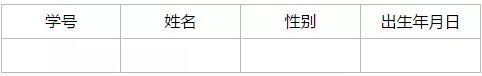
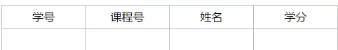
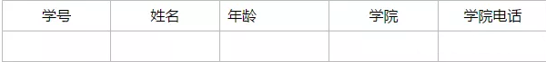
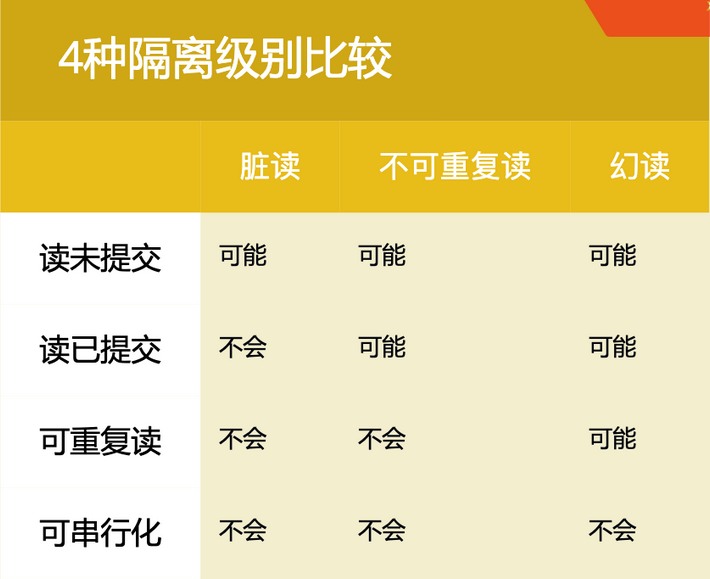
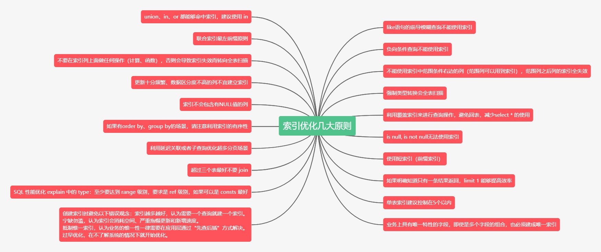

# 数据库基础

## 一、三大范式

### 第一范式： 列不可分
1NF（第一范式）是对属性具有原子性的要求，不可再分，例如：
如果认为最后一列还可以再分成出生年，出生月，出生日，则它就不满足第一范式的要求。


### 第二范式： 消除非主属性对码的部分函数依赖

2NF（第二范式）是对记录有唯一性的要求，即实体的唯一性，不存在部分依赖，每一列与主键都相关，例如：
该表明显说明了两个事物：学生信息和课程信息；正常的依赖应该是：学分依赖课程号，姓名依赖学号，但这里存在非主键字段对码的部分依赖，即与主键不相关，不满足第二范式的要求。


### 第三范式： 消除非主属性对码的传递函数依赖

3NF（第三范式）对字段有冗余性的要求，任何字段不能由其他字段派生出来，它要求字段没有冗余，即不存在依赖传递，例如：

很明显，学院电话是一个冗余字段，因为存在依赖传递：（学号）→（学生）→（学院）→（学院电话）

## 二、SQL语句执行原理：

- 第一步：将SQL语句发送到服务端执行
- 第二步：语句解析
  1. 查询高速缓存(library cache)
  2. 语句合法性检查(data dict cache)
  3. 语言含义检查(data dict cache)
  4. 获得对象解析锁(control structer)
  5. 数据访问权限的核对
  6. 确定最佳执行计划 
- 第三步：语句执行
- 第四步：提取数据

### SQL语句中的函数、关键字、排序等执行的顺序：

1. FROM 子句返回初始结果集。
2. WHERE 子句排除不满足搜索条件的行。
3. GROUP BY 子句将选定的行收集到 GROUP BY 子句中各个唯一值的组中。
4. 选择列表中指定的聚合函数可以计算各组的汇总值。
5. 此外,HAVING 子句排除不满足搜索条件的行。
6. 计算所有的表达式;
7. 使用 order by 对结果集进行排序。
8. 查找你要搜索的字段。

### SQL语句执行完整过程：

1. 客户端提交SQL语句，发送到服务端。
2. 服务端接收消息，在PGA中分配此次进程所需内存，并存储会话相关信息。
3. 服务器将SQL语句转化为ASCII码，并进行hash函数后再查询高速缓存。
4. 如果不在高速缓存中，则进行SQL语义解析，包括对语法的解析和对表、索引、视图等对象的解析，再根据语句生成一个执行计划，并核对用户的执行权限，最后生成编译代码。
5. 将本条SQL语句的信息存储到高速缓存中。
6. 为已编译的执行代码准备预处理数据。
7. 判断所需数据是否存在DB Buffer中，若不是则执行编译代码。
8. 记录日志。
9. 为事务建立回滚段。
10. 改写DB Buffer块的数据内容。

## 三、事务隔离

### 1、事务的特性（ACID）

- 原子性（Atomicity）。事务中所涉及的程序对数据库的修改操作要么全部成功，要么全部失败。

- 一致性（Consistency）。事务执行前和执行后来源和去向保持平衡。

- 隔离性（Isolation）。并发时每个事务是隔离的，相互不影响。

- 持久性（Durubility）。一旦事务成功提交，应该保证数据的完整存在。

### 2、事务并发

1. **脏读（Dirty Read）**

    一个事务读到了另一个未提交事务修改过的数据

2. **丢失修改（Lost to modify）**
    
    指在一个事务读取一个数据时，另外一个事务也访问了该数据，那么在第一个事 务中修改了这个数据后，第二个事务也修改了这个数据。这样第一个事务内的修改结果就被丢失

2. **不可重复读（Non-Repeatable Read）**

3. **幻读（Phantom）**


### 3、事务的隔离级别

MySQL默认为Repeatable-read（可重复读），Oracle默认为Read-commited（读已提交）,Oracle只支持Read-committed和Serializable。



1. read uncommitted 未提交读

所有事务都可以看到没有提交事务的数据。

2. read committed 提交读

事务成功提交后才可以被查询到。

3. repeatable 重复读

同一个事务多个实例读取数据时，可能将未提交的记录查询出来，而出现幻读。mysql默认级别

4. Serializable可串行化

强制的进行排序，在每个读读数据行上添加共享锁。会导致大量超时现象和锁竞争。

## 四、MySQL索引

**索引**是存储引擎快速找到记录的一种数据结构。

### 索引类型

1. 主键索引 Primary Key

2. 唯一索引 Unique

3. 普通索引/组合索引 Index

4. 全文索引 Fulltext

### 创建索引的技巧

1. 维度高的列创建索引。数据列中不重复值出现的个数即为维度。

2. 对 where,on,group by,order by 中出现的列使用索引。

3. 对较小的数据列使用索引，这样会使索引文件更小，同时内存中也可以装载更多的索引键。

4. 为较长的字符串使用前缀索引。

5. 不要过多创建索引，除了增加额外的磁盘空间外，对于DML操作的速度影响很大，因为其每增删改一次就得从新建立索引。

6. 使用组合索引，可以减少文件索引大小，在使用时速度要优于多个单列索引。

### 索引优化原则

原则如下：



## N、mybatis动态sql标签

- **if标签**

if标签通常用于WHERE语句，UPDATE语句、INSERT语句中，通过判断参数值来决定是否使用某个查询条件，判断是否更新某一个字段、判断是否插入某个字段

```sql
<if test = "name != null and name != ''">
	and NAME = #{name}
</if>
```


- **foreach标签**

foreach标签主要用于构建in条件，可在sql对集合进行迭代。也常用到批量删除、添加等操作中

```sql
<select id = "selectIn" resultMap="BaseResultMap">
	select name,hobby from student where id in
	<foreach item = "item" index="index" collection="list" open="(" separtor="," close=")">
		#{item}
	</foreach>
</select>
```

collection：collection属性的值有三个分别是list，array，map三种，分别对应的参数类型为：List、数组、map集合。

item：表示在迭代过程中的每一个元素的别名

index：表示迭代过程中每次迭代到的位置（下标）

open：前缀

close：后缀

separator：分隔符，表示迭代时每个元素之间以什么分隔

- **choose标签**

有时候我们并不想应用所有的条件，而只是想从多个选项中选一个。Mybatis提供了choose元素，按顺序判断when中的条件是否成立，如果一个成立，则choose结束。当choose中所有when都不满足的时候，则执行otherwise中的sql。类似于java的switch语句，choose为switch，when为case，otherwise则为default

```mysql
<select id="getStudentListChoose" parameterType="Student" resultMap="BaseResultMap">
    SELECT * from STUDENT WHERE 1=1
    <where>
        <choose>
            <when test="Name!=null and student!='' ">
                AND name LIKE CONCAT(CONCAT('%', #{student}),'%')
            </when>
            <when test="hobby!= null and hobby!= '' ">
                AND hobby = #{hobby}
            </when>
            <otherwise>
                AND AGE = 15
            </otherwise>
        </choose>
    </where>
</select>
```

- **where标签**

当if标签较多的时候，这样的组合可能会导致错误。如下：

```mysql
<select id="getStudentListWhere" parameterType="Object" resultMap="BaseResultMap">
    SELECT * from STUDENT WHERE
    <if test="name!=null and name!='' ">
        NAME LIKE CONCAT(CONCAT('%', #{name}),'%')
    </if>
    <if test="hobby!= null and hobby!= '' ">
        AND hobby = #{hobby}
    </if>
</select>
```

当name的值为空的时候，查询语句会出现WHERE AND 的情况，解决这种情况可以使用where标签。当标签返回的内容是以AND或OR开头的，标签会自动剔除。

```mysql
<select id="getStudentListWhere" parameterType="Object" resultMap="BaseResultMap">
    SELECT * from STUDENT
    <where>
        <if test="name!=null and name!='' ">
            NAME LIKE CONCAT(CONCAT('%', #{name}),'%')
        </if>
        <if test="hobby!= null and hobby!= '' ">
            AND hobby = #{hobby}
        </if>
    </where>
</select>
```

- **set标签**

没有适用if标签时，如果参数为null，都活导致错误。当update语句中使用if标签时，如果最后的if没有生效，则会导致逗号多余的错误。使用set标签可以动态的配置set关键字，和剔除追加到条件末尾的任何不相关的逗号。

```mysql
<update id="updateStudent" parameterType="Object">
    UPDATE STUDENT
    SET NAME = #{name},
    MAJOR = #{major},
    HOBBY = #{hobby}
    WHERE ID = #{id};
</update>

<update id="updateStudent" parameterType="Object">
    UPDATE STUDENT SET
    <if test="name!=null and name!='' ">
        NAME = #{name},
    </if>
    <if test="hobby!=null and hobby!='' ">
        MAJOR = #{major},
    </if>
    <if test="hobby!=null and hobby!='' ">
        HOBBY = #{hobby}
    </if>
    WHERE ID = #{id};
</update>
```

使用set+if标签修改后，如果某项为null则不进行更新，而是保持数据库原值

```mysql
<update id="updateStudent" parameterType="Object">
    UPDATE STUDENT
    <set>
        <if test="name!=null and name!='' ">
            NAME = #{name},
        </if>
        <if test="hobby!=null and hobby!='' ">
            MAJOR = #{major},
        </if>
        <if test="hobby!=null and hobby!='' ">
            HOBBY = #{hobby}
        </if>
    </set>
    WHERE ID = #{id};
</update>
```

- **trim标签**

trim标记是一个格式化的标记，主要用于拼接sql的条件语句（前缀或后缀的添加或忽略），

trim属性主要有以下4个

prefix：在trim标签内sql语句加上前缀

suffix：在trim标签内sql语句加上后缀

prefixOverrides：指定去除多余的前缀内容，如：prefixOverrides="AND|OR"，去除trim标签内sql语句多余的前缀"and"或者"or"

suffixOverrides：指定去除多余的后缀内容

使用场景

1. update

   ```mysql
   <update id="updateByPrimaryKey" parameterType="Object">
   	update student set 
   	<trim  suffixOverrides=",">
   		<if test="name != null">
   		    NAME=#{name},
   		</if>
   		<if test="hobby != null">
   		    HOBBY=#{hobby},
   		</if>
   	</trim> 
   	where id=#{id}
   </update>
   
   #如果name和hobby的值都不为空的话，会忽略最后一个“,”,执行如下语句
   update student set NAME='XXX',HOBBY='XXX' /*,*/ where id = 'XXX'
   ```

   

2. select中

   ```mysql
   <select id="selectByNameOrHobby" resultMap="BaseResultMap">
   	select * from student 
   	<trim prefix="WHERE" prefixOverrides="AND | OR">
   		<if test="name != null and name.length()>0"> 
   			AND name=#{name}
   		</if>
   		<if test="hobby != null and hobby.length()>0">
   			AND hobby=#{hobby}
   		</if>
   	</trim>
   </select>
   
   #如果name和hobby的值都不为空的话，会为片段添加“WHERE”前缀，并忽略第一“and”
   select * from student where /*and*/ name = 'XXX' and hobby = 'YYY'
   ```

   

3. insert中

   ```mysql
   <insert id="insert" parameterType="Object">
       insert into student 
   	<trim prefix="(" suffix=")" suffixOverrides=",">
   		<if test="name != null">
   			NAME,
   		</if>
   		<if test="hobby != null  ">
   			HOBBY,
   		</if>
   	</trim>
   	<trim prefix="values(" suffix=")" suffixOverrides=",">
   		<if test="name != null  ">
   			#{name},
   		</if>
   		<if test="hobby != null  ">
   			#{hobby},
   		</if>
   	</trim>
   </insert>
   ```

- **sql标签**

当多种类型的查询语句的查询字段或者查询条件相同的时候，可以将其定义为常量，方便调用。

```mysql
<!-- 查询字段 -->
<sql id="Base_Column_List">
    ID,MAJOR,BIRTHDAY,AGE,NAME,HOBBY
</sql>

<!-- 查询条件 -->
<sql id="Example_Where_Clause">
    where 1=1
    <trim suffixOverrides=",">
        <if test="id != null and id !=''">
            and id = #{id}
        </if>
        <if test="major != null and major != ''">
            and MAJOR = #{major}
        </if>
        <if test="birthday != null ">
            and BIRTHDAY = #{birthday}
        </if>
        <if test="age != null ">
            and AGE = #{age}
        </if>
        <if test="name != null and name != ''">
            and NAME = #{name}
        </if>
        <if test="hobby != null and hobby != ''">
            and HOBBY = #{hobby}
        </if>
        <if test="sorting != null">
            order by #{sorting}
        </if>
        <if test="sort!= null and sort != ''">
            order by ${sort} ${order}
        </if>
    </trim>
</sql>
```

- **include标签**

用于引用上面定义的常量

```mysql
<!-- 查询所有，不分页 -->
<select id="selectAll" resultMap="BaseResultMap">
    SELECT
    <include refid="Base_Column_List" />
    FROM student
    <include refid="Example_Where_Clause" />
</select>
```

### 分页查询
```
<!-- 分页查询 -->
<select id="select" resultMap="BaseResultMap">
    select * from (
        select tt.*,rownum as rowno from
        (
            SELECT
            <include refid="Base_Column_List" />
            FROM student
            <include refid="Example_Where_Clause" />
            ) tt
            <where>
                <if test="pageNum != null and rows != null">
                    and rownum
                    <![CDATA[<=]]>#{page}*#{rows}
                </if>
            </where>
        ) table_alias
    where table_alias.rowno>#{pageNum}
</select>
```

### 根据条件删除

```
<delete id="deleteByEntity" parameterType="java.util.Map">
    DELETE FROM student
    <include refid="Example_Where_Clause" />
</delete>
```

