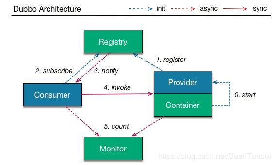

# **dubbo**

1. dubbo是什么？

   一款高性能轻量级开源的RPC框架

   a.提供面向接口的远程调用服务

   b.负载均衡和智能容错

   c.服务的自动发现和注册

   ***

2. 什么是RPC以及其原理

   - **RPC**：远程过程调用，即一个节点向另一个节点请求服务的过程

   - **原理**：在客户端的底层和服务端的底层分别进行封装，客户端调用客户端的封装模块，找到服务端的地址，并进行协议的封装，调用服务端封装模块，服务端封装模块调用本地的服务，并进行返回，客户端封装模块进行封装返回给客户端。

     

   ***

3. 相比于http请求,dubbo所具备的好处

   - 负载均衡，可以同时部署于不同的机器中
   - 服务注册与发现，能够高效的找到需要的服务地址
   - 服务降级的功能，能够对服务进行容错
   - 可以监控服务的调用情况，根据统计情况，对服务进行治理

   ****

4. 分布式的优缺点

   优点：

   - 增加团队的开发效率，每个团队负责一个模块或者服务的开发
   - 服务切分后，更好扩展和维护以及复用
   - 分布式部署之后能够更好地治理以及管理资源
   - 降低组件的复杂度，提高运行效率，增加可靠性和容错性

   缺点：

   - 程序开发的学习成本增加
   - 服务之间的调用会造成网络传输的损耗
   - 数据传输的过程中存在安全问题
   - 故障排查定位比较困难

5. dubbo中各节点的作用

   

   - Container：运行服务的容器

     ​			1、负责启动加载提供者

   - Registry：注册中心

     ​			1、接受注册和订阅

     ​			2、当服务变更的时候，基于长连接将变更数据推送给消费者

   - Provider：服务提供者

     ​			1、
