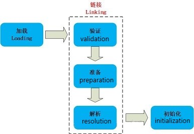

# Java虚拟机（Java Vurtual Machine）

## JVM内存模型

1.8同1.7比，最大的差别就是：元数据区取代了永久代。

元空间的本质和永久代类似，都是对JVM规范中方法区的实现。

元空间与永久代最大的区别：元数据空间并不在虚拟机中，而是使用本地内存。

-----

### 1. 程序计数器
每个线程一块，指向当前线程正在执行的字节码代码的行号。如果当前线程执行的是native方法，则其值为null。

-----

### 2. Java虚拟机栈

Java虚拟机栈(JVM Stack)是线程私有的，生命周期与线程同进同退。

每个java方法在执行时都会创建一个栈帧(Stack Frame)用于存储局部变量表、操作数栈、动态链接、方法出口等信息。每一个方法从调用直至执行结束，就对应着一个栈帧从虚拟机栈中入栈到出栈的过程。

**局部变量表**：存放了编译期可知的各种基本类型(boolean、byte、char、short、int、float、long、double)、对象引用(reference 类型)和 returnAddress 类型(指向了一条字节码指令的地址)

StackOverflowError：线程请求的栈深度大于虚拟机所允许的深度。

OutOfMemoryError：如果虚拟机栈可以动态扩展，而扩展时无法申请到足够的内存。

------

### 3. 本地方法栈
功能与Java虚拟机栈十分相同。

区别是，Java 虚拟机栈为虚拟机执行 Java 方法(也就是字节码)服务，而本地方法栈则为虚拟机使用到的 Native 方法服务。

也会有 StackOverflowError 和 OutOfMemoryError 异常。

-----

### 4. 元数据区
元数据区取代了1.7版本及以前的永久代。元数据区和永久代本质上都是方法区的实现。方法区存放虚拟机加载的类信息，静态变量，常量等数据。

-----

### 5. 直接内存
在 JDK 1.4 中新加入 NIO (New Input/Output) 类，引入了一种基于通道(Channel)和缓存(Buffer)的 I/O 方式，它可以使用 Native 函数库直接分配堆外内存，然后通过一个存储在 Java 堆中的 DirectByteBuffer 对象作为这块内存的引用进行操作。可以避免在 Java 堆和 Native 堆中来回的数据耗时操作。

OutOfMemoryError：会受到本机内存限制，如果内存区域总和大于物理内存限制从而导致动态扩展时出现该异常。

-----

### 6. 堆

堆是JVM内存占用最大，管理最复杂的一个区域。其唯一的用途就是存放对象实例：所有的对象实例及数组都在对上进行分配。1.8后，字符串常量池从永久代中剥离出来，存放在堆中。

**堆**的内存分配原则：

1. 新new的对象都放在Eden区（伊甸园嘛，创造的地方）如果Eden区没有足够的空间时，虚拟机执行一次Minor GC。

2. 大对象直接进入老年代（大对象是指需要大量连续内存空间的对象）。这样做的目的是避免在Eden区和两个Survivor区之间发生大量的内存拷贝（新生代采用复制算法收集内存）。

3. 长期存活的对象进入老年代。虚拟机为每个对象定义了一个年龄计数器，如果对象经过了1次Minor GC那么对象会进入Survivor区，之后每经过一次Minor GC那么对象的年龄加1，知道达到阀值对象进入老年区。

4. 动态判断对象的年龄。如果Survivor区中相同年龄的所有对象大小的总和大于Survivor空间的一半，年龄大于或等于该年龄的对象可以直接进入老年代。

5. 空间分配担保。每次进行Minor GC时，JVM会计算Survivor区移至老年区的对象的平均大小，如果这个值大于老年区的剩余值大小则进行一次Full GC，如果小于检查HandlePromotionFailure设置，如果true则只进行Monitor GC,如果false则进行Full GC。

#### JVM GC算法

jvm虚拟机主要是为了解决程序中哪些需要回收、怎么回收、回收的时机是什么时候;

1. 哪些需要回收，这个问题主要是明确在jvm中哪些对象是垃圾对象，这里最主要设计到两种算法

   - 引用计数算法（已经弃用）

     特点：一种比较简单直观的算法，效率高

     原理：对象有一个引用，那么计数+1,删除一个引用计数-1，只收集计数为0的对象

     缺点：

     ​		<1>、互相引用的两个对象的计数器不为0，但是这个两个对象都已经属于无用的对象，这样会出现死锁的情况，占用内存。

     ​		<2>、由于引用计数算法需要计算每个对象被引用的次数，所以需要编译器的帮忙为每个对象装配计数器，增加了内存了占用率。

   - 根搜索算法

     特点：解决引用计数出现的问题

     原理：在若干对象中，从任意**根对象**到这个对象是不可达的状态的时候，那么这个对象就是属于可以回收的状态，

     根对象：

     ​			1>、虚拟机栈中的引用对象。

     ​			2>、方法区中静态属性引用的对象。

     ​			3>、方法区中常量引用的对象。

     ​			4>、本地方法栈JNI引用的对象。

2. 怎么回收，“哪些需要回收”中的两种算法已经解决了什么是“垃圾“的事情，这里所讲的算法是如何处理垃圾

   - 复制算法

     复制算法是将内存分成两片不同的区域，在任何时间点内，所动态分配的对象1只能存在于其中的一片区域内（活动区域)，而另一片的区域则是空闲（空闲区域），当活动区域的空间被动态分配的对象耗尽的时候，JVM会暂停线程，启动GC复制线程，GC线程更新存活对象的内存引用地址指向空闲的区域，这时候空闲区域就变成了活动区域，原来在旧活动区域的垃圾对象就会被清除，

     缺点：第一个是由于垃圾算法的特点，实际内存的使用率只有50%，造成内存空间的浪费。

     ​		   第二个是当某个对象的生存时间非常长的时候，复制算法来回的切换引用地址会造成性能的下降

   - 标记-清除算法

     标记清除算法操作比较简单，当有效空间快要被耗尽的时候，JVM就会遍历所有的对象进行标记垃圾对象的操作，遍历完之后就会清除所有的垃圾对象，剩下存活对象，算法结束。

     缺点：由于每次直接删除垃圾对象，会造成剩下的物理地址不是连续的，一旦有比较大的对象分配进入来之后；虽然有效空间的大小是可以分配进去这个比较新的对象的，但是由于地址不是连续的，所以这个对象就无法分配。

   - 标记-整理算法

     标记整理算法有两个过程，标记+整理

     和标记清除一样的GC过程，都是遍历所有的GC Root，标记可达的存活对象，但是会多出“整理”的过程，这个整理的过程实际上就是对存活下来的对象的物理地址进行整理，呈现有序的状态，这样就不用了担心有较大的对象进入之后无法分配对象的时候；

     缺点：虽然已经解决了标记清除带来内存的物理地址排列紊乱的情况，但是这个问题却被转化成每次标记整理的时候都需要进行相应的数据整理所带来时间增加的情况。

   - 分代收集算法

     分代算法的实际上并没有产生任何新的GC算法，只是将内存的区域进行划分，对不同的地方使用不同的GC策略。

     - 对象类型：

       ​	夭折对象（局部变量/循环内的临时变量）

       ​	老不死对象（缓存对象/数据库连接对象/单例对象...)

       ​	永恒对象（String池中的对象/类加载信息)

     - 对象内存的区域：

       ​	Java堆：夭折对象和老不死对象都生存在Java堆里面

       ​	方法区：永恒对象所在区域

     - Java堆区域划分详解：

       ​	Java堆主要分成两片区域：1/3的区域用于构建新生代、2/3的区域用于构建老年代，其中新生代又分成from:to:Eden = 1:1:8  from和to主要适用于复制算法，而Eden使用的算法是标记整理或者是标记清除

     - GC过程：每次对象都会在新生代中的Eden中产生，在进行younger GC的时候就会进入到from或者是to的区域内，年龄+1,在之后的younge GC的过程中都会对对象的年龄进行+1,当年龄达到一定的年龄的时候就会进入到老年代中，而老年代的对象由于存活时间一般都比较长，所以采用的GC算法是标记整理或者是标记清除的算法。

     - 对象的转换情况：

       ​	1、新生代每次GC都会伴随着年龄的增长，到达一定的年龄后直接进入到老年代中。

       ​	2、当内存无法容纳新的对象的时候，也会进入到老年代，所以老年代是新生代的备用仓库。

       ​	3、永恒对象只存在于方法区中，不存在与Java堆中任意位置

3. 什么时候进行回收

   young/minor gc：当新生代不足以分配内存给新生的对象的时候，就会触发一次young gc,在进行young gc前，程序会判断老年代内连续空间是否大于新生代所有对象的总和，如果不是那么就启动full gc，

   full gc:

   - 老年代空间不足以分配内存的时候，当创建一个新的对象时候，如果新生代的80%的空间不足以分配的时候会直接进入到老年代，如果此时老年代的空间不足以分配内存的时候就会触发full gc。
   - 当永久代的空间已满的时候，再往永久代填入对象的时候就会触发full gc。
   - 显示调用System.gc，显示调用会在调用full gc前会先调用一次young gc

------

## 类的加载

当程序主动使用某个类时，如果该类还未被加载到内存中，则JVM会通过加载、连接、初始化3个步骤来对该类进行初始化。如果没有意外，JVM将会连续完成3个步骤，所以有时也把这个3个步骤统称为类加载或类初始化

### 一、类的加载过程

#### 1.加载    

加载指的是将类的class文件读入到内存，并为之创建一个java.lang.Class对象，也就是说，当程序中使用任何类时，系统都会为之建立一个java.lang.Class对象。

类的加载由类加载器完成，类加载器通常由JVM提供，这些类加载器也是前面所有程序运行的基础，JVM提供的这些类加载器通常被称为系统类加载器。除此之外，开发者可以通过继承ClassLoader基类来创建自己的类加载器。

通过使用不同的类加载器，可以从不同来源加载类的二进制数据，通常有如下几种来源。

- 从本地文件系统加载class文件，这是前面绝大部分示例程序的类加载方式。
- 从JAR包加载class文件，这种方式也是很常见的，前面介绍JDBC编程时用到的数据库驱动类就放在JAR文件中，JVM可以从JAR文件中直接加载该class文件。
- 通过网络加载class文件。
- 把一个Java源文件动态编译，并执行加载。

类加载器通常无须等到“首次使用”该类时才加载该类，Java虚拟机规范允许系统预先加载某些类。

#### 2.链接

当类被加载之后，系统为之生成一个对应的Class对象，接着将会进入连接阶段，连接阶段负责把类的二进制数据合并到JRE中。类连接又可分为如下3个阶段。

1. 验证：验证阶段用于检验被加载的类是否有正确的内部结构，并和其他类协调一致。Java相对C++语言是安全的语言，例如它有C++不具有的数组越界的检查。这本身就是对自身安全的一种保护。验证阶段是Java非常重要的一个阶段，它会直接的保证应用是否会被恶意入侵的一道重要的防线，越是严谨的验证机制越安全。验证的目的在于确保Class文件的字节流中包含信息符合当前虚拟机要求，不会危害虚拟机自身安全。其主要包括四种验证，文件格式验证，元数据验证，字节码验证，符号引用验证。

    四种验证做进一步说明：

     - **文件格式验证**：主要验证字节流是否符合Class文件格式规范，并且能被当前的虚拟机加载处理。例如：主，次版本号是否在当前虚拟机处理的范围之内。常量池中是否有不被支持的常量类型。指向常量的中的索引值是否存在不存在的常量或不符合类型的常量。

     - **元数据验证**：对字节码描述的信息进行语义的分析，分析是否符合java的语言语法的规范。

     - **字节码验证**：最重要的验证环节，分析数据流和控制，确定语义是合法的，符合逻辑的。主要的针对元数据验证后对方法体的验证。保证类方法在运行时不会有危害出现。

     - **符号引用验证**：主要是针对符号引用转换为直接引用的时候，是会延伸到第三解析阶段，主要去确定访问类型等涉及到引用的情况，主要是要保证引用一定会被访问到，不会出现类等无法访问的问题。

1. 准备：类准备阶段负责为类的静态变量分配内存，并设置默认初始值。

2. 解析：将类的二进制数据中的符号引用替换成直接引用。说明一下：符号引用：符号引用是以一组符号来描述所引用的目标，符号可以是任何的字面形式的字面量，只要不会出现冲突能够定位到就行。布局和内存无关。直接引用：是指向目标的指针，偏移量或者能够直接定位的句柄。该引用是和内存中的布局有关的，并且一定加载进来的。

#### 3.初始化
    初始化是为类的静态变量赋予正确的初始值，准备阶段和初始化阶段看似有点矛盾，其实是不矛盾的，如果类中有语句：private static int a = 10，它的执行过程是这样的，首先字节码文件被加载到内存后，先进行链接的验证这一步骤，验证通过后准备阶段，给a分配内存，因为变量a是static的，所以此时a等于int类型的默认初始值0，即a=0,然后到解析（后面在说），到初始化这一步骤时，才把a的真正的值10赋给a,此时a=10。

-----

### 二、类加载时机

1. 创建类的实例，也就是new一个对象
2. 访问某个类或接口的静态变量，或者对该静态变量赋值
3. 调用类的静态方法
4. 反射（Class.forName("com.lyj.load")）
5. 初始化一个类的子类（会首先初始化子类的父类）
6. JVM启动时标明的启动类，即文件名和类名相同的那个类         

      **除此之外，下面几种情形需要特别指出：**

- 对于一个final类型的静态变量，如果该变量的值在编译时就可以确定下来，那么这个变量相当于“宏变量”。
- Java编译器会在编译时直接把这个变量出现的地方替换成它的值，因此即使程序使用该静态变量，也不会导致该类的初始化。
- 反之，如果final类型的静态Field的值不能在编译时确定下来，则必须等到运行时才可以确定该变量的值，如果通过该类来访问它的静态变量，则会导致该类被初始化。

-----

### 三、类加载器
    类加载器负责加载所有的类，其为所有被载入内存中的类生成一个java.lang.Class实例对象。一旦一个类被加载如JVM中，同一个类就不会被再次载入了。正如一个对象有一个唯一的标识一样，一个载入JVM的类也有一个唯一的标识。在Java中，一个类用其全限定类名（包括包名和类名）作为标识；但在JVM中，一个类用其全限定类名和其类加载器作为其唯一标识。例如，如果在pg的包中有一个名为Person的类，被类加载器ClassLoader的实例kl负责加载，则该Person类对应的Class对象在JVM中表示为(Person.pg.kl)。这意味着两个类加载器加载的同名类：（Person.pg.kl）和（Person.pg.kl2）是不同的、它们所加载的类也是完全不同、互不兼容的。

  JVM预定义有三种类加载器，当一个 JVM启动的时候，Java开始使用如下三种类加载器：

1. 根类加载器（bootstrap class loader）:它用来加载 Java 的核心类，是用原生代码来实现的，并不继承自 java.lang.ClassLoader（负责加载$JAVA_HOME中jre/lib/rt.jar里所有的class，由C++实现，不是ClassLoader子类）。由于引导类加载器涉及到虚拟机本地实现细节，开发者无法直接获取到启动类加载器的引用，所以不允许直接通过引用进行操作。

2. 扩展类加载器（extensions class loader）：它负责加载JRE的扩展目录，lib/ext或者由java.ext.dirs系统属性指定的目录中的JAR包的类。由Java语言实现，父类加载器为null。

3. 系统类加载器（system class loader）：被称为系统（也称为应用）类加载器，它负责在JVM启动时加载来自Java命令的-classpath选项、java.class.path系统属性，或者CLASSPATH环境变量所指定的JAR包和类路径。程序可以通过ClassLoader的静态方法getSystemClassLoader()来获取系统类加载器。如果没有特别指定，则用户自定义的类加载器都以此类加载器作为父加载器。由Java语言实现，父类加载器为ExtClassLoader。

    **类加载器加载Class大致要经过如下8个步骤：**

   1. 检测此Class是否载入过，即在缓冲区中是否有此Class，如果有直接进入第8步，否则进入第2步。
   2. 如果没有父类加载器，则要么Parent是根类加载器，要么本身就是根类加载器，则跳到第4步，如果父类加载器存在，则进入第3步。
   3. 请求使用父类加载器去载入目标类，如果载入成功则跳至第8步，否则接着执行第5步。
   4. 请求使用根类加载器去载入目标类，如果载入成功则跳至第8步，否则跳至第7步。
   5. 当前类加载器尝试寻找Class文件，如果找到则执行第6步，如果找不到则执行第7步。
   6. 从文件中载入Class，成功后跳至第8步。
   7. 抛出ClassNotFountException异常。
   8.  返回对应的java.lang.Class对象。

-----

### 四、类加载机制

1. JVM的类加载机制主要有如下3种。

- 全盘负责：所谓全盘负责，就是当一个类加载器负责加载某个Class时，该Class所依赖和引用其他Class也将由该类加载器负责载入，除非显示使用另外一个类加载器来载入。

- 缓存机制。缓存机制将会保证所有加载过的Class都会被缓存，当程序中需要使用某个Class时，类加载器先从缓存区中搜寻该Class，只有当缓存区中不存在该Class对象时，系统才会读取该类对应的二进制数据，并将其转换成Class对象，存入缓冲区中。这就是为很么修改了Class后，必须重新启动JVM，程序所做的修改才会生效的原因。

- 双亲委派：所谓的双亲委派，则是先让父类加载器试图加载该Class，只有在父类加载器无法加载该类时才尝试从自己的类路径中加载该类。

2. 双亲委派机制：

    类加载器的父子结构：根加载器—>扩展类加载器—>应用程序加载器—>自定义加载器

*内容：*

     在使用某类加载器加载类的二进制文件进入内存的时候，首先会使用根加载器进行加载，如果不能加载的话再逐层往下递归，直至到达指定的类加载器后才加载该类。

*意义*

1. 避免类的重复加载

2. 防止核心API库被随意篡改：我们自己写的类会覆盖系统本身内部的类，造成系统内部程序的混乱，例如`java.lang.object`类

------

