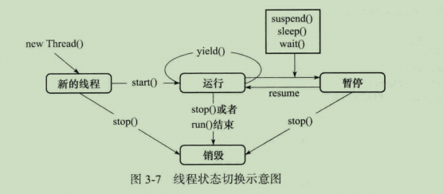

# <font color="#9c3">多线程</font>

## 进程与线程

### 区别
- 调度的基本单位
进程是操作系统资源分配的基本单位，而线程是任务调度和执行的基本单位
直白的说；线程是进程的一部分，一个操作系统有多个进程运行，而一个进程里面有多个线程进行（通过CPU进行调度，每个时间片只有一个线程）.
- 拥有的资源
进程可以拥有资源，而线程本身并不拥有系统资源
- 独立性
同一进程内的线程的独立性要比线程间的独立性低得多。
每一个进程都有独立的地址空间和其他资源。
- 系统开销
进程在每次被调度时，都需要上下文切换，系统开销大；在创建和撤销进程时，系统都要为之分配和回收进程控制块、其他如内存空间和I/O设备等资源。线程的切换代价远低于进程，无需操作系统内核的干预。
- 支持多处理机系统
多线程进程可以应用到多处理机系统中，并行执行提高了进程效率。

### 进程间通讯
- 无名管道(Pipe)：
  - 管道为半双工的；
  - 管道只能在具有公共祖先的两个进程之间使用，通常，一个管道由一个进程创建，在进程调用fork之后，这个管道就能在父进程和子进程之间使用了。
- 命名管道(FIFO)：
  - 其可以在不相关的程序之间交换数据。
  - FIFO其实是一种文件类型，创建FIFO类似于创建文件；
- 信号量(Semophore)：
  - 它是一个计数器，用于为多个进程提供共享数据对象的访问。
- 消息队列(Message Queue)：
  - 消息队列是消息的链接表，存储在内核中，有消息队列标识符标识。
- 消息传递系统(Message Passing System)
  - 直接通信方式
    - 利用操作系统提供的发送原语，直接把消息发送给目标进程
  - 间接通信方式
    - 发送和接收进程，都通过共享中间实体(邮箱)的方式进行。
- 共享储存器系统(Shared-Memory System)：
  - 共享存储允许两个或多个进程共享一个给定的存储区。
  - 共享内存无须复制，信息量大是其最大的优势。但是需要考虑同步问题。
- 客户机-服务器系统(Client-Server System)
  - 套接字(Socket)：
    - 是一种通信机制，凭借这种机制，客户/服务器（即要进行通信的进程）系统的开发工作既可以在本地单机上进行，也可以跨网络进行。
    - 也就是说它可以让不在同一台计算机但通过网络连接计算机上的进程进行通信。也因为这样，套接字明确地将客户端和服务器区分开来。
  - 远程过程调用(RPC, Remote Process Call)

### 线程间通讯

- 锁机制
  - 互斥锁：提供了以排它方式阻止数据结构被并发修改的方法。(volatile/reentrantLock)
  - 读写锁：允许多个线程同时读共享数据，而对写操作互斥。(readwriteLock)
  - 条件变量锁：可以以原子的方式阻塞进程，直到某个特定条件为真为止。对条件测试是在互斥锁的保护下进行的。条件变量始终与互斥锁一起使用。
- 信号量机制
  - 无名线程信号量
  - 有名线程信号量
- 管道通信
  - 使用java.io.PipedInputStream 和 java.io.PipedOutputStream进行通信
- wait/notify()机制
------
## 并发编程中的三个概念
    原子性：即一个操作或者多个操作要么全部执行并且执行的过程不会被任何因素打断，要么就都不执行。
    
    可见性:是指当多个线程访问同一个变量时，一个线程修改了这个变量的值，其他线程能够立即看得到修改的值。
    
    有序性：即程序执行的顺序按照代码的先后顺序执行。

## 1、synchronize锁和Lock锁的区别

1.  synchronize的自动释放锁，但是Lock必须手动进行释放，所以这就引发一个问题，如果程序在中间抛出异常，那么相对于synchronize来说，Lock就不会进行unlock，所以每次的解锁都必须放进finally里面进行。
2.  Lock有共享锁的功能，所以可以设置读写锁来提高效率，但是synchronize不能。
3.  Lock锁的事代码块，而synchronize锁不只是代码块还可以是方法锁还有类锁。
4.  Lock可以知道线程有没有获取到锁，但是synchronize不能。

------

##  2、synchronize在jdk1.6是如何进行优化的

1. ​	适应自旋锁，为了减少线程状态改变带来的改变，不停的执行当前线程。
2. ​    锁消除，不可能进行共享数据竞争的锁进消除。
3. ​    锁粗化，对于连续加锁的操作，优化成只加一把锁。
4. ​    轻量级锁，在无竞争条件下，通过CAS进行消除同步互斥
5. ​    偏向锁，在无竞争条件下，消除同步互斥，连CAS都不操作

------

## 3、关于CyclicBarrier的使用介绍

- 从字面来看，Cyclic（可循环利用）Barrier（屏障）。它的功能是让一组线程到达屏障或者是公共点之后被阻塞。直到最后一个线程也到达屏障时，才会打开屏障，所有被屏障拦截的线程才会继续运行。
- 每一个Cyclic类里面都有一个计数器，当一个线程进来之后调用await方法，计数器-1，当计数器归0的时候，放开栅栏；执行所有线程。这就是cyclicBarrier的拦截原理

------

## 4、Java调用线程的几种方法

1.   继承Thread类，重写run()方法
2.   实现Runnable接口
3.   实现callable接口，并用future类包装
4.   使用线程池，如Excutor框架

------

## 5、线程的状态有哪些



1. ​    创建状态（new）单纯创建一个线程，
2. ​    就绪状态（Runnable）线程创建之后，调用Thread的start()方法启动线程，表示线程进入就绪状态，
3. ​    运行状态（running）当线程获取到CPU资源之后进入运行状态，
4. ​    阻塞状态（blocked）线程进入运行状态之后，由于其他原因进入阻塞的状态，如：线程调用sleep()方法之后进入睡眠，wait()方法进入等待，
5. ​    死亡状态（dead）线程正常死亡，

## 6、什么是互斥锁，读写锁，自旋锁，分布式锁

### 互斥锁
    共享资源的使用是互斥的，只有加锁和未加锁的状态。
    当一个线程获得该资源的使用权后便会将其加锁，如使用过程中有其他线程想要获取该资源，就会被阻塞，直到该资源被使用完释放锁才会被唤醒。
### 读写锁
    有三个状态: 读模式下加锁状态, 写模式加锁状态和未加锁状态。
    读模式下，允许其他线程读，但是不允许写；
    写模式下，不允许其他线程的任何操作。
    在读频率高的情况下有更好的性能
### 自旋锁
    自旋锁也是广义上的互斥锁, 是互斥锁的实现方式之一, 它不会产生线程的调度, 而是通过"循环"来尝试获取锁, 优点是能很快的获取锁, 缺点是会占用过多的CPU时间, 这被称为忙等待(busy-waiting)。
### 分布式锁
    在单机情况下, 在内存中的一个互斥锁就能控制到一个程序中所有线程的并发.
    但由于有集群架构(负载均衡/微服务等场景下), 内存中的锁就没用了. 所以我们需要一个"全局锁"去实现控制多个程序/多个机器上的线程并发. 这个全局锁就叫"分布式锁"。

------

## 7、java实现多线程方式继承Thread和实现Runnable接口的区别

1.  使用runnable实现多线程的例子

   ```java
   class MyRunnable implements Runnable {
       private int ticket = 10;
   
       @Override
       public void run() {
           for (int i = 0; i < 50; i++) {
               if (ticket > 0) {
                   System.out.println(Thread.currentThread().getName() + "+sell ticket:" + ticket--);
               }
           }
       }
   }
   
   public class ThreadDemo2 {
       public static void main(String[] args) {
           MyRunnable my = new MyRunnable();
           new Thread(my).start();
           new Thread(my).start();
           new Thread(my).start();
       }
   }
   ```

   ,<font color="blue">结果：三个线程使用一个计数器</font>

   ```java
   Thread-1+sell ticket:10
   Thread-2+sell ticket:8
   Thread-0+sell ticket:9
   Thread-2+sell ticket:6
   Thread-1+sell ticket:7
   Thread-2+sell ticket:4
   Thread-2+sell ticket:2
   Thread-2+sell ticket:1
   Thread-0+sell ticket:5
   Thread-1+sell ticket:3
   ```

2. 使用Thread实现多线程

   ```java
   class MyThread extends Thread {
       private int ticket = 10;
       @Override
       public void run() {
           for (int i = 0; i < 50; i++) {
               if (ticket > 0) {
                   System.out.println(Thread.currentThread().getName() + "+sell ticket:" + ticket--);
               }
           }
       }
   }
   
   public class ThreadDemo2 {
       public static void main(String[] args) {
           new MyThread().start();
           new MyThread().start();
           new MyThread().start();
       }
   }
   ```

   <font color="blue">结果：三个独立的计数器线程</font>

   ```java
   Thread-0+sell ticket:10
   Thread-1+sell ticket:10
   Thread-1+sell ticket:9
   Thread-0+sell ticket:9
   Thread-1+sell ticket:8
   Thread-2+sell ticket:10
   Thread-1+sell ticket:7
   Thread-0+sell ticket:8
   Thread-1+sell ticket:6
   Thread-2+sell ticket:9
   Thread-1+sell ticket:5
   Thread-0+sell ticket:7
   Thread-1+sell ticket:4
   Thread-1+sell ticket:3
   Thread-1+sell ticket:2
   Thread-1+sell ticket:1
   Thread-2+sell ticket:8
   Thread-0+sell ticket:6
   Thread-2+sell ticket:7
   Thread-0+sell ticket:5
   Thread-2+sell ticket:6
   Thread-0+sell ticket:4
   Thread-2+sell ticket:5
   Thread-0+sell ticket:3
   Thread-2+sell ticket:4
   Thread-0+sell ticket:2
   Thread-2+sell ticket:3
   Thread-0+sell ticket:1
   Thread-2+sell ticket:2
   Thread-2+sell ticket:1
   ```

   

3. 区别====》Runnable的优点更好

   - 如上述演示的一样，Runnable适合多个相同代码的程序处理相同的资源
   - 避免单继承带来的局限性
   - 增强代码的健壮性，实现了相同代码的复用性，实现代码和数据的独立

------

## 8、Thread.start()和Thread.run()方法的区别

- start()方法；在调用start()的时候，系统会分配另一个线程来对这个任务进行处理，实现的异步的操作

- run()方法；在调用run()的时候，系统会使用当前线程来对该任务进行处理，这样实现的就是同步操作

  总得来说就是调用run()方法并不能实现多线程的效果，只是顺序执行的效果。

------

## 9、synchronize在代码块锁、方法锁、类锁的区别

​	Java的关键字，用它来修饰一个方法或者是一段代码块的时候，可以保证同一时间内只有一个县城可以访问该方法；

1. ​	修饰实例方法，相当于给当前的对象实例加锁，进入同步代码块之前要获得当前对象锁

   ​	该方法指的是把synchronize关键字放在实例方法上，用于修饰非静态方法；

   ​	

   ```java
       public synchronized void method(){
           System.out.println("线程"+Thread.currentThread().getName());
       }
   ```

   

2. ​    修饰静态方法，相当于给当前的类对象加锁，每次进入同步代码时候要获取该对象

3. ​    修饰代码块，制定加锁对象，对给定对象加锁，进入代码块之前获取该对象锁

   第一种：不同的对象

   ```java
       public void run(){
           synchronized (lock1){
   			do something
           }
           synchronized (lock2){
    			do something	
           }
       }
   ```

   上述的两个synchronize所包括的代码块是相互不影响的，因为使用着两个不同的锁对象。

------

## 10、线程之间通讯的方式（详解）

1. 不使用等待/通知的机制来进行线程之间的通讯；

   一个线程进行数据的操作，而另一个线程通过 while(true) 不断的检测数据的变化，从而达到线程之间通讯的效果。 

2. 使用等待/通知的机制来进行线程之间的通讯；即wait和notify进行线程之间得通讯

   - wait()方法的作用是时当前执行代码的线程等待，wait方法是object的方法，该方法<font color = "blue">将当前线程放置到“预执行队列”，</font>并且在wait所在的代码行处停止执行，直到<font color = "red">接收到通知或者是中断为止</font>，所以在调用wait方法之前需要获得对象的对象级别的监视锁，也就是说<font color = "red" size = "4">wait方法只能在同方法和同步代码块中执行</font>,执行wait方法之后，线程释放锁。
   - notify()方法也是在同步方法或者是同步代码块中执行，在执行notify方法之前，线程必须获得该对象的对象级别的监视锁，该方法用来通知那些可能等待该对象的锁的线程，如果有多个线程在等待时，那就有线程规划器从中随机选取一个进行notify，值得注意的是，当前线程执行完notify之后并不会立马释放该对象的锁，呈现wait状态的线程也不会立马得到线程，而是在当前线程执行完所有任务之后才会释放该对象的锁。

   简单的例子

   //需要wait的程序

   ```java
   public class needWait extends Thread{
   	private Object lock;
   	public needWait(Object lock){
           super;
           this.lock = lock;
       }
       @Override
       public void run(){
           try(){
               synchronized(lock){
                   System.out.println("开始睡觉......");
                   lock.wait();
                   System.out.println("结束睡觉......");
               }
           }catch{
               throw new Exception();
           }
       }
   }
   ```

   //进行notify的方法

   ```java
   public class needNotify extend Thread{
       private Object lock;
       public needNotify(Object lock){
       	super();
           this.lock = lock;
       }
       
       @Override
       public void run(){
           try(){
               synchronized(lock){
                   System.out.println("开始唤醒......");
                   lock.notify();
                   System.out.println("结束唤醒......")
               }
           }catch{
               throws new Exception();
           }
       }
   }
   ```

   //主程序

   ```java
   public class Main{
   	public static void main(String[] args){
           private Object lock;
           try(){
               needWait wait = new needWait(lock);
               wait.start();
               needNotify notify = new needNotify(lock);
               notify.start();
           }catch{
               throws new Exception();
           }
       }
   }
   ```


总结：关键字synchronize可以将所有object对象当成同步对象对待，而Java为所有的对象都实现了wait()和notify()方法，它们必须用在被synchronize同步的object的临界区中，通过wait()方法可以使处于临界区的线程进入等待状态，同时释放对象锁，notify()方法通过唤醒因为wait()进入等待的线程，使其进入就绪状态，被唤醒的线程会尝试重新获取对锁的控制权，并继续执行临界区内的代码，如果发出notify()的线程没有找到对应的对象，那么就忽略。

------

## 11、ThreadLocal

### ThreadLocal实现原理


ThreadLocal的实现是这样的：每个Thread 维护一个 ThreadLocalMap 映射表，这个映射表的 key 是 ThreadLocal实例本身，value 是真正需要存储的 Object。

也就是说 ThreadLocal 本身并不存储值，它只是作为一个 key 来让线程从 ThreadLocalMap 获取 value。值得注意的是图中的虚线，表示 ThreadLocalMap 是使用 ThreadLocal 的弱引用作为 Key 的，弱引用的对象在 GC 时会被回收

### ThreadLocal内存泄漏

ThreadLocal内存泄漏的根源是：由于ThreadLocalMap的生命周期跟Thread一样长，如果没有手动删除对应key就会导致内存泄漏，而不是因为弱引用。

### 如何避免ThreadLocal内存泄漏

- **每次使用完ThreadLocal，都调用它的remove()方法，清除数据。**

在使用线程池的情况下，没有及时清理ThreadLocal，不仅是内存泄漏的问题，更严重的是可能导致业务逻辑出现问题。所以，使用ThreadLocal就跟加锁完要解锁一样，用完就清理。


## 12、线程池ExecutorService的理解和使用


### **前言：**

- 线程池存在的意义就在于以前创建线程是通过继承Thread，每次new Thread的时候都需要创建一个新的线程，性能差

- 线程缺乏管理，可能存在无线创建线程的情况，占用过多系统资源导致死机或者oom；
- Thread类缺少更多的功能，比如更多的执行、定期执行、线程中断

### **优点：**

- 重用存在的线程，减少对象的创建、消亡的开销、性能佳
- 可以有效的控制最大并发线程数，提高系统资源利用率，同事可以避免过多资源竞争，避免阻塞
- 提供定时执行、定期执行、单线程、并发数控制等功能


### **创建线程池**

四种创建方式：

```java
/* 
 * 该方法返回一个固定线程数量的线程池，该线程池池中的线程数量始终不变。
 * 当有一个新的任务提交时，线程池中若有空闲线程，则立即执行。
 * 若没有，则新的任务会被暂存在一个任务队列中，待有线程空闲时，便处理在任务队列中的任务 
 * 默认等待队列长度为Integer.MAX_VALUE
 */
ExecutorService fixedThreadPool = Executors.newFixedThreadPool(1);

/* 
 * 该方法返回一个只有一个线程的线程池。
 * 若多余一个任务被提交到线程池，任务会被保存在一个任务队列中，等待线程空闲，按先入先出顺序执行队列中的任务
 * 默认等待队列长度为Integer.MAX_VALUE
 */
ExecutorService singleThreadExecutor = Executors.newSingleThreadExecutor();

/* 
 * 该方法返回一个可根据实际情况调整线程数量的线程池。
 * 线程池的线程数量不确定，但若有空闲线程可以复用，则会优先使用可复用的线程。
 * 若所有线程均在工作，又有新任务的提交，则会创建新的线程处理任务。
 * 所有线程在当前任务执行完毕后，将返回线程池进行复用
 */
ExecutorService newCachedThreadPool = Executors.newCachedThreadPool();

/* 
 * 该方法返回一个ScheduledExecutorService对象，线程池大小为1。
 * ScheduledExecutorService接口在ExecutorService接口之上扩展了在给定时间内执行某任务的功能，
 * 如在某个固定的延时之后执行，或者周期性执行某个任务
 */
ExecutorService newSingleThreadScheduledExecutor = Executors.newSingleThreadScheduledExecutor();

/*
 * 该方法也返回一个ScheduledExecutorService对象，但该线程池可以指定线程数量
 */
ExecutorService newScheduledThreadPool = Executors.newScheduledThreadPool(1);
```

上述的创建线程的缺点：

1>FixedThreadPool、SingleThreadPool

允许的请求队列长度是Integer.MAX_VALUE，可能会堆积大量请求，从而导致OOM。

2>CachedThreadPool、ScheduledThreadPool、SingThreadScheduledExecutor

允许的创建线程数量为Integer.MAX_VALUE，可能会创建大量线程导致OOM

### **ThreadPoolExecutor线程池类**

线程池尽量采用ThreadPoolExecutor的方式进行创建；

```java
public ThreadPoolExector(int corePoolSize,
                         int maximumPoolSize,
                         long keepAliveTime,
                         TimeUnit unit,
                         BlockingQueue<Runnable> workQueue,
                         ThreadFactory thradFactory,
                         RejectedExecutionHandle handler);
```

- corePoolSize：提交一个任务到线程池的时候，线程池会新建一个线程执行任务，及时其他已有的线程处于空闲的状态的时候，线程池也会新建线程来执行任务，可调用线程池的prestartAllCoreThreads方法启动所有线程。
- maximumPoolSize：线程允许创建的最大线程数，如果任务队列满了之后，线程池已创建的线程数小于最大线程数，则线程池就会创建新的线程用来执行任务，（无界任务队列忽略此参数）
- keepAliveTime：当线程池的线程数量超过corePoolSize的时候，多余的空闲线程存活时间
- unit：keepAliveTime的单位
- workQueue：任务队列，有以下四种任务队列
  1. ArrayBlockingQueue：基于数组结构的游街阻塞队列，此队列按照FIFO（先进先出）原则对元素记性排序
  2. LinkedBlockingQueue：一个基于链表结构的阻塞队列，此队列按FIFO（先进先出）原则对元素进行排序，吞吐量通常要高于ArrayBlockingQueue。
  3. SynchronousQueue：一个不储存元素的阻塞队列，每个插入操作必须等到另一个线程调用一出操作，否则插入操作一直处于阻塞状态
  4. PriorityBlockingQueue：一个具有优先级的无线阻塞队列
- threadFactory：线程工厂，用于创建线程，一般使用默认的即可，也可以通过定义线程工厂的给每个创建出来的线程设置更有意义的名字
- handler：拒绝策略，当队列和线程池都满的情况下，又有新的任务进来的时候需要采取一种新的策略进行处理
  1. AbortPolicy：直接抛出异常，组织系统正常工作
  2. CallerRunPolicy：只要线程未关闭，该策略直接在调用者线程中，运行当前被丢弃的任务
  3. DiscardOldPolicy：该策略将丢弃最老的一个请求，也就是即将被执行的一个任务，并尝试再次提交当前任务
  4. DiscardPilicy：该策略默默地丢弃无法处理的任务
  5. 可自定义RejectedExecutionHandler策略
- **执行过程**


