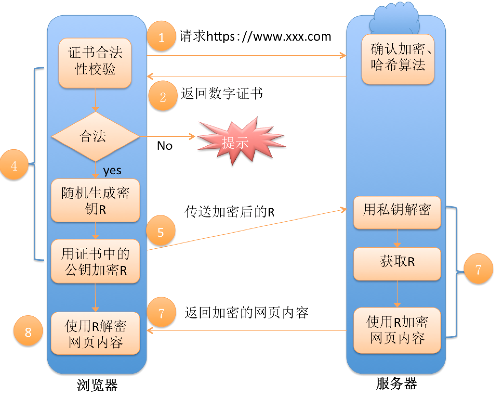

# 计算机网络基础

## 应用层
应用层的作用是通过进程间交互来完成特定的网络应用
### HTTP

超文本传输协议（HTTP，HyperText Transfer Protocol)是互联网上应用最为广泛的一种网络协议。所有的WWW文件都必须遵守这个标准。设计HTTP最初的目的是为了提供一种发布和接收HTML页面的方法。

#### 1、HTTP 1.0/1.1/2.0 的区别

    HTTP 1.0: 每个TCP连接只能发送一个请求，TCP连接

##### HTTP 1.0 -> 1.1

- 新增了24个错误1状态响应码

- Host头处理：IP+hostname，否则400 Bad request

- 带宽优化：支持断点续传；支持只发送header信息，如果服务器认为客户端有权限请求服务器，则返回100，否则返回401

- 长连接：默认开启Connection:keep-alive参数

- 缓存策略的控制

##### HTTP 1.1 -> 2.0

- 采用二进制格式而非文本格式

- 完全的多路复用

- 使用了报头(Header)压缩，降低了开销

- 让服务器可以将响应主动的推送到客户端缓存中(server push)

#### 2、https的请求过程

 

 此处涉及一个问题是客户端如何验证证书是否有效，当客户端获取到签名证书之后，浏览器从签名证书中获取颁发者的信息，从颁发者的证书中找到CA证书（CA证书是所有电脑在操作系统安装时就已经装好），使用CA中心提供的公钥检验CA证书的有效性，然后再用CA证书中的公钥去验证的客户端获取到的签名证书的有效性。 

####  文件传输协议（FTP）：

- FTP 是File TransferProtocol（文件传输协议）的英文简称，而中文简称为“文传协议”。用于Internet上的控制文件的双向传输。同时，它也是一个应用程序（Application）。
- 所有FTP应用程序都遵守同一种协议以传输文件。在FTP的使用当中，用户经常遇到两个概念："下载"（Download）和"上传"（Upload），用户可通过客户机程序向（从）远程主机上传（下载）文件。
- FTP的默认端口：控制端口一般为21，而数据端口不一定是20，这和FTP的应用模式有关，如果是主动模式，应该为20，如果为被动模式，由服务器端和客户端协商而定。

####  简单文件传输协议（TFTP）：
    TFTP（Trivial File Transfer Protocol,简单文件传输协议）是TCP/IP协议族中的一个用来在客户机与服务器之间进行简单文件传输的协议，提供不复杂、开销不大的文件传输服务。端口号为69。

####  远程终端协议（TELNET）：
    Telnet协议是TCP/IP协议族中的一员，是Internet远程登陆服务的标准协议和主要方式。它为用户提供了在本地计算机上完成远程主机工作的能力。
    在终端使用者的电脑上使用telnet程序，用它连接到服务器。终端使用者可以在telnet程序中输入命令，这些命令会在服务器上运行，就像直接在服务器的控制台上输入一样。
    可以在本地就能控制服务器。要开始一个telnet会话，必须输入用户名和密码来登录服务器。Telnet是常用的远程控制Web服务器的方法。

## 传输层

### TCP

### UDP

TCP与UDP区别总结：
1. TCP面向连接（如打电话要先拨号建立连接）;UDP是无连接的，即发送数据之前不需要建立连接
2. TCP提供可靠的服务，无差错，不丢失，不重复，且按序到达;UDP尽最大努力交付，即不保证可靠交付，没有拥塞控制，因此网络出现拥塞不会使源主机的发送速率降低
3. 流模式（TCP）与数据报模式(UDP)
4. 每一条TCP连接只能是点到点的;UDP支持一对一，一对多，多对一和多对多的交互通信
5. TCP首部开销20字节;UDP的首部开销小，只有8个字节
6. TCP的逻辑通信信道是全双工的可靠信道，UDP则是不可靠信道

## 网络层

### ARP协议

- ARP协议是地址解析协议（Address Resolution Protocol）是通过解析IP地址得到MAC地址。

- ARP缓存表，这个表记录着IP地址与MAC地址的映射关系

- ARP协议的主要工作就是建立、查询、更新、删除ARP表项。

## 链路层

## 物理层
